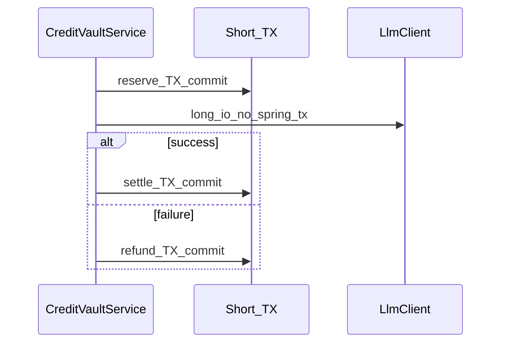

# フェーズ1.1 第4回: Ledger 原子性サービス（CreditVault）計画

## 0. 現状

- リポジトリ内に **`wallet_transactions` テーブルは未採用**（grep 0 件）。新規 **Flyway** が必要（例: [V109 以降](geo-analytics/src/main/resources/db/migration/)。現状最新想定: V108）。
- 多くの「クレジット」挙動は [PlanBasedQuotaManager](geo-analytics/src/main/java/com/geo/analytics/application/service/PlanBasedQuotaManager.java)（Bucket4j）等で、**永続台帳**はこれから導入。
- テナント隔離: [RlsConnectionInterceptor](geo-analytics/src/main/java/com/geo/analytics/infrastructure/persistence/RlsConnectionInterceptor.java) が `app.current_org_id` を設定。[TenantContextHolder.CONTEXT](geo-analytics/src/main/java/com/geo/analytics/infrastructure/tenant/TenantContextHolder.java)（`ScopedValue`）に `organizationId` が乗る。
- [organizations](geo-analytics/src/main/resources/db/migration/V1__init_schema.sql) に `credit_balance BIGINT` が**既存**。台帳と併用するかは設計上の分岐点（後述）。

---

## 1. 修正・新規作成するファイルのパス一覧（案）

| 区分 | パス |
|------|------|
| Flyway 新規 | [geo-analytics/src/main/resources/db/migration/V109__wallet_transactions.sql](geo-analytics/src/main/resources/db/migration/V109__wallet_transactions.sql)（番号はマージ時点で調整）: `CREATE TABLE wallet_transactions`、**RLS**、**GRANT**、**インデックス**（`organization_id`、`(parent_reservation_id)`、`created_at` 等） |
| Enum | [geo-analytics/src/main/java/com/geo/analytics/domain/enums/TransactionType.java](geo-analytics/src/main/java/com/geo/analytics/domain/enums/TransactionType.java): `RESERVE`, `SETTLE`, `REFUND`（文字列 JPA/DB と一致） |
| 例外 | [geo-analytics/src/main/java/com/geo/analytics/domain/exception/InsufficientCreditException.java](geo-analytics/src/main/java/com/geo/analytics/domain/exception/InsufficientCreditException.java)（名は可）。二重 `settle`/`refund` 用に `InvalidReservationStateException` 等は設計士判断 |
| 永続層 | [geo-analytics/src/main/java/com/geo/analytics/domain/entity/WalletTransactionEntity.java](geo-analytics/src/main/java/com/geo/analytics/domain/entity/WalletTransactionEntity.java)（JPA + `@Table` RLS 前提列）; [WalletTransactionRepository](geo-analytics/src/main/java/com/geo/analytics/infrastructure/repository/WalletTransactionRepository.java) |
| サービス | [geo-analytics/src/main/java/com/geo/analytics/application/service/CreditVaultService.java](geo-analytics/src/main/java/com/geo/analytics/application/service/CreditVaultService.java): `reserve` / `settle` / `refund` |
| 仕様整合 | 呼び出し元（将来の LLM オーケストレータ）: **トランザクション境界**のドキュメント or 1 箇所のファサード — 本チケットでは**サービス＋永続＋DB**に限定しても可 |

**型の注意**: 要求に `long projectId` があるが、既存 [ProjectEntity](geo-analytics/src/main/java/com/geo/analytics/domain/entity/ProjectEntity.java) の主キーは **UUID**。計画では API を **`UUID projectId`** とし、仕様差分は副操縦士検疫で合意。`reservationId` も **UUID**（台帳行の PK）が自然。

---

## 2. `wallet_transactions` 追記（Append-only）のみで残高を整合させるロジック案

**原則**

- 台帳行は **常に INSERT**。`UPDATE wallet_transactions` は行わない（監査・WORM 方針と整合）。

**行の意味（案）**

- 共通: `id`（UUID）, `organization_id`（RLS/必須）, `project_id`（UUID, NULL 可）, `transaction_type`（VARCHAR / Enum 名）, `amount`（BIGINT, 非負想定）, `currency` や `idempotency_key` は将来拡張で可。
- **RESERVE**（予約行）: `amount` = 予約したクレジット量。`parent_reservation_id` = NULL。返却時・確定時の参照用にこの行の `id` を **reservationId** として扱う。
- **SETTLE**（実消費）: `parent_reservation_id` = 対象 RESERVE の `id`。**`amount` = 実際に消費した分**（予約以下）。  
- **REFUND**（全額返却）: `parent_reservation_id` = 対象 RESERVE の `id`。**`amount` = 返還額**（通常は予約額に一致）。

**残高（使用可能枠）の導出**

- **A. 台帳のみ**（厳格 append-only ソー）:  
  `available = f(初期残高, 全行の区分付き和)`  
  例: 入金行が別テーブル/別タイプの場合、**有効**な予約 = RESERVE 合計 −（その RESERVE に紐づく SETTLE/REFUND の効果）… と状態を **行の積み上げ**で表す。  
  実装は **「RESERVE 1 行につき、SETTLE または REFUND は高々 1 度」** など不変条件を課し、**整合制約**（部分 UNIQUE や CHECK）で二重精算を防ぐ。
- **B. キャッシュ列**（[organizations.credit_balance](geo-analytics/src/main/resources/db/migration/V1__init_schema.sql) を「利用可能残高」として扱う）:  
  台帳は **監査専用**、**同一トランザクション**で `organizations` の `UPDATE` も行う。  
  - **UPDATE 対象は `organizations` のみ**で、`wallet_transactions` は INSERT のまま。  
  - 副操縦士が「台帳以外の更新を許容するか」を判断。

**推奨（実装難度と一貫性）**

- **RESERVE 時**: `SELECT ... FOR UPDATE` で `organizations` 行をロック（組織単位直列化）、`credit_balance` が `amount` 以上か判定 → 不足なら [InsufficientCreditException](geo-analytics/src/main/java/com/geo/analytics/domain/exception/) 相当 → 十分なら **INSERT RESERVE** +（採用するなら）**`UPDATE organizations SET credit_balance = credit_balance - amount`**。  
- **REFUND 時**: **INSERT REFUND** + `credit_balance += reserved_amount`（RESERVE 行の amount を参照）。  
- **SETTLE 時**: **INSERT SETTLE**（消費額 C）+ `credit_balance += (A - C)`（差額を利用可能に戻す）を同一 TX で実行。  
  これで **「利用可能」= `credit_balance` の単一列**に寄せつつ、**台帳は全イベントの SoT/監査**になる。

**二重 `settle` / `refund` 防止**

- **DB**: `CREATE UNIQUE INDEX ... ON wallet_transactions (parent_reservation_id) WHERE transaction_type = 'SETTLE'` のように **1 予約 1 回**を強制、または `reservation_state` を別**参照用**小テーブルに持つ（INSERT のみ）— 付録テーブルも append-only なら INSERT のみで状態遷移行を重ねる。  
- **Service**: 先に `SELECT` で既存子行有無を確認（同一 TX 内）。

---

## 3. LLM 通信中に DB 接続を解放する「トランザクション分割」

- **`reserve` / `settle` / `refund` は各メソッドで `@Transactional` を完結**（**PROPAGATION_REQUIRED** デフォルトで十分）。1 メソッド = 1 コミット。接続はコミットまで。
- **LLM 呼び出し**は、**これらのメソッドの外**、かつ**別スレッドでコネクションを掴まない**位置に置く。  
  例: `reservationId = creditVaultService.reserve(...);` が return ＝**TX 解放済** → その後 `llmService.generate(...)` → 戻りで `settle` または `refund`。
- **仮想スレッド**でも、**1 本の Loom スレッドが長い `@Transactional` でコネクションプールを占有**するのは避ける。  
  長時間処理用に **`@Transactional(propagation = NOT_SUPPORTED)` のラッパ**で LLM だけ囲い、JPA/DB セッションを使わないことも有効（「トランザクション非参加」と明示）。

**ScopedValue**（[TenantContextHolder](geo-analytics/src/main/java/com/geo/analytics/infrastructure/tenant/TenantContextHolder.java)）:

- `reserve` 実行直前の HTTP 要求スコープ（または [TenantPlanScope](geo-analytics/src/main/java/com/geo/analytics/infrastructure/tenant/TenantPlanScope.java) で囲ったバッチ）内で `TenantIdentity.organizationId` が有効なこと。  
- **settle/refund** は非同期/別 VT で動かす場合、`executeWithTenant(org, workspace, ...)` で **同じ org** を再バインドしてから呼ぶ（既存パターンに合わせる）。

**失敗時の一貫性**

- `reserve` 成功後、LLM が例外でも **`finally` または上層の `catch` で `refund` を保証**（冪等性は `reservationId` ベース）。**再送**で二重 `refund` しないよう DB 一意制約 + 冪等ハンドリング。

---

## 4. 副操縦士向け未決事項（短く）

- **V109** の採番衝突（V108 直後想定）と、**B 方針**（`organizations.credit_balance` 同時更新）の Go/No-Go。
- **projectId** の型: UUID へ寄せるか、別 bigint PK を導入するか。

以上を第4回の実装前計画とする。
