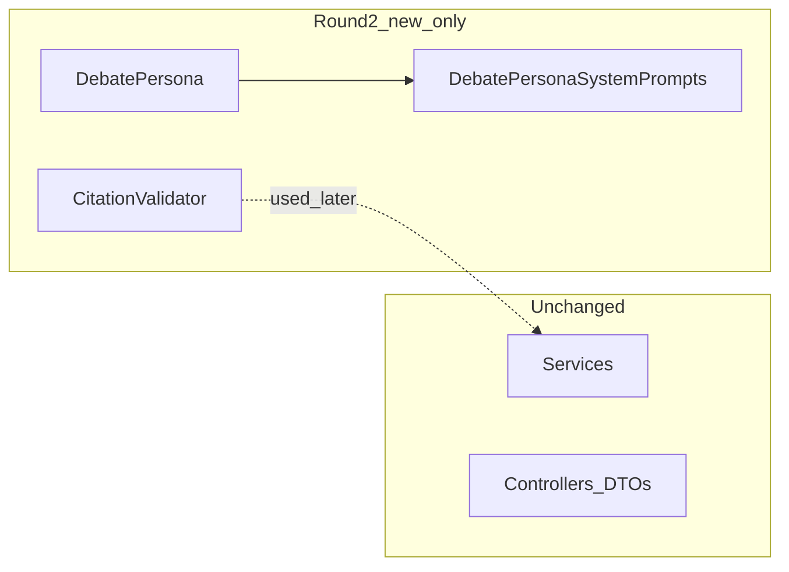

# 第2回：AI部品の製造（プロンプト定義と引用検証）計画

## 1. 作成する新規ファイルのパス一覧（案）

| パス | 役割 |
|------|------|
| [geo-analytics/src/main/java/com/geo/analytics/domain/ai/DebatePersona.java](geo-analytics/src/main/java/com/geo/analytics/domain/ai/DebatePersona.java) | 4 役割の列挙、`temperature`（推奨値）取得 API。 |
| [geo-analytics/src/main/java/com/geo/analytics/domain/ai/DebatePersonaSystemPrompts.java](geo-analytics/src/main/java/com/geo/analytics/domain/ai/DebatePersonaSystemPrompts.java) | 各ペルソナの**システムプロンプト本文**（テキストブロック）を **1 ファイルに集約**。`DebatePersona` から参照するファサードメソッド（例: `static String forPersona(DebatePersona p)`）。 |
| [geo-analytics/src/main/java/com/geo/analytics/domain/ai/CitationValidator.java](geo-analytics/src/main/java/com/geo/analytics/domain/ai/CitationValidator.java) | `[引用: …]` 形式の有無・最低品質検証。 |

**第2回では触れない**: [ProjectOnboardingService](geo-analytics/src/main/java/com/geo/analytics/application/service/ProjectOnboardingService.java)、[ProjectContextService](geo-analytics/src/main/java/com/geo/analytics/application/service/ProjectContextService.java)、[ProjectOnboardingController](geo-analytics/src/main/java/com/geo/analytics/web/controller/ProjectOnboardingController.java)、[ProjectContextResponse](geo-analytics/src/main/java/com/geo/analytics/web/dto/ProjectContextResponse.java)、[UpdateProjectContextCommand](geo-analytics/src/main/java/com/geo/analytics/application/command/UpdateProjectContextCommand.java)、フロントなど**既存の全配線**。

---

## 2. `DebatePersona` の設計方針

**推奨: Enum + プロンプト本文の分離クラス**

- **`DebatePersona` は Enum のまま**にし、定数は `ANALYST`, `SKEPTIC`, `INNOVATOR`, `DIRECTOR` の 4 つ。各定数に **`double recommendedTemperature()`**（または `BigDecimal` だが `0.1` 等なら `double` で十分）を保持。役割の短い **識別子・表示用ラベル（日本語）** も Enum フィールドにまとめると呼び出し側が読みやすい。
- **長文システムプロンプトは Enum 内にベタ書きしない**（可読性・レビュー・差分管理のため）。別 final クラス **`DebatePersonaSystemPrompts`** に **Java 15+ テキストブロック (`"""`)** で 1 ペルソナあたり 1 定数（例: `private static final String ANALYST = """..."""`）として置く。必要ならサブセクション見出しはコメントではなく**プロンプト内のマークダウン風見出し**のみ（ユーザー制約で `//` を避ける場合はプロンプト文言側だけに埋め込む）。
- **骨子の内容**（実装時に埋める）:
  - ANALYST: 事実・データのみ、推測禁止、GEO 文脈（検索順位ではない）の一言。
  - SKEPTIC: 独自性欠如・論理矛盾の指摘骨子。
  - INNOVATOR: 尖った視点 + **Cite Before You Speak**（先に `[引用: …]` で原文フレーズを出してから意見）。
  - DIRECTOR: 合意「盤石」案とマイノリティ・レポートの**出力 JSON スキーマ指示**は第3回で LangChain と接続するまで**骨子レベル**に留めるか、第2回で「JSON キー名の希望」だけプロンプトに書くかは実装時判断（本計画では「骨子＋構造化指示のドラフト」を `DIRECTOR` ブロックに含める）。

**Record を主に使わない理由**: ペルソナは固定 4 種の**有限集合**であり、分岐は `switch (DebatePersona)` で型的に網羅しやすい。Record は「1 インスタンス＝1 カスタムペルソナ」の拡張には向くが、本チケットの要件は固定ロールの定義が中心のため **Enum が最適**。

---

## 3. `CitationValidator` の正規表現パターン案と検証方針

**想定フォーマット（INNOVATOR 絶対制約に合わせる）**

- 表記ゆれ: 全角 `［引用：…］` と半角 `[引用: …]` の両方を許容するか**方針を固定**する。推奨: **半角 `[引用:` に正規化して検証**し、実装時は **半角のみ**を第2回の MVP とし、第3回で全角許容を足すのがシンプル。
- パターン案（Java `Pattern`）:
  - `\\[引用[:：]\\s*([^\\]]{1,})\\]`
  - 意味: `[引用:` または `[引用：` の直後に**非空**の内容（`]` まで）が少なくとも 1 文字以上。`[^\\]]{1,}` で**空引用** `[引用: ]` を不合格にしやすい。

**API 方針**

- `boolean hasValidCitation(String text)`  
  - `text == null` または空 → `false`。  
  - 上記パターンに **1 回以上マッチ**したら `true`（MVP）。
- オプション（第2回で入れてもよい拡張）: `List<String> extractCitations(String text)` で中身を返し、後続の「原文照合」に使う（**第2回は独立部品のみ**なら `hasValidCitation` のみでも要件充足）。

**ハルシネーション防止の位置づけ**

- 第2回は **形式検証のみ**（引用タグの存在・非空）。**引用内容とスクレイプ原文の一致検証**は別ユーティリティ（将来 `SnippetsMatchScrapedText` 等）に分けると責務が明確（本計画では第2回スコープ外として明記）。

---

## 4. 既存 DTO / Service / Controller に今回一切触れないことの確認

| 確認項 | 内容 |
|--------|------|
| データの流し込み | `minorityReports` やディベート結果の**永続化・API 返却**は第3回以降。第2回は **定義と検証だけ**で、DB や `ProjectEntity` への書き込みコードを呼ばない。 |
| コンパイル | 新規クラスだけ追加し、既存クラスを**import して改修する変更を加えない**（ゼロ差分）。 |

**宣誓（計画レベル）**: 第2回の実装は `com.geo.analytics.domain.ai` 配下（上記 3 ファイル）の**新規追加に限定**し、既存の DTO・Service・Controller・フロントには**一切手を加えない**。配線は第3回に委ねる。

