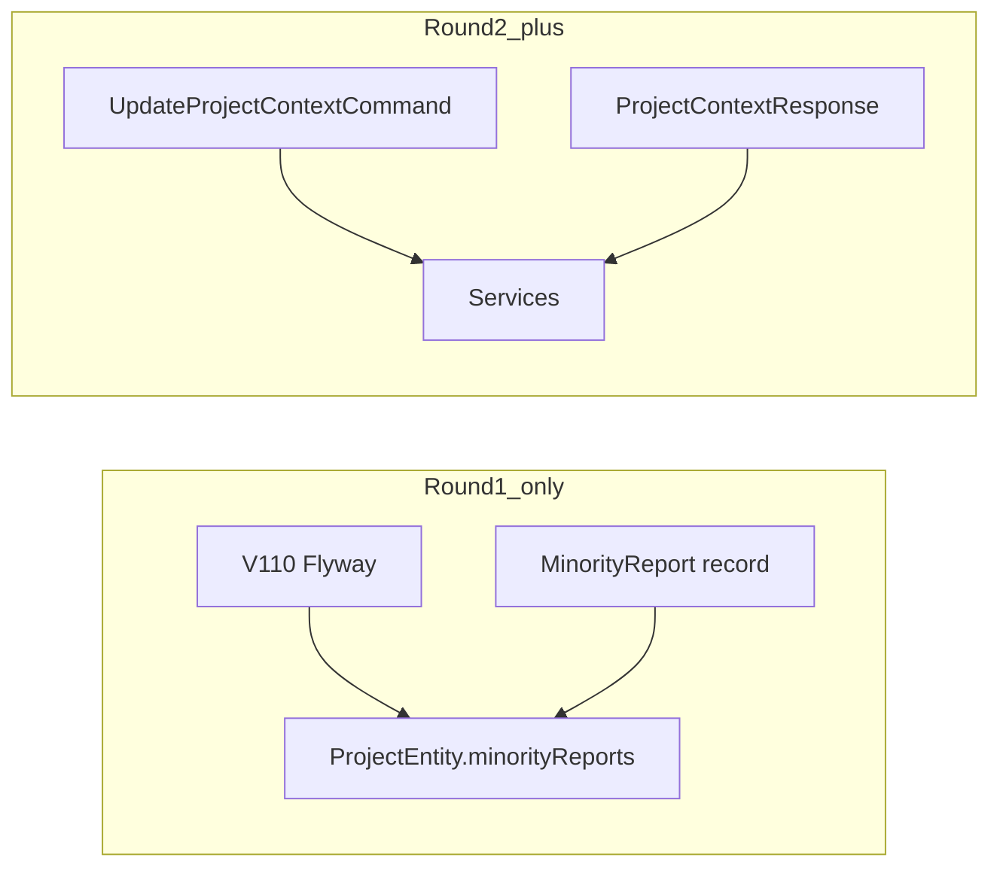

# 第1回：器の拡張（DB & ドメインモデル）計画

## 前提（重要）

- **既存 `V105` あり**: [V105__rename_rank_position_to_ai_citation_position.sql](geo-analytics/src/main/resources/db/migration/V105__rename_rank_position_to_ai_citation_position.sql) が存在するため、指定名 `V105__add_minority_reports_to_projects.sql` は **採用不可**。次の未使用版は **V110**（現状最大は [V109__wallet_transactions.sql](geo-analytics/src/main/resources/db/migration/V109__wallet_transactions.sql)）。
- **スコープ**: 回答に基づき、第1回は **DB + `ProjectEntity` + `MinorityReport` 型** のみ。[`UpdateProjectContextCommand`](geo-analytics/src/main/java/com/geo/analytics/application/command/UpdateProjectContextCommand.java) / [`ProjectContextResponse`](geo-analytics/src/main/java/com/geo/analytics/web/dto/ProjectContextResponse.java) の拡張は **第2回** に回す（Service/Controller/フロントは第1回では **触れない**）。

---

## 1. 作成・修正するファイルのパス一覧（第1回）

| 操作 | パス |
|------|------|
| 新規 | [geo-analytics/src/main/resources/db/migration/V110__add_minority_reports_to_projects.sql](geo-analytics/src/main/resources/db/migration/V110__add_minority_reports_to_projects.sql) |
| 新規 | [geo-analytics/src/main/java/com/geo/analytics/domain/model/MinorityReport.java](geo-analytics/src/main/java/com/geo/analytics/domain/model/MinorityReport.java)（パッケージ名は `domain.model` / `domain.vo` 等、チーム慣習に合わせて1箇所に固定） |
| 改修 | [geo-analytics/src/main/java/com/geo/analytics/domain/entity/ProjectEntity.java](geo-analytics/src/main/java/com/geo/analytics/domain/entity/ProjectEntity.java) |

**第1回では作成しない（第2回へ）**: `UpdateProjectContextCommand`、`ProjectContextResponse`、`ProjectContextService`、`ProjectOnboardingController`、`ProjectOnboardingService`、フロント。

---

## 2. PostgreSQL JSONB と Hibernate 6 のマッピング戦略

- **DB**: `ALTER TABLE projects ADD COLUMN minority_reports JSONB NOT NULL DEFAULT '[]'::jsonb;`（または `NULL` 許容 + アプリ側で `null`/`[]` 方針を決める。**NOT NULL + 空配列**の方が運用・集計が単純）。
- **Java 型**: フィールドは `List<MinorityReport>`。`MinorityReport` は **JPA エンティティではない** 純粋な `record`（`insight`, `conflictReason`, `evidence`）。JSON 直列化は Hibernate の JSON マッパー（通常 Jackson）が `record` を扱える前提で利用。
- **アノテーション（Hibernate 6 想定）**:
  - `import org.hibernate.annotations.JdbcTypeCode;`
  - `import org.hibernate.type.SqlTypes;`
  - フィールドに `@JdbcTypeCode(SqlTypes.JSON)` を付与。
  - `@Column(name = "minority_reports", columnDefinition = "jsonb")` で PostgreSQL 型を明示。
- **コレクションの初期化**: `private List<MinorityReport> minorityReports = new ArrayList<>();` など、NPE と空配列を揃える。
- **Getter/Setter**: 既存 [ProjectEntity](geo-analytics/src/main/java/com/geo/analytics/domain/entity/ProjectEntity.java) のスタイルに合わせて追加。

補足: もし実行時に JSON マッピングで `record` が解釈されない場合は、第2回前に同パッケージで **POJO + 無引数コンストラクタ** に差し替えるフォールバックを検討（第1回時点では record で進め、統合テストで検証）。

---

## 3. 「既存ロジックに今回一切影響を与えない」についての確認

| 項目 | 第1回の扱い |
|------|----------------|
| Web層・Application Service | **変更しない**（Command/Response 拡張は第2回）。 |
| `ProjectOnboardingService` / クローラー / `CreditVaultService` / `ContextPropagator` | **変更しない**。 |
| `ProjectEntity` | **カラム追加とフィールド追加のみ**。既存カラムの意味・制約は変更しない。 |
| Flyway | **新規 V110 のみ追加**。過去バージョンの SQL は書き換えない。 |

**宣誓（計画レベル）**: 第1回の実装は、マイグレーションと `ProjectEntity`・`MinorityReport` の **永続化の器** に限定し、課金・SSRF・VT 伝搬といったフェーズ1.1インフラのコードパスには **手を入れない**。

---

## 第2回以降（参考・今回は実装しない）

- `UpdateProjectContextCommand` / `ProjectContextResponse` に `minorityReports` を追加。
- `ProjectContextService` / `ProjectOnboardingService` でのマッピング・`ProjectContextTextLimiter` との関係（必要なら少数意見フィールドの長さ方針）。
- 必要なら [V108](geo-analytics/src/main/resources/db/migration/V108__add_geo_context_to_projects.sql) 以降のデータ移行は不要（JSONB デフォルト `[]` で足りる）。

