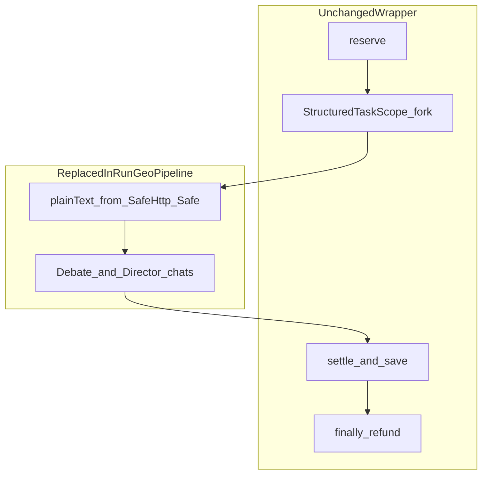

# 第3回：ディベート・オーケストレーション接合（計画）

## 1. 修正対象の特定と既存インフラを壊さない防衛戦略

### 触れてよいゾーン（接合部のみ）
- [ProjectOnboardingService.java](geo-analytics/src/main/java/com/geo/analytics/application/service/ProjectOnboardingService.java) のうち、**`runGeoPipeline` の後半**（`plain` 取得完了後）と **`applyProjectSnapshot` / その入力型**、および **単発 LLM 用の `parseLlmResult` / 旧 `SYSTEM_GEO` + 単一 `chat`** を置き換え対象とする。
- オーケストレーションが肥大化する場合は、**同一パッケージ内の新クラス**（例: `DebateOnboardingOrchestrator`）に「ディベート＋DIRECTOR 呼出し＋DTO組み立て」だけ委譲し、[ProjectOnboardingService](geo-analytics/src/main/java/com/geo/analytics/application/service/ProjectOnboardingService.java) には **`runOnboarding` の骨格**（下記）を残す方針も可。いずれにせよ **課金・スコープ・refund ブロックは Service 本体に残す**。

### 絶対に不変（行の削除・構造の組み替えなし）とする範囲
次の**ブロックは論理的に同じ制御流れを維持**する（行の消去やメソッド統合で消さない）:
- `runOnboarding`: `validateHttpUrl` → `reserve` → `StructuredTaskScope.open` + `ContextPropagator.wrap` + `runGeoPipeline` → `join` / `get` / 例外 → `transactionTemplate` で `settle` + 保存 → `finally` + `refund` + **CRITICAL ログ**（[L72-114 付近](geo-analytics/src/main/java/com/geo/analytics/application/service/ProjectOnboardingService.java)）
- `runGeoPipeline` **前半**: URI 生成、`SafeHttpClient.send`、非2xx ボディ破棄、**`StreamTextExtractor.extract` + try-with-resources**（[L140-172 相当](geo-analytics/src/main/java/com/geo/analytics/application/service/ProjectOnboardingService.java)）
- `ProjectContextTextLimiter` による正規フィールドの保存時トリム
- 依存: [CreditVaultService](geo-analytics/src/main/java/com/geo/analytics/application/service/CreditVaultService.java) / [SafeHttpClient](geo-analytics/src/main/java/com/geo/analytics/infrastructure/crawler/safety/SafeHttpClient.md) / [StreamTextExtractor](geo-analytics/src/main/java/com/geo/analytics/infrastructure/crawler/extraction/StreamTextExtractor.java) への**注入シグニチャ**は、必要な **追加注入**（新 `ChatLanguageModel`）のみ。既存引数の削除はしない

### 方針（「指一本触れない」の意味を具体化）
- **トランザクション境界・クレジット**は現状の `runOnboarding` から動かさない（長い I/O の外枠のまま）。
- **1 本の `fork` で `runGeoPipeline` 全体**を走らせる形は維持可能。ディベート内の **ANALYST/INNOVATOR 並列**は、**`runGeoPipeline` 内**で**ネストした** `StructuredTaskScope` または直列＋`ContextPropagator` で行い、**外側**の `reserve` や `ContextPropagator.wrap` によるテナント伝搬方針は揃える。

**今回触れない**（指示どおり）: [ProjectOnboardingController](geo-analytics/src/main/java/com/geo/analytics/web/controller/ProjectOnboardingController.java)、[ProjectContextResponse](geo-analytics/src/main/java/com/geo/analytics/web/dto/ProjectContextResponse.java)、[UpdateProjectContextCommand](geo-analytics/src/main/java/com/geo/analytics/application/command/UpdateProjectContextCommand.java)、フロント。

### 新規·改修（想定）
| 種別 | パス | 内容 |
|------|------|------|
| 改修 | [ProjectOnboardingService.java](geo-analytics/src/main/java/com/geo/analytics/application/service/ProjectOnboardingService.java) | 上記方針で「`plain` 以降」差し替え。 |
| 改修 | [GeoOnboardingLlmResult](geo-analytics/src/main/java/com/geo/analytics/application/dto/GeoOnboardingLlmResult.java) または代替 record | `minorityReports` 等の持ち帰し用。Web 向け DTO ではない（利用は当 Service のみ[現状 grep](geo-analytics)）。 |
| 新規 | [geo-analytics/.../infrastructure/ai/DebateDirectorOutputSchema.java](geo-analytics/src/main/java/com/geo/analytics/infrastructure/ai/DebateDirectorOutputSchema.java) 等 | DIRECTOR 用 `ResponseFormat` + `JsonSchema`（`industry_type` / `extracted_strengths` / `target_audience` / `minority_reports[]`）。 |
| 加算 | [AiConfig.java](geo-analytics/src/main/java/com/geo/analytics/infrastructure/config/AiConfig.java) | `GoogleAiGeminiChatModel` を **追記**（Flash: 3 本程度の温度差、Pro: 1 本＋DIRECTOR 用 `responseFormat`）。既存 bean の**削除・リネームはしない**（例: 旧 `geminiGeoOnboardingChatModel` を当面残し、第3回でオーケストレーション用に切替／段階的に整理する方針を文書化）。 |
| 新規（任意） | `DebateOnboardingOrchestrator.java` | 上記方針でオーケストレーション専従（テスト容易化）。 |

---

## 2. ディベート・フェーズの通信フロー（LangChain4j 前提）

本コードベースは **Spring AI ではなく LangChain4j** の [ChatLanguageModel#chat](geo-analytics/src/main/java/com/geo/analytics/application/service/ProjectOnboardingService.java) + [ChatRequest](https://github.com/langchain4j/langchain4j) を使用している。LangChain4j には**対話専用の必須フレームワーク**は使わず、**毎回 `ChatRequest` を組み立てる**形が既存 [KeywordSuggestionService](geo-analytics/src/main/java/com/geo/analytics/application/service/KeywordSuggestionService.java) と一致する。

- **1 手ずつの「ターン」** = 1 回の `model.chat(ChatRequest.builder().messages(SystemMessage.from(...), UserMessage.from(...)).build())`。
- **システムプロンプト** = [DebatePersonaSystemPrompts.forPersona](geo-analytics/src/main/java/com/geo/analytics/domain/ai/DebatePersonaSystemPrompts.java)（第2回資産）。ユーザ入力は **`<scraped_data>` 付き**の抽出テキスト、または**中間の議事録 1 本の String**（SKEPTIC・DIRECTOR 向け）を一発 `UserMessage` に載せる。マルチメッセージ（AiMessage 連鎖）を本当に積みたい場合は `List<ChatMessage>` を作る方式も可だが、**初回導入は「1 UserMessage＝全文ログ」**で十分扱いやすい。
- **温度**: `ChatRequest` 側で上書きできない前提が多いため、**ペルソナ推奨温度ごとに別 `GoogleAiGeminiChatModel` Bean**（[AiConfig](geo-analytics/src/main/java/com/geo/analytics/infrastructure/config/AiConfig.java) の `.temperature(...)`。モデル名は [LlmModelNames.GEMINI_25_FLASH](geo-analytics/src/main/java/com/geo/analytics/infrastructure/ai/LlmModelNames.java) 等）を **追加**する戦略を推奨。
- **ANALYST / INNOVATOR**: **並列**なら、取得済み `plain` を入力に、**`runGeoPipeline` 内**の **ネスト** `StructuredTaskScope` で 2 `fork`（各 `ContextPropagator.wrap`）。**直列**なら同じ `plain` 上に順次 `chat`。
- **INNOVATOR 後**: [CitationValidator.hasValidCitation](geo-analytics/src/main/java/com/geo/analytics/domain/ai/CitationValidator.java)。不合格なら**次工程にそのブロックを載せない**、または**ログ＋空扱い**（実装方針を1つに固定）。
- **SKEPTIC**: ANALYST 出力＋INNOVATOR 出力（検証通過分）を **1 本の String** にまとめ、単発 `UserMessage` で渡す。

---

## 3. DIRECTOR 出力 JSON と Java Record のマッピング

- **API 戻し JSON キー**は既存方針に合わせ **snake_case**（[ProjectContextResponse](geo-analytics/src/main/java/com/geo/analytics/web/dto/ProjectContextResponse.java) 等）に合わせ、**DIRECTOR 用 `JsonObjectSchema` ルート**例:
  - `industry_type` (enum: `IndustryType` 名)
  - `extracted_strengths` (string) または `strengths` 配列 → 永続化前に**既存の join + TextLimiter 方針**へ合わせる
  - `target_audience` (string)
  - `minority_reports` (object の配列: `insight`, `conflict_reason`, `evidence` 等 — [MinorityReport](geo-analytics/src/main/java/com/geo/analytics/domain/model/MinorityReport.java) との対応)
- **パース**: `ObjectMapper.readTree` または専用 **内部 record**（例: `DirectorOnboardingJson`）+ `TypeReference`。**Web DTO ではない**層に閉じる。
- [GeoOnboardingLlmResult](geo-analytics/src/main/java/com/geo/analytics/application/dto/GeoOnboardingLlmResult.java) へ畳み込み、または**新 record** へ置換し、`applyProjectSnapshot` で
  - `industry` / 強み / `targetAudience` / **`project.setMinorityReports(...)`** まで一括反映。

---

## 4. 宣誓（計画レベル）

- **reserve / refund / `TransactionTemplate` / `StructuredTaskScope` 外枠 / `ContextPropagator` / SSRF 経路 / ストリーム上限抽出**の設計意図を**意図的に壊さない**（削除・圧縮で消さない）。
- 第3回の変更範囲は **「`plain` 取得後の LLM 呼出し」および「`ProjectEntity` へディベート結果の詰め込み」**に限定し、**フロント向け DTO/Command/Response には手を出さない**。

