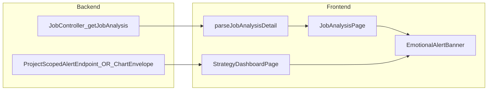

# フェーズ2.4 第1回：エモーショナル・アラート・バナー実装計画

## 現状との整理（復唱）

- **目的**: 監査・ベンチマーク由来の `emotional_alert`（経営者向け短い一言）を、**分析詳細ページ**および**戦略ダッシュボード**のいちばん目立つ上位領域に置き、`variant="filled"` の MUI `Alert` でコントラストを最大化しつつ、`DANGER` 時のみ初回表示の視線誘導アニメーションを載せる。
- **データ**: `JobAnalysisDetailResponse` の `emotional_alert` は JSON で `level` / `message` / `used_fallback`（フロントでは camelCase 化され `usedFallback`）。[`JobAnalysisDetailResponse.java`](geo-analytics/src/main/java/com/geo/analytics/web/dto/JobAnalysisDetailResponse.java) と [`parseJobAnalysisDetail`](geo-analytics/frontend/src/types/analysis.ts) がまだ `emotional_alert` を読んでいないため、**型＋パーサーの拡張が前提**。
- **既存 UI の競合**: 同名 [`EmotionalAlertBanner.tsx`](geo-analytics/frontend/src/components/EmotionalAlertBanner.tsx) は現在、[`buildEmotionalAlerts`](geo-analytics/frontend/src/lib/buildEmotionalAlerts.ts) 由来の **複数行アラート**（`severity: "error" | "warning"` のみ）専用。[`JobAnalysisPage.tsx`](geo-analytics/frontend/src/pages/JobAnalysisPage.tsx) 649 行付近で使用。**要件どおり「APIペイロード1件」を扱うバナーに書き換えると Rubric UI が失われる**ため、**コンポーネントを役割別に分割**する（下記）。

## アーキテクチャ決定：`EmotionalAlertBanner` の役割付け

| コンポーネント | 責務 | Props |
|---|---|---|
| **`EmotionalAlertBanner`**（要件どおり書き換え） | LLM/`usedFallback` を含む**経営者向け1本**の訴求 | `payload: EmotionalAlertPayload`（親が `null` のときは**レンダリングしない**） |
| **新規** `RubricGapAlertStack.tsx`（仮称） | 既存どおり複数ギャップ用の一覧＋スクロール CTA | `alerts`（現在の [`EmotionalAlert`](geo-analytics/frontend/src/lib/buildEmotionalAlerts.ts) 配列） |

- [`JobAnalysisPage.tsx`](geo-analytics/frontend/src/pages/JobAnalysisPage.tsx): `h1「解析結果」` の直下（現在 457 行の直後）に **`data.emotionalAlert` があれば** `EmotionalAlertBanner`。その下で従来の Rubric 用は `RubricGapAlertStack` に差し替え（表示条件・`pdf-avoid-break` は現状維持）。
- **コメント禁止・ロジックは純関数**: `level`→MUI の `severity` マップ、`INFO` は `severity="info"`、メッセージの前後トリムだけ必要なら [`src/lib/emotionalAlertTone.ts`](geo-analytics/frontend/src/lib/emotionalAlertTone.ts) のような単一ファイルに `mapEmotionalLevelToSeverity` を置く。

## A. `EmotionalAlertBanner`（API ペイロード版）詳細設計

1. **`@mui/material/Alert`**  
   - `variant="filled"` 固定。  
   - **DANGER** → `severity="error"`（赤系 filled）。  
   - **WARNING** → `severity="warning"`（黄橙 filled）。  
   - **INFO** → `severity="info"`（青系 filled）。

2. **アイコン**  
   - `@mui/icons-material` の **`AutoAwesome`** または **`AutoAwesomeOutlined`**（AI生成の連想）を `slotProps` / `icon` で指定。  
   - `usedFallback === true` のときだけ、[`Alert`](https://mui.com/material-ui/react-alert/) 内に `Typography variant="caption"` で短い一文（日本語・控えめ色 `color="inherit"` + 低不透明）を**メイン本文の下**に追加。レイアウトは `Stack` で縦並び。

3. **CTA（任意だが現行との整合）**  
   - 既存ボタン「今すぐ対策を見る」は **Rubric 側スタックのみ** に残すか、単一バナーにも **`#next-action-section` への scroll** を付けるかは製品判断。計画提案: **両方に同じスクロール CTA を载せ修正相談導線を一本化**（`next-action-section` は既に [`JobAnalysisPage`](geo-analytics/frontend/src/pages/JobAnalysisPage.tsx) に存在）。

4. **`DANGER` 専用アニメーション**  
   - `useEffect` は使わず、**親から渡される `payload` に依存した `sx`** で表現する。  
   - 構成案: **`@mui/material/Fade`** で `in={true}` + `timeout`（初回マウントのみ見えるフェード）は、親が conditional mount することで実質「初回」のみになる。  
   - **微細な揺れ**: `@mui/material/styles` の **`keyframes`** で ±1〜2deg・50ms×数回程度の **`animation`** を `sx` に付与。`WARNING`/`INFO` では `animation: "none"`。  
   - **アクセシビリティ**: 揺れは控えめ（`prefers-reduced-motion: reduce` では [`useMediaQuery`](https://mui.com/material-ui/react-use-media-query/) でアニメ無効）を推奨（ロジックは純関数 or フックではなく、`sx` 内分岐でも可）。

5. **`props` で完結**  
   - 状態は持たず、`payload` と（必要なら）`analyticsKey` は不要。**親の `{payload && <EmotionalAlertBanner … />}`** が唯一のガード。

## C. 型定義・パース（[`analysis.ts`](geo-analytics/frontend/src/types/analysis.ts)）

1. **`export type EmotionalAlertLevelApi = "DANGER" | "WARNING" | "INFO"`**  
2. **`export interface EmotionalAlertPayload { level: EmotionalAlertLevelApi; message: string; usedFallback: boolean }`**  
3. **純関数** `parseEmotionalAlertPayload(raw: unknown): EmotionalAlertPayload | null`  
   - `camel` と `snake` の両対応は既存どおりプロパティ両方読むパターンに合わせる（`used_fallback` / `usedFallback`）。  
   - `message` が空、`level` が未知なら `null`。  
4. **`JobAnalysisDetail`** に **`emotionalAlert?: EmotionalAlertPayload | null`** を追加。  
5. **`parseJobAnalysisDetail`**: `r.emotional_alert ?? r.emotionalAlert` をパースして設定。欠落時は `undefined` でよい。

## B. `JobAnalysisPage` への配線

- **配置**: 「解析結果」`h1` の**直下**に `data.emotionalAlert` が存在するときだけ単一バナー（ユーザー要件復唱）。
- **既存ギャップUI**: `<RubricGapAlertStack alerts={buildEmotionalAlerts(...)} />` を **今の EmotionalAlertBanner 位置付近に移動**（バナーを二段にしてもよいが、経営者メッセージを最上位に）。
- **`ReportPrintPage`**: 印刷物にも同文言が必要なら、同様に `parseJobAnalysisDetail` 済みオブジェクト経由で `EmotionalAlertBanner` を載せられるが、フェーズ2.4 のスコープ外なら省略可。

## D. `StrategyDashboardPage` への配線 — **バックエンド前提**

現状 [`StrategyDashboardPage.tsx`](geo-analytics/frontend/src/pages/StrategyDashboardPage.tsx) は [`useProjectAssetSnapshots`](geo-analytics/frontend/src/hooks/useProjectAssetSnapshots.ts) のみ。**完了ジョブの `GET /jobs/{id}/analysis` と等価なデータソースがページ内に無い**。「最新 COMPLETED の emotional_alert」を出すには**いずれかの API**が必要：

**推奨（改修が局所的）**:  
- [`ProjectAnalyticsController`](geo-analytics/src/main/java/com/geo/analytics/web/controller/ProjectAnalyticsController.java) が返すチャート応答／別 GET に、サーバ側で  
  **`JobRepository.findFirstByProjectIdOrderByCreatedAtDesc(projectId)`** → `job_status == COMPLETED` かつ `emotional_alert` 非null のときだけ [`EmotionalAlertPayload`](geo-analytics/src/main/java/com/geo/analytics/web/dto/EmotionalAlertPayload.java) を同梱。  
  完了で JSON 未取得なら **`emotional_alert: null`**。

**フロント**:  
- 新規小フック `useProjectEmotionalAlert(projectId)`（単一 `useEffect` + `reload` で十分）または `useProjectAssetSnapshots` のレスポンス拡張に追随。  
- **描画**: [`StrategyDashboardPage`](geo-analytics/frontend/src/pages/StrategyDashboardPage.tsx) の **`header` 直下**（現在 126 行前後の `LockedInsightCallout` より上）に `payload && <EmotionalAlertBanner … />`。`loading/error` と競合しないよう、エラー時は非表示または既存エラーブロックの下のみ。

※ ルート上 **ログイン直後デフォルトは `/` の [`JobCreationPage`](geo-analytics/frontend/src/App.tsx)**。要件の「トップ」を戦略ページと読む場合の整合は製品側のナビ確認。

## アーキテクチャ遵守（復唱）

- **コメント**: 追加・変更ファイルとも Javadoc／`//` **禁止**。  
- **ロジック分離**: パース・`level→severity` マップ・アニメ有効可否はすべて **コンポーネント外の純関数**（または MUI の `styled` と `keyframes` は UI ファイル内の「宣言」だけに留める）。  
- **状態**: `EmotionalAlertBanner` 自体は状態レス。ページ側も `payload` があればマウント、無ければアンマウント。

## 実装ステップ（作業順）

1. **`analysis.ts`**: `EmotionalAlertPayload` 型 + `parseEmotionalAlertPayload` + `JobAnalysisDetail`/`parseJobAnalysisDetail` 更新。  
2. **リファクタ**: 現 [`EmotionalAlertBanner`](geo-analytics/frontend/src/components/EmotionalAlertBanner.tsx) 実装を `RubricGapAlertStack.tsx` へ退避、`EmotionalAlertBanner` を API 要件どおり書き換え。  
3. **`JobAnalysisPage`**: `h1` 直下に API バナー、ギャップ用に `RubricGapAlertStack`。import 調整。  
4. **バックエンド小拡張**（上記どちらか）: プロジェクトスコープで `emotional_alert` を返却。DTO は既存 [`EmotionalAlertPayload`](geo-analytics/src/main/java/com/geo/analytics/web/dto/EmotionalAlertPayload.java) 再利用を優先。  
5. **`StrategyDashboardPage`**: フェッチ結果を親が保持、`EmotionalAlertBanner` に渡すのみ。  
6. **ビジュアル確認**: filled 色・アイコン、`usedFallback` 注釈、`DANGER` の Fade+シェイク、`prefers-reduced-motion`。  
7. **`npm run build`**（および必要なら `mvn compile`）。

