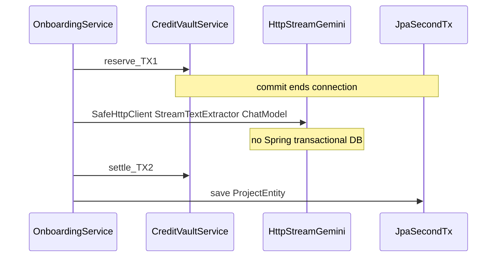
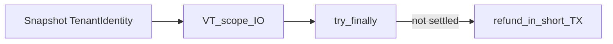

# フェーズ1.1 第5回: 構造化オーケストレーター（Onboarding / GeoBrain）計画

## 1. 修正・新規作成するファイルのパス一覧（案）

| 目的 | パス（案） |
|------|------------|
| オーケストレータ本体 | [geo-analytics/src/main/java/com/geo/analytics/application/service/ProjectOnboardingService.java](geo-analytics/src/main/java/com/geo/analytics/application/service/ProjectOnboardingService.java)（名称は同義 `GeoBrainOrchestrator` 可）: `runStructuredOnboarding(...)` 等。クラス**全体に** `@Transactional` を付けない（長いI/Oを包含しない） |
| LLM 用設定 | [geo-analytics/src/main/java/com/geo/analytics/infrastructure/config/AiConfig.java](geo-analytics/src/main/java/com/geo/analytics/infrastructure/config/AiConfig.java): 新 Qualifier 付き `ChatLanguageModel` ビルド（[LlmModelNames.GEMINI_25_FLASH](geo-analytics/src/main/java/com/geo/analytics/infrastructure/ai/LlmModelNames.java) 相当、`ResponseFormat` で JSON スキーマ固定） |
| 定数 / 名寄せ | [LlmModelNames](geo-analytics/src/main/java/com/geo/analytics/infrastructure/ai/LlmModelNames.java) に用途別定数（既に `GEMINI_25_FLASH` あり。オンボ専用 Qualifier 名の定数を追加可） |
| プロンプト＋スキーマ | 新規 [geo-analytics/src/main/java/com/geo/analytics/infrastructure/ai/GeoOnboardingJsonSchema.java](geo-analytics/src/main/java/com/geo/analytics/infrastructure/ai/GeoOnboardingJsonSchema.java) または [ConsultantOutputSchema](geo-analytics/src/main/java/com/geo/analytics/infrastructure/ai/ConsultantOutputSchema.java) と並ぶ `JsonObjectSchema` 組み立て: `industry`（enum 名の文字列 or 限定）, `strengths`（配列/文字列）, `targetAudience` 等。プロンプト文字列内で `<scraped_data>...</scraped_data>` ブロック化 |
| 入出力 DTO | 新規 [geo-analytics/src/main/java/com/geo/analytics/application/dto/GeoOnboardingLlmResult.java](geo-analytics/src/main/java/com/geo/analytics/application/dto/GeoOnboardingLlmResult.java)（`record`）: LLM パース用 |
| トランザクション制御 | [TransactionTemplate](https://docs.spring.io/spring-framework/docs/current/javadoc-api/org/springframework/transaction/support/TransactionTemplate.html) 注入: `REQUIRES_NEW` 相当で明示したい箇所のみ（通常は下記「2」参照） **または** コールバック内で `@Transactional` が付いた別サービス呼び出し |
| 既存部品 | [CreditVaultService](geo-analytics/src/main/java/com/geo/analytics/application/service/CreditVaultService.java)（既存メソッドの**外部**に長いI/Oを置く）、[SafeHttpClient](geo-analytics/src/main/java/com/geo/analytics/infrastructure/crawler/safety/SafeHttpClient.java)、[StreamTextExtractor](geo-analytics/src/main/java/com/geo/analytics/infrastructure/crawler/extraction/StreamTextExtractor.java)、[PerDomainRequestLimiter](geo-analytics/src/main/java/com/geo/analytics/infrastructure/crawler/safety/PerDomainRequestLimiter.java)（[Spring @Bean 未登録なら [CrawlerConfiguration](geo-analytics/src/main/java/com/geo/analytics/infrastructure/config/CrawlerConfiguration.java) 等に追加）） |
| 永続化 | [ProjectRepository](geo-analytics/src/main/java/com/geo/analytics/infrastructure/repository/ProjectRepository.java) / [ProjectEntity](geo-analytics/src/main/java/com/geo/analytics/domain/entity/ProjectEntity.java)（`industryType`, `extractedStrengths`, `targetAudience` 更新） |
| 金額（任意） | [QuotaCreditCalculator](geo-analytics/src/main/java/com/geo/analytics/domain/model/QuotaCreditCalculator.java) 等で**予約額/実額**を決定（第4回台帳と数値一貫性） |
| テナント再束縛 | 既存 [TenantPlanScope](geo-analytics/src/main/java/com/geo/analytics/infrastructure/tenant/TenantPlanScope.java) / [TenantContextHolder](geo-analytics/src/main/java/com/geo/analytics/infrastructure/tenant/TenantContextHolder.java) をオーケストレータ内で**キャプチャ**し、I/O スレッド・`StructuredTaskScope` 子に渡す**ヘルパ**（小さな `runWithIdentity(TenantIdentity, Runnable)` 私有メソッドでも可） |

**今回のスコープ外（後続可）**

- 新 API コントローラ（`/api/.../onboarding`）と SSE/キャンセル信号の**配線**（計画の「3」で枠組みのみ）。コントローラ層に `Cancellable` / `RequestContext` を渡す等。

---

## 2. 長い I/O 中に DB 接続を確実に解放するコード構造案

**方針**: **オーケストレータの最上位**は `@Transactional` **なし**。DB 作業は **短い**メソッドに閉じ、Spring のトランザクション境界で **getConnection → commit/rollback → 接続返却**が終了してから I/O へ入る。

- **TX1**（例）: 公開メソッド `creditVaultService.reserve(projectId, estimatedCost)` のみ。メソッド終了でコミット。
- **I/O ゾーン**: `HttpRequest` 構築 → [SafeHttpClient#send](geo-analytics/src/main/java/com/geo/analytics/infrastructure/crawler/safety/SafeHttpClient.java) → `getBody` を `InputStream` で [StreamTextExtractor#extract](geo-analytics/src/main/java/com/geo/analytics/infrastructure/crawler/extraction/StreamTextExtractor.java)（**try-with-resources**でストリーム閉鎖）→ プロンプト組み立て → LangChain4j [ChatRequest](geo-analytics/src/main/java/com/geo/analytics/application/service/KeywordSuggestionService.java) 風 `ChatLanguageModel.chat`。**この区間**は `EntityManager` / `Session` を触らない。
- **TX2**（例）: `creditVaultService.settle(reservationId, actualCost)` 、続けて `projectRepository.save` を**同一トランザクション**に乗せるなら、**専用の小さな** `@Transactional` サービス（例 `ProjectOnboardingPersistence`）の 1 メソッドに**まとめる**、または `TransactionTemplate.execute` 内に両方を記述。逆に、**分離**したいなら `settle` コミット後に別 `REQUIRES_NEW` で `save`（多くの場合 **1 つの TX2**で十分）。

**`TransactionTemplate` の使いどころ**

- 同一クラス内で二段階のプログラム的トランザクションを**明示的**に分けたい時に `setPropagationBehavior(REQUIRES_NEW)` 付き [TransactionTemplate](https://docs.spring.io/spring-framework/docs/current/javadoc-api/org/springframework/transaction/support/TransactionTemplate.html) を使用。
- 多くの場合、`CreditVaultService` が既にメソッド単位 `@Transactional` なら、**オーケストレータからの連続呼び出し**で十分に TX1／TX2 が分離される（I/O の間に `@Transactional` が無い限り、接続は保持されない）。

**Anti-starvation 要点**: I/O 前後で **`@Transactional` がアクティブでない**ことを Linter/レビューで保証。必要ならオーケストレータに `@Transactional(propagation = NOT_SUPPORTED)` を付与して親 TX の伝播を止める案も有り（**設計士判断**）。

---

## 3. キャンセル・例外時に ScopedValue のテナントを維持して Refund する仕組み

**事実（JDK）**: [ScopedValue](https://openjdk.org/jeps/446) のバインドは、**子スレッドに自動で全面的に引き継がれるとは限らない**（`StructuredTaskScope` 利用時も、作業内で**明示的に**同じ文脈を使う安全策が推奨）。既存の [TenantPlanScope.executeWithTenant](geo-analytics/src/main/java/com/geo/analytics/infrastructure/tenant/TenantPlanScope.java) パターン（`TenantContextHolder` を再 `where`）を焼き直し用に用いる。

**手順案**

1. **オーケストレータ入口**（HTTP 要求スレッド等）で `TenantIdentity identity = TenantContextHolder.requireContext();` および必要なら `SubscriptionPlan` を取得し、**不変**として保持。
2. 長い処理を [StructuredTaskScope](https://docs.oracle.com/en/java/javase/25/docs/api/java.base/java/util/concurrent/StructuredTaskScope.html)（`ShutdownOnFailure` 等、**仮想スレッド**ファクトリ推奨）の `fork` に渡す。`fork` 内先頭で **必ず**  
   `TenantPlanScope.executeWithTenant(workspaceId, () -> ScopedValue.where(TenantContextHolder.CONTEXT, identity).run(() -> { ... 実I/O ... }))`  
   または、既存 `executeWithTenant` / `ContextPropagator` に相当する**既存**ユーティリティがあればそれを拡張して再利用（[ContextPropagator](geo-analytics/src/main/java/com/geo/analytics/infrastructure/tenant/ContextPropagator.java) 参照）.
3. **例外・キャンセル**: `scope.join()` 失敗、または**中断**受信時、**`finally` ブロック**（または `ShutdownOnFailure` のシャットダウン）で、まだ `settle` 未実行なら **`refund` 用**の短い TX だけ起動: 同じく `identity` を再束縛した上で `creditVaultService.refund(reservationId)` だけ呼ぶ。`refund` 自体は `@Transactional` で短い。
4. **冪等性**: `reservationId` について **1 度だけ** `settle` または `refund` になるよう、第4回の**部分一意**＋**ビジネス**「既に子行があれば例外」と整合。
5. **HTTP レベルキャンセル**（「ブラウザを閉じた」）: 将来的に `AsyncContext` 中断、`ClientAbortException` 検出、Reactor キャンセル等で **オーケストレータ**に**中断シグナル**（`Thread.interrupt` 等）を送り、`InputStream#read` / HttpClient 側で**割り込み**を意識。Java 25 の `HttpClient#send` は**割り込み**で打ち切す可能性—完全保証は難しいため、**timeout** や **最長時間** も併用する案を併記。

**ミニ mermaid（Refund 保証）**

---

## 補足（A/B 仕様の詰め）

- **B. プロンプト**: システム/ユーザー分離は既存 [KeywordSuggestionService](geo-analytics/src/main/java/com/geo/analytics/application/service/KeywordSuggestionService.java) に倣いつつ、`<scraped_data>` 内は**生テキストのみ**、本文で「GEO・AI Overview/生成AI**言及**に利く強み。SEO 順位の話は出さない」等の**否定指示**を追記。JSON は LangChain4j `ResponseFormat` / [ConsultantOutputSchema](geo-analytics/src/main/java/com/geo/analytics/infrastructure/ai/ConsultantOutputSchema.java) パターンを踏襲。
- **C. 仮想スレッド**: エグゼキュータは [Executors#newVirtualThreadPerTaskExecutor](https://docs.oracle.com/en/java/javase/25/docs/api/java.base/java/util/concurrent/Executors.html#newVirtualThreadPerTaskExecutor\(\)) を `StructuredTaskScope` コンストラクタ（対応版）に渡す案を明記。キャンセルは **JVM/HTTP** の制約上 **ベストエフォート**。

以上を第5回の実装前設計とする。
