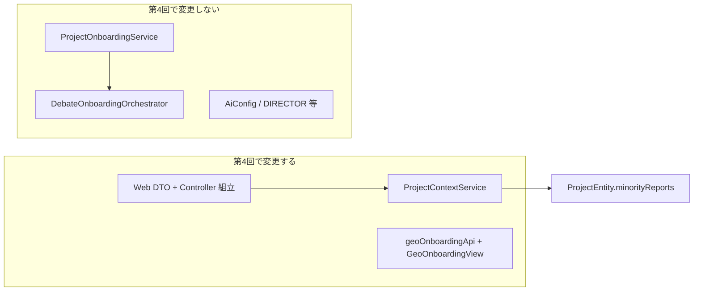

# 第4回: デュアル提示 UI と Web 層接合（計画）

## スコープの境界

- **変える**: `ProjectContextResponse` / `ProjectContextPatchRequest` / そのマッピングを担う `ProjectContextService` と、[`ProjectOnboardingController`](geo-analytics/src/main/java/com/geo/analytics/web/controller/ProjectOnboardingController.java) のリクエスト→コマンド組立。フロントの [`geoOnboardingApi.ts`](geo-analytics/frontend/src/api/geoOnboardingApi.ts) と [`GeoOnboardingView.tsx`](geo-analytics/frontend/src/pages/GeoOnboardingView.tsx)（必要なら分割コンポーネント新規）。
- **変えない**: [`DebateOnboardingOrchestrator`](geo-analytics/src/main/java/com/geo/analytics/application/service/DebateOnboardingOrchestrator.java)、[`ProjectOnboardingService`](geo-analytics/src/main/java/com/geo/analytics/application/service/ProjectOnboardingService.java) のオーケストレーション部分、第3回までの LLM/Bean/スキーマ／抽出パイプライン。理由: 本回は **API 入出力と表示・編集** に集中する。

**宣誓（設計上のコミットメント）**: 上記のとおり、第3回のオーケストレーションロジックには**手を入れない**。Web 層の拡張と `ProjectContextService` の read/write マッピング、およびフロントの表示・保存に限定する。

---

## 1. 修正・新規（バックエンド）ファイル一覧

| 種別 | パス | 内容 |
|------|------|------|
| 新規 | [geo-analytics/src/main/java/com/geo/analytics/web/dto/MinorityReportDto.java](geo-analytics/src/main/java/com/geo/analytics/web/dto/MinorityReportDto.java) | `insight` / `conflictReason` / `evidence`（Jackson は親と同様 `@JsonNaming(SnakeCaseStrategy)` で wire は snake_case。フィールド名は既存方針に合わせ **camelCase の record 形**＋JSON は snake_case でも可。現状 [`ProjectContextPatchRequest`](geo-analytics/src/main/java/com/geo/analytics/web/dto/ProjectContextPatchRequest.java) は record + `@JsonNaming`） |
| 改修 | [geo-analytics/src/main/java/com/geo/analytics/web/dto/ProjectContextResponse.java](geo-analytics/src/main/java/com/geo/analytics/web/dto/ProjectContextResponse.java) | `List<MinorityReportDto> minorityReports` を追加（GET 互換: 空配列可） |
| 改修 | [geo-analytics/src/main/java/com/geo/analytics/web/dto/ProjectContextPatchRequest.java](geo-analytics/src/main/java/com/geo/analytics/web/dto/ProjectContextPatchRequest.java) | `List<@Valid MinorityReportDto> minorityReports`（下記 Profit Guard） |
| 改修 | [geo-analytics/src/main/java/com/geo/analytics/application/command/UpdateProjectContextCommand.java](geo-analytics/src/main/java/com/geo/analytics/application/command/UpdateProjectContextCommand.java) | マイノリティ一覧を追加。**推奨**: `List<com.geo.analytics.domain.model.MinorityReport>`（`MinorityReportDto` は **Web 層のみ**、Controller で DTO→ドメイン変換してコマンドを組み立て、application から `web` への依存を避ける） |
| 改修 | [geo-analytics/src/main/java/com/geo/analytics/web/controller/ProjectOnboardingController.java](geo-analytics/src/main/java/com/geo/analytics/web/controller/ProjectOnboardingController.java) | `UpdateProjectContextCommand` 生成時に `minorityReports` をマッピング |
| 改修 | [geo-analytics/src/main/java/com/geo/analytics/application/service/ProjectContextService.java](geo-analytics/src/main/java/com/geo/analytics/application/service/ProjectContextService.java) | `toContextResponse`: `ProjectEntity.getMinorityReports()` → `List<MinorityReportDto>`。`patchContext`: コマンドのリストを `ProjectContextTextLimiter` で各文字列に適用のうえ `setMinorityReports`（[既存 1000 code points](geo-analytics/src/main/java/com/geo/analytics/application/service/ProjectContextTextLimiter.java) と `@Size(max=1000)` を揃える） |
| 任意 | グローバル `ControllerAdvice` 等 | 入れ子 `minorityReports[i].insight` のような `fields` キーでフロントが拾えるなら既存の [`parseApiErrorBody`](geo-analytics/frontend/src/api/geoOnboardingApi.ts) 拡張方針をメモ（実装時に確認） |

**Profit Guard（入力防衛）**

- 各 DTO 文字列: `@Size(max = 1000)`（[`ProjectContextPatchRequest`](geo-analytics/src/main/java/com/geo/analytics/web/dto/ProjectContextPatchRequest.md) の `extractedStrengths` / `targetAudience` と同水準）。`@NotNull` の要否は `minorityReports` 自体を `null` 禁止にするか「省略時は空リスト」にするかで決める（**推奨: 常に `List`、空は `[]`**）。
- リストの過剰行数: `@Size(max = N)` をリストに（例: **10 件**—[`ProjectEntity`](geo-analytics/src/main/java/com/geo/analytics/domain/entity/ProjectEntity.java) 側の想定とディレクター出力 1〜3 件に余裕を持たせる）。N は実装時に固定値でコミット。

---

## 2. フロント: 修正パスとコンポーネント案

| パス | 役割 |
|------|------|
| [geo-analytics/frontend/src/api/geoOnboardingApi.ts](geo-analytics/frontend/src/api/geoOnboardingApi.ts) | `ProjectContextData` に `minorityReports: { insight, conflictReason, evidence }[]` を追加。`asContextData` のパース、PATCH body に `minority_reports` 同型を送る。 |
| [geo-analytics/frontend/src/pages/GeoOnboardingView.tsx](geo-analytics/frontend/src/pages/GeoOnboardingView.tsx) | プレビュー領域を **2 セクション**に分割。既存の業種・強み・ターゲットを「盤石な合意案」ブロックにまとめ、下に「マイノリティ」ブロック。 |
| 新規（推奨） | `geo-analytics/frontend/src/components/geoOnboarding/ConsensusContextSection.tsx`（仮名） | 既存の FormControl / TextField / 保存ボタン上側の「合意」編集 UI を切り出し、読みやすさ維持。 |
| 新規（推奨） | `geo-analytics/frontend/src/components/geoOnboarding/MinorityTensionMapSection.tsx`（仮名） | テンション・マップ＋各カード。 |

**UI 設計案（テンション・マップ + デュアル）**

- **上段: 盤石な合意案 (Consensus)**  
  - 見出し + 短い補足テキスト（「事実根拠が重なった強み」など）。  
  - 既存と同じく業種セレクト、強み（複行）、ターゲット。視覚的に **穏当な枠**（例: 淡い枠・左アクセントバー `primary`）で「確定枠」感を出す。

- **下段: 破壊的マイノリティ・レポート**  
  - 見出し + 「参考・対立意見」的な補足。  
  - `map` で各要素を **カード**（MUI `Card` または `Paper` + `Stack`）に。カード内を **3 行ブロック**で対比:  
    - 左/上: **Insight** — アイコン 💡 ラベル「独自の強み」、本文。  
    - 中: **Conflict** — ⚠️ 「多数派の懸念 / 衝突理由」。  
    - 下: **Evidence** — 🔍 「根拠」。  
  - レイアウト案: 狭い幅では縦積み、余裕があれば insight | conflict の 2 カolumn（`Grid`）＋下に evidence 全幅、と「引っ張る張力」が伝わる配置。色は合意枠より **控えめな warning/chip** で差別化（アクセシビリティのため色だけに依存せずラベル必須）。

- **状態**: `useState<MinorityItem[]>` を抽出直後と保存後のレスポンスで同期。PATCH 時に `patchProjectContext` に同梱。フィールドエラー用に `FieldKey` を `minorityReports.0.insight` のようなキー拡張するか、最初は汎用 `message` のみ（実装時に `ControllerAdvice` の形式に合わせる）。

---

## 3. API 形の要約（実装時）

- **Response（POST / PATCH 共通）**: 既存キー + `minority_reports: [...]`（snake_case、サーバ側 `@JsonNaming` 前提）。  
- **Request（PATCH）**: 同上。フロントは既存通り手動 `snake_case` ボディ or 揃え方を `geoOnboardingApi` 内に一本化。  

---

## 4. テスト / 受け入れ（任意・軽量）

- バック: `ProjectContextService` のマッピングを **単体テスト** するか、最小限 **WebMvcTest** で PATCH の JSON 検証。  
- 手動: オンボーディング後に POST レスポンスに `minority_reports` が載ること、PATCH で編集反映されること。  

以上が第4回の実装方針である。
