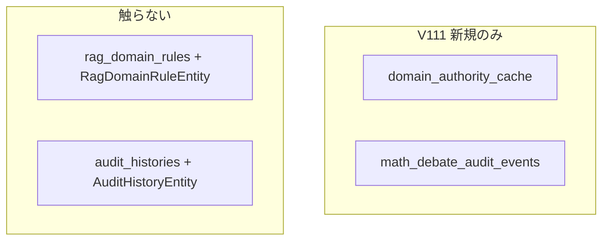

# フェーズ1.2 第1回: データの器（DB・Entity・Repository）計画

## 重要: 既存スキーマとの名前衝突

リポジトリには **既に** 次が存在します（[V1__init_schema.sql](geo-analytics/src/main/resources/db/migration/V1__init_schema.sql) / 既存 JPA）。

| 既存 | 役割 |
|------|------|
| テーブル `rag_domain_rules` | `host_suffix`, `rule_kind`, `trust_boost`, `active`（RAG 信頼ルール） |
| エンティティ [RagDomainRuleEntity](geo-analytics/src/main/java/com/geo/analytics/domain/entity/RagDomainRuleEntity.java) / [RagDomainRuleRepository](geo-analytics/src/main/java/com/geo/analytics/infrastructure/repository/RagDomainRuleRepository.java) | [DomainTrustService](geo-analytics/src/main/java/com/geo/analytics/application/service/DomainTrustService.java) 等で使用中 |
| テーブル `audit_histories` | ジョブ単位 GEO 監査（SoM、query、raw_response 等の固い列） |
| エンティティ [AuditHistoryEntity](geo-analytics/src/main/java/com/geo/analytics/domain/entity/AuditHistoryEntity.java) / [AuditHistoryRepository](geo-analytics/src/main/java/com/geo/analytics/infrastructure/repository/AuditHistoryRepository.java) | 本番フローで広く利用 |

そのため、要件の「`rag_domain_rules` / `audit_histories`」という**名前をそのまま**新規 V111 で再定義することは **不可**（既存データ・JPA マッピングを壊す）。

**本第1回の方針**: 要件の**概念**（ドメイン権威キャッシュ、WORM 風数値監査 JSON）を満たす **新しい物理テーブル名**と **新しい Entity / Repository 名**を採用する。既存4クラス（上表）は**参照のみ・改変しない**（第1回スコープ外で触れない）。

推奨する物理名（実装時に確定）:

- **ドメイン権威グローバルキャッシュ**: テーブル `domain_authority_cache`（一意キー: `domain`）
- **数理ディベート・収束用 WORM ログ**: テーブル `math_debate_audit_events`（`target_id` + `event_type` + `audit_data` + `created_at` のみ）

（別案: `debate_worm_events` 等。短く一意な snake_case を維持。）

---

## 1. Flyway: [V111__...sql](geo-analytics/src/main/resources/db/migration/)（新規）

- 前番号は [V110__add_minority_reports_to_projects.sql](geo-analytics/src/main/resources/db/migration/V110__add_minority_reports_to_projects.sql) のため、ファイル名は **`V111__...sql`**。

### 1.1 `domain_authority_cache`

- `id` UUID PRIMARY KEY（アプリは `@GeneratedValue(GenerationType.UUID)` に合わせ、INSERT 時に生成可）。
- `domain` TEXT または VARCHAR(…）**NOT NULL UNIQUE**（正規化方針: 小文字化は将来 Service 層; 第1回は列のみ）。
- `authority_tier` VARCHAR(32) NOT NULL（将来 Enum に対応; DB は文字列）。
- `created_at` TIMESTAMPTZ NOT NULL
- `updated_at` TIMESTAMPTZ NOT NULL
- 任意: 検索用 `CREATE INDEX`（`authority_tier` 等）は将来クエリに応じて追加可。第1回は UNIQUE(domain) 必須。

### 1.2 `math_debate_audit_events`（WORM 意図）

- `id` UUID PRIMARY KEY
- `target_id` UUID NOT NULL（注釈: 多くの場合 `projects.id` を指す想定; **第1回は FK を付けない**选择でマイグレーション依存を減らす。次ステップで FK 追加可。）
- `event_type` VARCHAR(64) NOT NULL
- `audit_data` JSONB NOT NULL
- `created_at` TIMESTAMPTZ NOT NULL（`updated_at` 列は**作らない**）
- インデックス: `(target_id, created_at)`（時系列走査用）

WORM の厳格な DB 層保証（UPDATE/DELETE 禁止トリガー）は**第1回では任意**。アプリ層の append-only は後続。必要なら計画メモに「V112 でトリガー」程度。

---

## 2. JPA Entity（新規2クラス、既存と別名）

**パス**: [geo-analytics/src/main/java/com/geo/analytics/domain/entity/](geo-analytics/src/main/java/com/geo/analytics/domain/entity/)

| 推奨クラス名 | `@Table` |
|-------------|----------|
| `DomainAuthorityCacheEntity` | `domain_authority_cache` |
| `MathDebateAuditEventEntity` | `math_debate_audit_events` |

- **グローバルキャッシュ**用テーブルに `tenant_id` は**付けない**（要件の「グローバル」に合致）。`BaseTenantEntity` は**継承しない**。
- **WORM テーブル**も要件に `tenant_id` なしのため、第1回は**継承なし**の独立 `@Entity`（必要なら後続で `tenant_id` 追加のマイグレーション可）。
- 共通: `@Id` UUID, `PrePersist` / `PreUpdate` で日時（`MathDebateAuditEventEntity` には `updated_at` を**持たせない**; `PreUpdate` は使わないか no-op。不変ログなら `created_at` だけ `PrePersist`）。

### JSONB: `audit_data`

[ProjectEntity](geo-analytics/src/main/java/com/geo/analytics/domain/entity/ProjectEntity.java) と同パターン:

- `@JdbcTypeCode(SqlTypes.JSON)`
- `@Column(name = "audit_data", nullable = false, columnDefinition = "jsonb")`
- Java 型は **汎用**に: `Map<String, Object>` または `JsonNode`（Jackson）— 数値/ネスト混在の監査向け。第1回は `Map<String, Object>` で十分（Hibernate 6 JSON マッピング）。

- **新規** [AuthorityTier](geo-analytics/src/main/java/com/geo/analytics/domain/enums/) 相当は任意: 列は文字列でもよく、`@Enumerated(STRING)` は Entity で `AuthorityTier` を定義した場合のみ。

---

## 3. Spring Data JPA Repository（新規2インターフェース）

**パス**: [geo-analytics/src/main/java/com/geo/analytics/infrastructure/repository/](geo-analytics/src/main/java/com/geo/analytics/infrastructure/repository/)

| インターフェース | 必須メソッド案（第1回の最小） |
|------------------|--------------------------------|
| `DomainAuthorityCacheRepository` | `JpaRepository<DomainAuthorityCacheEntity, UUID>`、追加で `Optional<DomainAuthorityCacheEntity> findByDomain(String domain)`（一意キー用） |
| `MathDebateAuditEventRepository` | `JpaRepository<MathDebateAuditEventEntity, UUID>`、追加で `List<...> findByTargetIdOrderByCreatedAtAsc(UUID targetId)`（走査用） |

カスタム `@Query` や仕様 API は**書かない**（Service が無いため）。

---

## 4. 厳守スコープ（第1回）

- **書かない**: すべての `*Service`、`*Controller`、数式・KS・収束ロジック、既存 `ProjectOnboardingService` / `DebateOnboardingOrchestrator` への接続。
- **触らない**（上記衝突のため）: 既存 `RagDomainRuleEntity`、`AuditHistoryEntity`、既存2 Repository、V1 由来の2テーブル定義の**置き換え**。

---

## 5. 実装後の確認（エージェント作業用チェックリスト）

- `./mvnw -q compile -DskipTests` が通る
- Flyway: 新規 V111 のみが追加され、既存 V1 テーブル名と重複しない
- 新 Entity の JSON 列が起動時メタデータで問題にならない（`SqlTypes.JSON` + `jsonb`）

---

## 6. ユーザー合意が必要な一点（短く）

既存名と**別テーブル・別エンティティ名**で進める点のみ、プロダクト名の最終採択（`domain_authority_cache` / `MathDebateAuditEventEntity` 等）を副操縦士レビューで確定すればよい。
