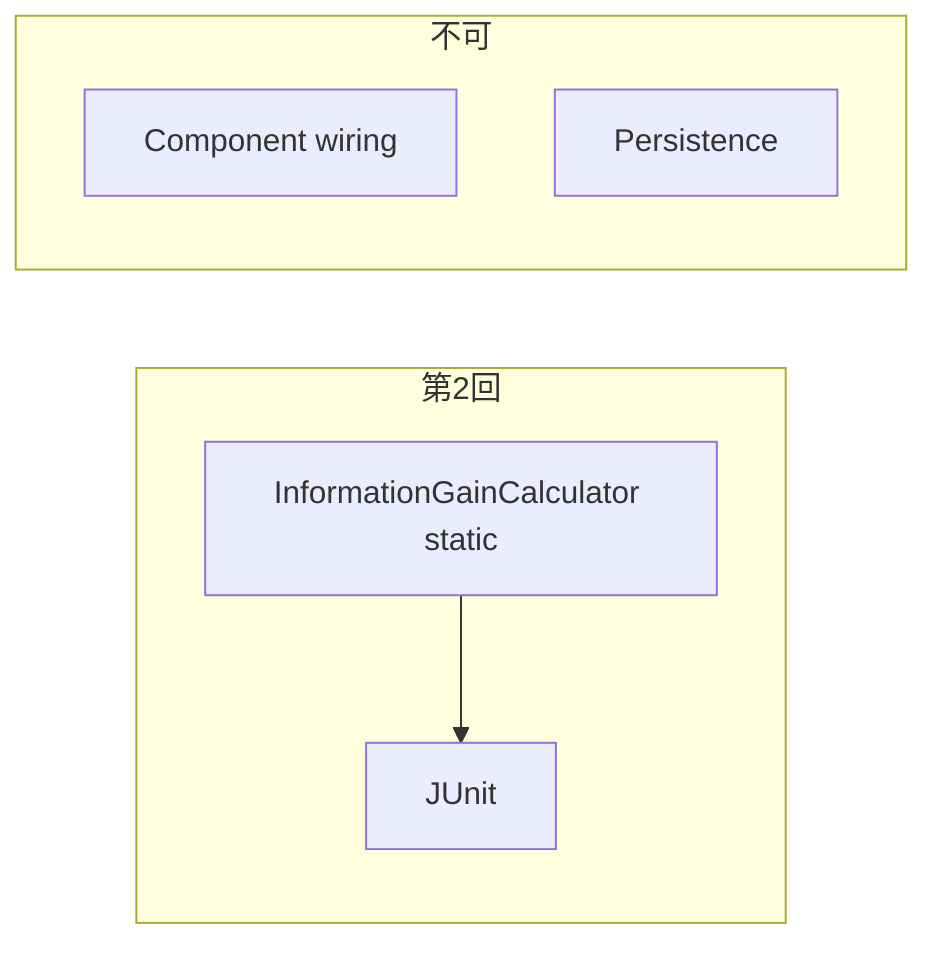

# フェーズ1.2 第2回: 数理カーネル①（情報利得）— 改訂計画

## 0. スコープ境界

- **行う**: [geo-analytics/src/main/java/com/geo/analytics/domain/logic/InformationGainCalculator.java](geo-analytics/src/main/java/com/geo/analytics/domain/logic/InformationGainCalculator.java)（**純粋 `static` メソッド群**、コンストラクタ `private` または `final` ユーティリティ）。単体テスト（`src/test/.../domain/logic/`）。
- **行わない**: Spring Bean 化、Repository、第1回の WORM テーブル書き込み、既存 [InformationTheoryBasedAggregator](geo-analytics/src/main/java/com/geo/analytics/domain/service/InformationTheoryBasedAggregator.java) への**配線**。

---

## 1. クラス配置（回答フォーマット 1の確認）

| 項目 | 内容 |
|------|------|
| **パス** | [geo-analytics/src/main/java/com/geo/analytics/domain/logic/InformationGainCalculator.java](geo-analytics/src/main/java/com/geo/analytics/domain/logic/InformationGainCalculator.java) |
| **性質** | `public final` クラス + `private` コンストラクタ。公開 API はすべて `static`。依存は JDK のみ（`java.lang.StrictMath` 等）。 |
| **テスト** | 例: `geo-analytics/src/test/java/com/geo/analytics/domain/logic/InformationGainCalculatorTest.java` |

※ 既存 [EntropyMetricsCalculator](geo-analytics/src/main/java/com/geo/analytics/domain/metrics/EntropyMetricsCalculator.java) は `domain/metrics` のまま。本件は**別パッケージ** `domain/logic` で数理カーネルを集約する。

---

## 2. 三つの防衛線に基づくアルゴリズム案（回答フォーマット 2）

### 防衛線1: ネイティブ `StrictMath.log` / `StrictMath.exp`、テイラー厳禁

- **禁止**: 自作 `fastLn`、ミニマックス多項式、Horner による `log` 近似、テイラー展開の `log`。
- **必須**: すべての自然対数は `StrictMath.log`。指数は `StrictMath.exp`（事実密度のスカシュング用）。
- **`StrictMath.fma` の用途**: 防衛線どおり、**乗和のまとまり**（例: 加重和の一項 `fma(weight, value, acc)`、または検証用の厳密な加算）**のみ**。`log` 近似の Horner 連鎖には**使わない**。

**内部ヘルパ（例、設計上の定義）**

- `log2(x) = StrictMath.log(x) / StrictMath.log(2.0)`（定数 `LN2` を `static final` で共有）: JSD を **0〜1 ビット**の標準的な上界に揃えるため、KL の各項の対数に **底 2** を一貫して用いる（下記 JSD 参照）。実装は `log` 呼び出し回数削減のため `log(x) * (1.0 / LN2)` でも可。

### 防衛線2: JSD（Jensen–Shannon）のみ、KL の単体エクスポートはしない

- **方針**: 市場分布 \(P_{\text{market}}\) と自社 \(P_{\text{site}}\)（同一次元・同一インデックス順）に対し、**中間分布** \(M_i = \frac{1}{2}(P_{\text{site},i} + P_{\text{market},i})\)。
- **JSD**（自然対数版の定式は上限が nats なので、**ビット**で一貫させる版を推奨）:

\[
\mathrm{JSD}(P_{\text{site}}, P_{\text{market}}) = \frac{1}{2} D_{\mathrm{KL}}^{(2)}(P_{\text{site}} \Vert M) + \frac{1}{2} D_{\mathrm{KL}}^{(2)}(P_{\text{market}} \Vert M)
\]

ここで \(D_{\mathrm{KL}}^{(2)}(P\Vert Q) = \sum_i P_i \bigl(\log_2 P_i - \log_2 Q_i\bigr)\)（0・log 0 は下記のスムージングで回避）。

- **ゼロ除算 / 発散の回避**: 各分布に**同一の** Laplace 風擬似カウント \(\varepsilon\)、または [RobustAuditMathUtil.EPSILON](geo-analytics/src/main/java/com/geo/analytics/domain/matching/RobustAuditMathUtil.java) スケールの小さな床を足して**再正規化**（\(P, Q, M\) すべて一貫した手順を Javadoc に固定）。\(P_i=0\) の項は 0 寄与として省くか、\(\varepsilon\) 付きの一本化を選ぶ（実装一つに固定）。
- **戻り値域**: 上記 log2 版 JSD は有限アルファベット上で **\([0, 1]\)**（ビット）内に収まる。超過時の数値害は `Double.isFinite` チェックで安全側 `0.0` 等へ**契約**明記可。

- **API**: 例として `static double jensenShannonDivergenceBits(double[] pSite, double[] pMarket)`。**単体の KL のみを返す public メソッドは置かない**（内部 `private` の KL-項計算可）。

### 防衛線3: 事実密度のスカシュング + GEO-IG

- **スカシュング**（\(\gamma = 0.1\) を `static final double DENSITY_SQUASH_GAMMA`）:

\[
S_{\text{norm}} = 1.0 - \mathrm{StrictMath.exp}(-\gamma \cdot S_{\text{density}})
\]

- \(S_{\text{density}} \ge 0\) を前提。負の入力は Javadoc で「事前に 0 クランプ」等を指定。
- **最終**（本ロールアウトの指定式、ロジスティック不要）:

\[
\mathrm{GEO\_IG} = Q_{\text{intent}} \cdot S_{\text{norm}} \cdot \mathrm{JSD}
\]

- \(Q_{\text{intent}} \in [0,1]\) 等は呼び出し側、または `static` 内で `min(1, max(0, q))` へクランプ方針を Javadoc 化。

---

## 3. 回答フォーマット 3: 方針の確認（宣誓用文言）

- **本設計は、対数の多項式 / テイラー近似（自作 `fastLn`）を採用しない。**
- **対数・指数は `StrictMath.log` / `StrictMath.exp` のみ。**
- **`StrictMath.fma` は乗和の安定化用に限り使用し、log 近似には使わない。**
- **本クラスは Spring・DB・外部 I/O を持たない純粋な static 数式ルーチンのみを実装範囲とする。**

（実装段階で副操縦士検疫にそのまま貼付可能。）

---

## 4. テスト方針（実装時）

- \(P_{\text{site}} = P_{\text{market}}\) のとき JSD = 0（数値誤差内）。
- 既知の 2 点/3 点分布で JSD の手計算（または `BigDecimal` 参照）と照合 1 本以上。
- \(S_{\text{norm}}\): \(\gamma>0\) で単調、極大で 1 未満（漸近）のスモーク。
- 同一引数再実行でビット等価（決定論）。

---

## 5. 旧版計画からの**明示的廃止**

- ミニマックス `LOG_POLY_COEFFS` + Horner + `fastLn` の記述は**無効**。
- `StrictMath.pow(S, 1.2)` および**ロジスティック**による GEO-IG 最終 0..1 化の記述は**無効**（本改訂では上記 3 防衛線の式に置換）。
