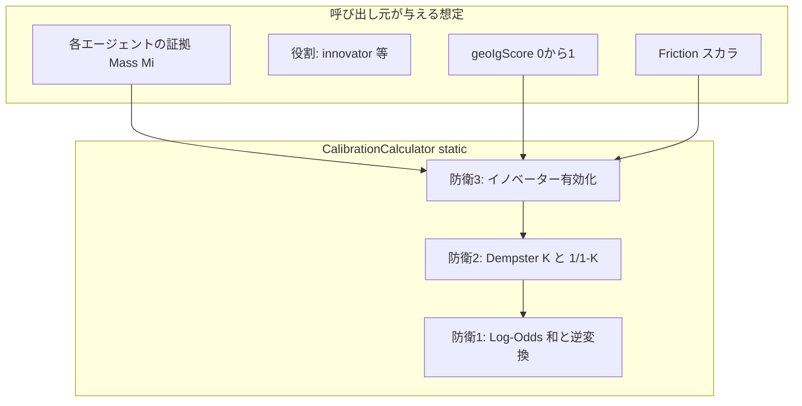

# フェーズ1.2 第3回: 数理カーネル②（較正重み付け）計画

## 1. 配置と境界

| 項目 | 内容 |
|------|------|
| クラス | [geo-analytics/src/main/java/com/geo/analytics/domain/logic/CalibrationCalculator.java](geo-analytics/src/main/java/com/geo/analytics/domain/logic/CalibrationCalculator.java) |
| 性質 | `public final` + `private` コンストラクタ、**公開 API はすべて `static`**。**Spring / DB / 既存 Service に依存しない**（`java.lang` と第2回計算器の **静的呼び出しのみ** 可: `InformationGainCalculator.geoInformationGain` 等を**引数で受け取る**形が望ましい。第3回クラス内から第2回を**必須 import する**かは任意; `double geoIgScore` を呼び出し元が渡す方が依存が最小。 |
| テスト | 例: `src/test/java/com/geo/analytics/domain/logic/CalibrationCalculatorTest.java`（実装は別タスク） |

---

## 2. 三つの防衛線と統合アルゴリズム案

**前提（フレーム）**: 各エージェント \(i\) は二元仮説 \(H\)（信じる主張）に対する**単一信頼度** \(M_i \in (0,1)\) を持つ（D-S では通常 \(m_i(H) + m_i(\neg H) = 1\)、無知化質量を別枠にする拡張は任意）。`M` は [`RobustAuditMathUtil.EPSILON`](geo-analytics/src/main/java/com/geo/analytics/domain/matching/RobustAuditMathUtil.java) 相当のクランプ区間 \((\varepsilon, 1-\varepsilon)\) に事前マッピングし、`log` の定義域を保証する。

### 防衛線3（先に設計: 以降の \(M_i\) を「有効信頼度」にする）

- **目的**: イノベーター（少数意見）に対し、**固定加算**は禁止; **摩擦 \(F\)**（例: 他エージェントとの不整合度、0〜1）と **GEO-IG スコア** \(G \in [0,1]\) のみでブースト。
- **式の例**（実装で確定; 採択基準: \(F\) と \(G\) の両方が大きいときだけ増幅）:

  - ブースト係数（例）:  
    \[
    \beta = \phi(F) \cdot \psi(G), \quad \phi(F)=F^2 \text{ または } \max(0, F - \tau) \text{ 等};\quad
    \psi(G)=G
    \]
  - イノベーターのみ:  
    \[
    M_i' = \text{clip}\bigl( M_i + \beta \cdot (1 - M_i) \cdot M_i \bigr)
    \]
    または **`logit` 空間**で加算: \(\text{logit}(M_i') = \text{logit}(M_i) + \eta \beta\)（\(\eta\) はスケール定数）。非イノベーターは \(M_i' = M_i\)。

- **入出力 API 案**:  
  `static double calibratedBelief( double[] agentMass, boolean[] isInnovator, double friction, double geoIgScore )` など、**摩擦はスカラ 1 本**（全員共通の「議論の熱量」）か **エージェントごと**かは仕様化（プラン推奨: まず **共通摩擦** 1 本で可換性の説明を簡潔にし、拡張は配列可）。

### 防衛線2: Dempster 正規化（衝突 \(K\)）

- 二元枠 **のみ** かつ 各ソースが \((m(H), m(\neg H))\) のペアのとき、2 源のデンプスター合成で  
  衝突度 \(K = \sum m_1(A)m_2(B)\)（交差 \(A \cap B = \emptyset\)）。  
  正規化後: \(m_{12}(C) = \frac{1}{1-K} \sum m_1(A)m_2(B)\)（古典式）。
- **複数源**: 上記を**ペア同士に結合可能**（演算子は結合的だが**結合順は結果に影響しない**のは同一フレーム上の一貫法則の下）。**実装の推奨**: 定めた **順列非依存**の順（例: 添字昇順）で**左畳み**するか、**二分木畳み**で中間 \(K\) を蓄積—いずれも**同一実装内で一定**なら決定論的。ここに「**順序に依存する naive 和**」を置かない。
- 各ソースの入力は上記 **\(M_i'\)** から作る: \(m_i(H) = M_i'\), \(m_i(\neg H) = 1 - M_i'\)（無知化が無い簡易モデル）。**\(K \to 1\)** 近傍は数値災難: `K` を `1 - ε` 未満にクリップ、または `Double.isFinite` 検査で**安全棄却**方針を Javadoc 化。

### 防衛線1: Log-Odds（logit）集約の可換性

- 定義（要件どおり; 全て `StrictMath`）:  
  \[
  \ell(M) = \text{logit}(M) = \ln\frac{M}{1-M}
  \]
- **朴素な累積**（可換）:  
  \[
  L = \sum_i \ell(M_i'')
  \]
  ここで \(M_i''\) は **Dempster 合成前の**「較正済み信頼度」とするか、**Dempster 合成後の単一信念** `m_*(H)` 1 個に対し \(\ell(m_*(H))\) のみを取るか、**二段パイプ**で役割を分ける必要がある（下記 **統合方針**）。

**Dempster と logit の併用の明文化（設計上の合意点）**

- 素朴な**logit の和**は**独立事後の乗法モデル**に対応し、Dempster の**積＋1/(1-K)** は**別の**結合則。両立のため、本計画は次の **ハイブリッド** を推奨する（副操縦士レビュー用の一文）:

  1. **Stage A**: 防衛3で \(M_i \to M_i'\)。  
  2. **Stage B**: 防衛2で \(M_i'\) から BPA を構成し、**全エージェント**について **逐次 Dempster** で \(m^*(H)\), \(K_{\text{tot}}\) を得る。  
  3. **Stage C（防衛1）**: 可換な「証拠の足し上げ」は **各エージェントの分岐 logit** を用い、  
     \[
     L_{\text{sum}} = \sum_i \ell(M_i') \quad \text{（Dempster 前）}
     \]
     一方、**衝突ペナルティ**を可換形で加える:  
     \[
     L = L_{\text{sum}} + \lambda \ln\bigl(1 - K_{\text{tot}}\bigr)
     \]
    （\(\lambda\) は負: 衝突が大きいほど確率を下げる; \(K\) は上で計算。`\ln` は `StrictMath.log`）。  
  4. **Stage D**: 最終信念  
     \[
     P = \sigma(L) = \frac{1}{1 + \exp(-L)}
     \]
     または**単一**信念として **Stage B の** \(m^*(H)\) と **logit-混合**の加重平均（どちらを主とするかは実装タスクで一つに定める）:

     - **推奨一貫案**: 最終 `P` は **`sigmoid(L)`** に**クリップ**し、Stage B の \(m^*(H)\) を**参照値**として整合チェック用テストに使う; 主経路は **logit 和 + 衝突項**（可換性を満足）。

- 代替（シンプル案）: Dempster のみで \(m^*(H)\) を出し、**最後**に 1 回 \(\ell(m^*(H))\) だけ（和は取らない）—この場合、防衛1の「**和**」要件は**較正前**の \(\sum \ell(M_i')\) を**監査用**に併記する。要件文言が「sum 必須」なら上記ハイブリッドを採用する。

---

## 3. 第2回 [InformationGainCalculator](geo-analytics/src/main/java/com/geo/analytics/domain/logic/InformationGainCalculator.java) との接続

- `geoIgScore` は **`geoInformationGain(...)` の戻り**、または同ファイルの中間量を呼び出し元が**計算して引数に渡す**形とする。`CalibrationCalculator` 内で Spring を使わない。
- 対数はすべて **`StrictMath.log` / `StrictMath.exp`**（シグモイド）、第2回と同じ数値安全の精神。

---

## 4. 回答フォーマット 3: 宣誓文（プラン上の合意事項）

- 較正・統合ロジックは **評価順序に依存しない** 形（**logit 和、対称な \(K\) 項、Dempster の固定畳み込み手順**）を設計し、**固定ボーナス**でイノベーターを上げない。  
- **純粋 Math 層**として **DI/DB 非依存**の `static` API に集約する。

---

## 5. テスト方針（実装タスク用メモ）

- **可換性**: エージェント配列の**順序入れ替え**で、同一パラメータなら最終 `P` のビット等価。  
- **衝突**: あえて衝突が大きい BPA 例で `K<1` の正規化・クリップ。  
- **防衛3**: 同一 `G` かつ**摩擦低**のときイノベーター上げが**抑制**、摩擦と `G` 両大でみ**増分**。  
- **定義域**: `M` 近傍 0/1、\(K\approx 1\)。

---

## 6. 本プランの留保

- 完全な Dempster–Shafer（無知枠付き3直和集合）はスコープ外可能; 本回は**二元仮説＋Dempster K**＋**logit 可換和**の**最小整合セット**に留める。拡張は次段。
