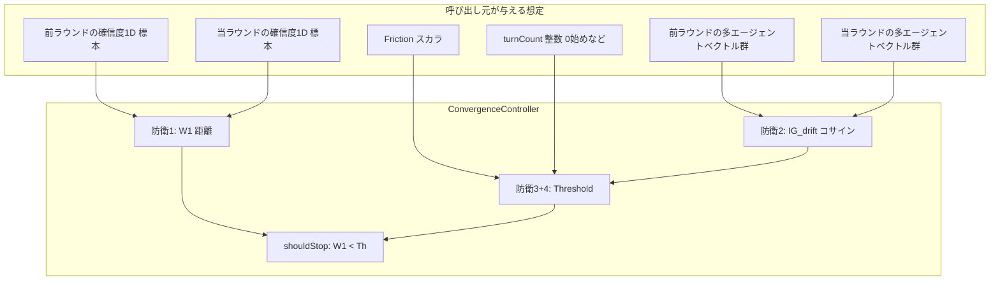

# フェーズ1.2 第4回: 数理カーネル③（適応的安定性）計画

## 1. 配置とスコープ

| 項目 | 内容 |
|------|------|
| クラス | [geo-analytics/src/main/java/com/geo/analytics/domain/logic/ConvergenceController.java](geo-analytics/src/main/java/com/geo/analytics/domain/logic/ConvergenceController.java) |
| 性質 | `public final` + `private` コンストラクタ、**static のみ**。`java.lang`（`StrictMath`、必要なら `java.util` で配列**コピー**後の `Arrays.copyOf` + `Arrays.sort`）— **Spring / DB 禁止**。 |
| テスト（別タスク） | 例: `src/test/java/com/geo/analytics/domain/logic/ConvergenceControllerTest.java` |

既存の [InformationGainCalculator](geo-analytics/src/main/java/com/geo/analytics/domain/logic/InformationGainCalculator.java) / [CalibrationCalculator](geo-analytics/src/main/java/com/geo/analytics/domain/logic/CalibrationCalculator.java) と同層の **純粋数式カーネル**として扱う。

---

## 2. 防衛線1: 1 次元 Wasserstein-1（EMD 特例、KS 禁止）

**対象**: 直前と現在の **同一エージェント数** $n$（例: 4）の 1 次元確信度サンプル $P = (p_1,\ldots,p_n)$, $Q = (q_1,\ldots,q_n)$。エージェント $i$ 同士の対応は**ラベル不変**; 最適輸送は 1D で **順序統計量同士**の対応が最適。

**手順**（$O(n\log n)$: ソートが支配）:

1. $P$、$Q$ の**作業用コピー**を作り、それぞれ昇順にソート（`Arrays.sort` 等）。入力は**非破壊**。
2. **経験的 Wasserstein-1**（等重み質量 $1/n$ 各点）:  
   \[
   W_1 = \frac{1}{n} \sum_{i=1}^{n} \bigl| P^{(\text{sort})}_i - Q^{(\text{sort})}_i \bigr|
   \]
3. 実装方針: 絶対値は `StrictMath.abs`；除算 `1.0/n` も可。

**$n$ が異なる場合**（将来拡張、第4回は任意）: 一般の 1D 等間隔/エンピリカルは **二つの CDF の $L^1$ 距離**（区間上の積分）に帰着。分岐点列にマージして \(|F-G|\) の区間和 — $O((n+m)\log(n+m))$。**第4回の最小範囲**は **$n$ 一致**のみを public API の契約にして、不一致は `IllegalArgumentException` か別メソッドに分ける。

**KS 検定**は**実装しない**（設計文書に明示禁止）。

---

## 3. 防衛線2: Cosine Drift（Jaccard 禁止）

- **禁止**: 離散タグ集合上の Jaccard。
- **入力**: 前ラウンドのエージェントごとの連続ベクトル $\{u_a\}_{a=1}^{A} \subset \mathbb{R}^D$、当ラウンドの $\{v_a\}$（同形）。  
  **中心**:  
  \[
  c^{prev} = \frac{1}{A}\sum_a u_a,\quad c^{curr} = \frac{1}{A}\sum_a v_a
  \]
  （呼び出し元が**既に中心だけ**を渡すオーバーロードを許可してもよい。）
- **コサイン類似度**（Javadoc でゼロベクトル契約）:  
  \[
  \text{sim} = \frac{c^{prev} \cdot c^{curr}}{\lVert c^{prev}\rVert\,\lVert c^{curr}\rVert + \eta}
  \]
  $\eta$ は**床**（例: `1e-9`、防衛3 と別名でも可）で**ゼロ除算回避**。$\text{sim}$ を $[-1,1]$ にクランプ。
- \[
  IG_{drift} = 1.0 - \text{sim}
  \]
- ノルムは `StrictMath.sqrt` と内積用の素朴な和（FMA 近似の `exp` 禁止は**指数だけ**; 内積の `fma` 加算は [CalibrationCalculator](geo-analytics/src/main/java/com/geo/analytics/domain/logic/CalibrationCalculator.java) 方針と同様、可）。

---

## 4. 防衛線3: 有界な摩擦项

- 分母は**絶対に** `1.0/Friction` にしない。  
- 参考式どおり:  
  \[
  \text{Th}_{friction} = \frac{1}{Friction + \epsilon}
  \]
  $\epsilon$ は正の**公開定数**（例: `0.1` あるいは [CalibrationCalculator.MASS_EPSILON](geo-analytics/src/main/java/com/geo/analytics/domain/logic/CalibrationCalculator.java) より大きく、**意図通り有界**に保つ。`Friction \in [0,1]` を推奨し、Javadoc 化。

---

## 5. 防衛線4: ターン圧力は `StrictMath.exp` のみ

- ターンペナルティ:  
  \[
  p_{turn} = \mathrm{StrictMath.exp}(-\lambda \cdot \text{turnCount})
  \]
- $\lambda > 0$ は `TURN_LAMBDA` 等。`turnCount` は非負整数化（負は 0 扱い等を契約）。**指数の fma 多項式近似は禁止**。

---

## 6. 停止閾値と `shouldStop` 全体

**参考式**（定数をクラス内で固定; 名は `BASE_ALPHA`, `TURN_LAMBDA`, `FRICTION_OFFSET` 等）:

\[
Threshold = \text{BaseAlpha} \cdot (1.0 + IG_{drift}) \cdot \exp(-\lambda \cdot \text{turnCount}) \cdot \frac{1.0}{Friction + \epsilon}
\]

**判定**（参考どおり; 不変量はプロダクト定義に合わせ微調整可）:

- `wasserstein1D(...)` または内部で上記 $W_1$ を返す
- `shouldStop(prevConfidences, currConfidences, prevAgentMatrix, currAgentMatrix, friction, turnCount) -> boolean` のような **単一窓口**、または**分解メソッド** + 1 行の**統合** static だけ公開、を実装者が選定。

- **戻り値**: $W_1 < Threshold$ なら `true`（停止）。  
- 非有限 `W_1` / `Threshold` は**停止しない** or **保守的に停止**—どちらかを Javadoc の安全契約で一つに決める（推奨: 非有限なら `false` + 呼び出し側ログは範囲外）。

---

## 7. 回答フォーマット 3（宣誓用）

- KS 検定、テイラー展開に基づく**自作指数/対数**は用いない。  
- 指数は `StrictMath.exp` のみ（ターンペナルティ）。  
- 1D 距離は**ソート＋$L^1$ 差の平均**として Wasserstein-1（EMD 相当）に限定し、**Jaccard は使わない**。  
- **純粋 static 数式**; Spring / DB / Repository に依存しない。

---

## 8. 実装タスク用チェックリスト（本プランのあと）

- 等長 1D 標本 + 2 つの **$A \times D$ 行列**（あるいは中心ベクトル直渡し）のバリデーション。  
- 単体テスト: 同一分布 $P=Q$ なら $W_1=0$；極端にずれた 2 分布で $W_1$ 上昇; $Friction=0$ でも分母有限; `turn` 増で閾値低下; 中心が平行なら $IG_{drift}=0$ 付近。  
- `mvnw test -Dtest=ConvergenceControllerTest`（次チケット）。
