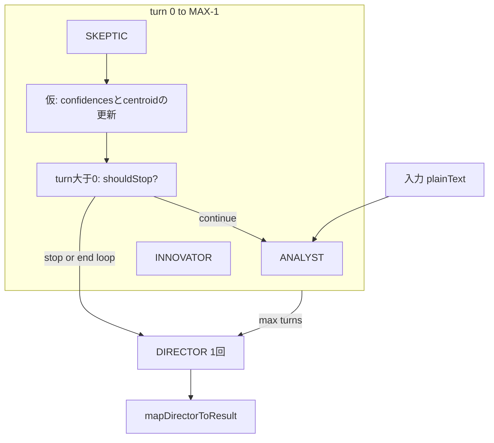

# フェーズ1.2 第6回: オーケストレーターへの動的ループ組み込み（計画のみ）

## 1. 改修対象クラス

| 役割 | パス |
|------|------|
| **主** | [geo-analytics/src/main/java/com/geo/analytics/application/service/DebateOnboardingOrchestrator.java](geo-analytics/src/main/java/com/geo/analytics/application/service/DebateOnboardingOrchestrator.java) |
| 参照（変更しない） | [geo-analytics/src/main/java/com/geo/analytics/domain/logic/ConvergenceController.java](geo-analytics/src/main/java/com/geo/analytics/domain/logic/ConvergenceController.java)（`shouldStop` 呼び出しのみ想定） |
| 必要に応じて定数化 | 同一パッケージまたは `domain/logic` に `MAX_DEBATE_TURNS` を置く**選択可**（実装で確定） |

[ProjectOnboardingService](geo-analytics/src/main/java/com/geo/analytics/application/service/ProjectOnboardingService.java) の**インフラ防衛**（`StructuredTaskScope` / クレジット等）は**触らない**方針を継続（従来指示どおり外縁のまま `runDebateOnboarding(plain)` の契約を維持）。

---

## 2. 現状フローと目標差分

現状: `runDebateOnboarding` は **1 回**、ANALYST → INNOVATOR → SKEPTIC → DIRECTOR の直列 1 パス（[L48–L75](geo-analytics/src/main/java/com/geo/analytics/application/service/DebateOnboardingOrchestrator.java) 付近）。

**第6回の目標**: 同一メソッド内で、**A/N/S を `MAX_TURNS` 回上限で繰り返し**、各ラウンド末に**収束**を見にいく。DIRECTOR（JSON 最終化）は**ループ外で 1 回**、または「打ち切り直後 1 回」に集約（**D を毎ターン呼ばない**ことで**課金爆発**を防ぐ; 本計画の前提）。



---

## 3. 三つの防衛線（オーケストレーション）

### 防衛線1: 絶対ハードリミット

- `while (true)` および「`shouldStop` が true になるまで**のみ**待つ」ループ**禁止**。
- 唯一許容:  
  `for (int turn = 0; turn < MAX_TURNS; turn++) { ... }`  
  例: `MAX_TURNS = 5`（`private static final int` または `AppProperties` 拡張は**任意**; 第6回は定数で十分）。
- `shouldStop` が常に `false` でも、**高々 `MAX_TURNS` 回**の A/N/S ペアのみ消費。

### 防衛線2: 状態の引き継ぎ

- **ループ外**（メソッド先頭直後、または専用 `record DebateState` ローカル変数）に保持:
  - `double[] prevConfidences`（長さ 4: ANALYST / INNOVATOR / SKEPTIC / 予備 または「第4 スロットの意味」を Javadoc 固定）
  - `double[] prevCentroid`（次元 `D` 固定: 第4回同様、呼び出し元計算; **本ステップ**では「プレースホルダー中心」でも可）
- **初回 `turn == 0`**:
  - `ConvergenceController.shouldStop` **を呼ばない**（比較対象なし）。
  - 1 回目の A/N/S 終了後、**現ラウンド**から `currConfidences` / `currCentroid` を算出し、`prev*` に**コピー**して次ターンへ。
- **`turn >= 1`**: 現ラウンドの `curr*` を計算 → `shouldStop(prev, curr, prevCentroid, currCentroid, friction, turn)` → 早期終了なら **break**。終了しなければ `prev* <- curr*`（**配列の防衛的コピー** `Arrays.copyOf` 推奨）。

### 防衛線3: 摩擦（Friction）

- **本回**: 次の**いずれか 1 本**に固定（Javadoc 明記）:
  - **A**: 定数 `0.5`（ユーザー例どおり）を `shouldStop` に渡す。
  - **B**（推奨の軽量案）: 4 本の `currConfidences`（または 4 エージェントの内部スコア配列）の**標本分散** `Var` を `[0,1]` に**単調正規化**（例: `friction = min(1, Var * scale)`）し、定数 0.5 にフォールバックできない**非ゼロ**を保証（`+ 1e-9` 等は [ConvergenceController](geo-analytics/src/main/java/com/geo/analytics/domain/logic/ConvergenceController.java) 側 `FRICTION_OFFSET` との二重定義に注意; **分母用ではなく**引数 `friction` 用の有限値にとどめる）。

- **未接合**: 第2回 `InformationGainCalculator` / 第3回 `CalibrationCalculator` への**本配線**は**必須ではない**（第7回以降）。第6回は `ConvergenceController` への**有界** `friction` だけ満足すればよい。

### 3.1 補足: 「確信度配列」および「中心点」のプレースホルダー

- 本オーケストレーターは今、エージェント毎の**数値信頼度**を**出力していない**。第6回は**同じ 4 要素配列**を**決定論的**に埋める専用 `private` メソッド（例: テキスト長・ハッシュ正規化の**ベタ実装**、あるいは一定 `[0.25,0.25,0.25,0.25]`）を置き、**第7回**で**意味のある**スコアに置換可能な**注入点 1 箇所**に集約する。
- **中心点**は、当面 **同一次元の固定ベクトル**（例: 3 次元のゼロ）または「3 本の要約数値化」のスタブ; **初回**は `prev` と `curr` を同一手続きにすると `shouldStop` の比較が**あり得る**ため、`turn==0` で **shouldStop スキップ**が必須。

---

## 4. ループ擬似コード（要点）

```text
prevConf := null, prevCenter := null
analyst, innovator, skeptic の累積文字列（または最終回だけ）を格納する変数を初期化

for turn in 0 .. MAX_TURNS-1
  実行: ANALYST / INNOVATOR / SKEPTIC（既存の chatDebate / singleChat 流儀に合わせる）
  currConf, currCenter := buildPlaceholderConfidencesAndCentroid(...)
  if turn > 0
     if shouldStop(prevConf, currConf, prevCenter, currCenter, friction, turn)
         break
  prevConf := copy(currConf)
  prevCenter := copy(currCenter)
end for

# 1 回だけ DIRECTOR: 上記最終回の A/N/S ログを directorInput に渡す
# （ループ中の中間文面を**どう連結**するかは Javadoc: 最終 1 スナップショット vs 全ラウンド付記; 本計画は「最終 A/N/S」最小で可）
return mapDirectorToResult(directorRawJson)
```

- **打ち切り**時も DIRECTOR 1 回（プロンプト**文言変更なし**）で、既存 `mapDirectorToResult` へ**同一契約**。

---

## 5. 本ラウンド**やらない**こと（宣誓用）

- **リサーチ・プロダクト**が承認するまで、**DIRECTOR システムプロンプト**の改訂、**DIRECTOR スキーマ**変更なし。  
- **第1回 WORM テーブル**（[MathDebateAuditEventEntity](geo-analytics/src/main/java/com/geo/analytics/domain/entity/MathDebateAuditEventEntity.java) 等）への**永続化**は行わない。  
- **無限ループ禁止**: **`MAX_TURNS` 付き for** のみ; `shouldStop` に**完全依存**しない。

---

## 6. テスト方針（次タスク）

- **ユニット**: オーケストレーターに**モック** `ChatLanguageModel` を差し、ループ回数と `ConvergenceController` 呼び出し回数（`turn>0` 時）を**検証**（オプション: `ConvergenceController` をスパイ/ラップ困難なら、プレースホルダーで**第 2 ターン**で常に `shouldStop`  true を返すスタブ**は**作らず、**統合**で `MAX_TURNS` 打ち切りだけ確認しても可）。  
- 既存 [DebateOnboardingOrchestrator](geo-analytics/src/main/java/com/geo/analytics/application/service/DebateOnboardingOrchestrator.java) テストが無い場合は**新規**。

---

## 7. リスク / オープン（実装前レビュー用）

- **ループ中の SKEPTIC 入力**: 2 週目以降、**同一 `wrapped` のみ**でよいか、**前ラウンド A/N 本文を追記**するかは**振る舞い**の分岐; 本計画は「**従来と同スキーマ**で、累積は文字列連結**のみ**可」とし、**プロンプト本文の意味的合意**は第7回に譲る。  
- **最大 API 回数**上限: 概算 `MAX_TURNS * 3`（A+N+S）+ 1（D）; ドキュメントに明記。
