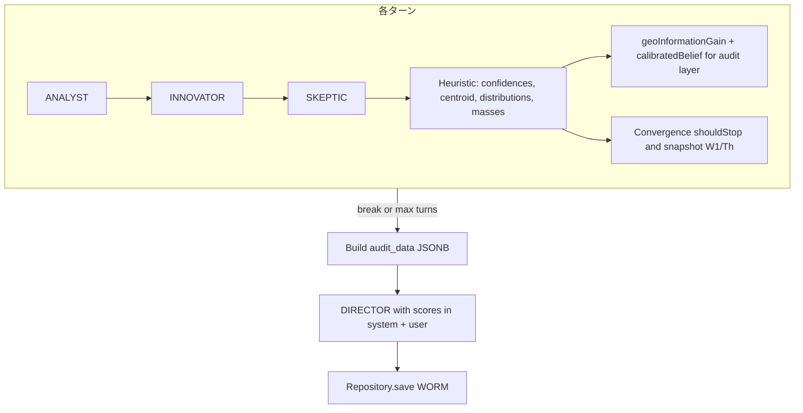

# フェーズ1.2 第7回：ディレクターへのスコア注入と最終結合（計画）

## 前提（現状コードとの整合）

- ループ本体: [`DebateOnboardingOrchestrator.java`](geo-analytics/src/main/java/com/geo/analytics/application/service/DebateOnboardingOrchestrator.java)（`MAX_DEBATE_TURNS`、`ConvergenceController.shouldStop`、プレースホルダー `createPlaceholderConfidences` / `createPlaceholderCentroid`）。
- 数理カーネル: [`InformationGainCalculator.geoInformationGain`](geo-analytics/src/main/java/com/geo/analytics/domain/logic/InformationGainCalculator.java) は `(qIntent, sDensity, pSite[], pMarket[])`（同一長の分布2本）、[`CalibrationCalculator.calibratedBelief`](geo-analytics/src/main/java/com/geo/analytics/domain/logic/CalibrationCalculator.java) は `(agentMass[], isInnovator[], friction, geoIgScore)`（同一長の `agentMass` / `isInnovator`、イノベーターは1要素が `true` を想定）。
- DIRECTOR ベース文: [`DebatePersonaSystemPrompts.java`](geo-analytics/src/main/java/com/geo/analytics/domain/ai/DebatePersonaSystemPrompts.java) の `DIRECTOR` 定数（今回、静止プロンプトに「数値指標の参照」を組み込む改修の対象）。
- WORM: [`MathDebateAuditEventEntity`](geo-analytics/src/main/java/com/geo/analytics/domain/entity/MathDebateAuditEventEntity.java)（`target_id`, `event_type`, `audit_data` JSONB）、[`MathDebateAuditEventRepository`](geo-analytics/src/main/java/com/geo/analytics/infrastructure/repository/MathDebateAuditEventRepository.java)（JpaRepository）。

- 呼び出し経路: [`ProjectOnboardingService.runGeoPipeline`](geo-analytics/src/main/java/com/geo/analytics/application/service/ProjectOnboardingService.java) は現在 `debateOnboardingOrchestrator.runDebateOnboarding(plain)` のみ。監査の `target_id` には **同一フロー内の `projectId` を渡す**形が自然（`target_id` のビジネス意味は「このオンボの対象ID」= プロジェクトIDとする扱いを明記すればよい）。

- **重要**: 監査用の $W_1$ と $Threshold$ は `shouldStop` 内と同じ式が必要。現状 [`ConvergenceController`](geo-analytics/src/main/java/com/geo/analytics/domain/logic/ConvergenceController.java) では `wasserstein1DEqualWeight` のみ public、`computeThreshold` と `informationGeometryDrift` は **非 public**。計画では **第7回の実装時に、ドメイン層に「収束指標のスナップショット」を返す public API**（例: `record` で `w1`, `threshold`, `igDrift` をまとめて返す `public static` メソッド、または二つのメソッドを public 化）を追加する、と明記する。



---

## 1. 改修・追加対象となるクラス（パス）

| 役割 | パス / 作業内容 |
|------|-----------------|
| オーケストレーション統合 | [`DebateOnboardingOrchestrator.java`](geo-analytics/src/main/java/com/geo/analytics/application/service/DebateOnboardingOrchestrator.java): プレースホルダー削除、ヒューリスティック呼び出し、最終 `geoIG` / `calibratedP` 算出、`Convergence` 指標の保持、DIRECTOR 用 `singleChat` のシステムメッセージ組立、`MathDebateAuditEventRepository.save` 呼び出し。コンストラクタに **Repository 注入**（+ 必要なら `ObjectMapper` は既存のまま）。`runDebateOnboarding` に **`UUID targetId`（= projectId）** を追加。 |
| オンボ呼び出し | [`ProjectOnboardingService.java`](geo-analytics/src/main/java/com/geo/analytics/application/service/ProjectOnboardingService.java): `runGeoPipeline` / `runDebateOnboarding` へ `projectId` を引き渡す。 |
| DIRECTOR プロンプト | [`DebatePersonaSystemPrompts.java`](geo-analytics/src/main/java/com/geo/analytics/domain/ai/DebatePersonaSystemPrompts.java): 静止の `DIRECTOR` 本文に「数学的スコアを最重要指標の一つとして扱う」追記。動的数値（情報利得 $X$、信頼度 $Y$）は **定数化できない** ため、**`forDirectorWithScoreInjection(double informationGain, double trustScore)` のような新規メソッド**（または ベース文字列 + スコアブロック）で組み立てる設計。 |
| 監査永続化 | 既存 [`MathDebateAuditEventRepository`](geo-analytics/src/main/java/com/geo/analytics/infrastructure/repository/MathDebateAuditEventRepository.java)、エンティティ新規 `new MathDebateAuditEventEntity` + `setTargetId` + `setEventType` + `setAuditData`。`eventType` は例: `MATH_DEBATE_ONBOARDING`（定数化推奨）。 |
| ヒューリスティック分離（推奨） | 新規 `com.geo.analytics.domain.ai` または `domain.logic` 配下の **`DebateTextMathHeuristics`（仮名）** final クラス: テキスト3本 + 必要なら原データ長から、分布・質量・3次元ベクトルへマッピング。単体テストを付けやすい。 |
| 収束指標の参照可能化 | [`ConvergenceController.java`](geo-analytics/src/main/java/com/geo/analytics/domain/logic/ConvergenceController.java): 監査用の **$W_1$ / $Threshold$**（および一貫性のため `igDrift`）を、オーケストレーターと式がズレない形で取得できる public API。 |
| トランザクション | WORM 挿入を `@Transactional` にするか、`ProjectOnboardingService` の既存 `TransactionTemplate` 内に寄せるかを実装時に決定。オーケストレーターに `@Transactional` を付与する案も可。 |

**テスト**: `DebateTextMathHeuristics` / `ConvergenceController` 新 API / `DebatePersonaSystemPrompts` 組立の単体テストを追加。オーケストレーターは `ChatLanguageModel` モック化が重い場合、Repository 保存が呼ばれる境界までの統合的な小テストは任意。

---

## 2. プレースホルダー置換：軽量ヒューリスティック案

**目的**: ベクトルDBなしで、`currConfidences`（4成分・正規化分布）、`currCentroid`（3成分）、`geoInformationGain` 用 `pSite` / `pMarket`、 `calibratedBelief` 用 `agentMass[3]` + `isInnovator` を一貫して埋める。

**案（全て 0 以上、分布は合計 1 に再正規化; ゼロ除算に注意）**

- **4バケット $p_{site}$（および Convergence 用 `currConfidences` に再利用可）**  
  ラウンド内の `analyst + innovatorForHistory + skeptic` 連結文に対し、事前定義の **日本語キーワード集合**（例: 数値・日付系 / 固有名・サービス名 / 訴求・利用者 / 上記に含まれない一般語へのマッチ）の **出現回数**を数え、$+\epsilon$ 付きで正規化。  
  **$p_{market}$** は中立事前として **均等 $[0.25,0.25,0.25,0.25]$** 固定（シンプルで再現性が高い）。

- **$q_{intent}$**  
  `min(1, ヒット数/スケール)` など。例: 「導入」「比較」「推奨」「課題」等の意図っぽい短語、または文長に対する感嘆・疑問符比率の軽 weight。

- **$S_{density}$**  
  非負の「事実密度」プロキシ。例: `wordCount` または `charCount/1000` など。`InformationGainCalculator.normalizedFactDensity` が内部で扱える範囲に収まるようクランプ。

- **3次元 `currCentroid`**  
  エージェント別の **「活性」**スカラー: 各テキストの正規化長、または箇条書き行数・引用マーカ有無等から `[a, b, c]` を作り、**L2 正規化**または `[0,1]` 範囲のベクトルに揃えて `Convergence` に渡す（第6回の3次元のまま利用）。

- **`agentMass[3]`（較正用）**  
  - **アナリスト**: 数値/日付/箇条書き密度から高いほど質量上げ。  
  - **イノベーター**: `CitationValidator` 既存利用可否や `[引用:…]` パターン数。  
  - **スケプティック**: 否定的キーワード・「飛躍」指摘等の出現。  
  いずれも $[0,1]$ にクランプ。`isInnovator = [false, true, false]`。

- **1ターン内の手順**  
  1. 上記で `pSite`, $q$, $S_{density}$ などを算出。  
  2. `double geoIg = InformationGainCalculator.geoInformationGain(q, sDensity, pSite, pMarket);`  
  3. `double trust = CalibrationCalculator.calibratedBelief(agentMass, isInnov, friction, geoIg);`（`friction` は第6回と同様 **0.5** でよい。）  
  4. 収束用: `currConfidences` = 4バケット分布、`currCentroid` = 3次元。前ターンと `shouldStop` 比較。  
  5. 監査用: 毎ターン **または** 最終ターンのみのスナップショットを蓄積（下記擬似コードは「毎ターン再計算 + 最後に要約」でも「最後の1回だけ」でも可; **$W_1$ と $Threshold$ は用户要件どおり最終的に記録**）。

**注意**: 分布が完全に衝合すると $W_1=0$ となり第6回同様、最初の本比較ターン（`turn>0`）で early break しやすい。意図した「実データ連動の早期停止」挙動として文書化しておく。

---

## 3. 最終フローの擬似コード（DIRECTOR 注入 + DB 保存）

```text
function runDebateOnboarding(plainText, targetId) -> GeoOnboardingLlmResult:
  wrapped = formatScraped(plainText)
  prevConf = prevCent = null
  lastW1, lastThreshold, lastIgDrift = NaN
  lastGeoIg, lastTrust = 0.0
  lastTurnCountUsed = 0
  stopReason = "MAX_TURNS_REACHED"

  for turn in 0 .. MAX-1:
    userAIN = buildUserWithAccumulator(wrapped, debateAccumulator)
    analyst = chat(ANALYST, userAIN)
    innov = chat(INNOVATOR, userAIN)
    innovH = filterCitationOrReject(innov)
    skeptic = chat(SKEPTIC, buildSkeptic(analyst, innovH, ...))

    appendRoundToAccumulator(debateAccumulator, ...)

    pSite, pMarket, q, sD, agentMass = heuristics.derive(plain, analyst, innovH, skeptic)
    geoIg = InformationGainCalculator.geoInformationGain(q, sD, pSite, pMarket)
    trust = CalibrationCalculator.calibratedBelief(agentMass, [F,T,F], 0.5, geoIg)
    lastGeoIg, lastTrust = geoIg, trust  // 最終採用はループ最後

    currConf, currCent = heuristics.toConvergenceArrays(...)

    if turn > 0:
      stop = ConvergenceController.shouldStop(prev, curr, prevCent, currCent, 0.5, turn)
      snap = ConvergenceController.snapshotMetrics(prev, curr, prevCent, currCent, 0.5, turn)  // 計画: 新API
      lastW1, lastThreshold, lastIgDrift = snap.w1, snap.threshold, snap.igDrift
      if stop:
        lastTurnCountUsed = turn + 1
        stopReason = "CONVERGED"
        break

    prevConf = copy(currConf)
    prevCent = copy(currCent)
    lastTurnCountUsed = turn + 1

  // DIRECTOR: システム = DebatePersonaSystemPrompts.forDirectorScored(baseStaticText, lastGeoIg, lastTrust)
  // ユーザ = 従来の directorInput + 数値要約1段落
  rawJson = chat(DIRECTOR, system, userPayloadWithDebateLog)

  // WORM: 1行 append（DIRECTOR 成功直後; 失敗時は方針を決めてログのみ or リトライは実装方針で）
  auditData = {
    turnCount: lastTurnCountUsed,
    wasserstein1: lastW1, threshold: lastThreshold, igDrift: lastIgDrift,  // または turn==0 専用の扱い
    informationGain: lastGeoIg,
    calibratedBelief: lastTrust,  // 「信頼度スコア」
    perAgent: { mass: [...], isInnovator: [..], geoInformationGain: lastGeoIg },
    stopReason: stopReason,
    friction: 0.5
  }
  repository.save(targetId, eventType, auditData)

  return mapDirectorToResult(rawJson)
```

- **$W_1$ / $Threshold$**: `turn == 0` では比較が無いため、JSON では `null` または `not_applicable`、または 2 ターン目以降のみ値を入れる、と明文化。
- **「各エージェントの（情報利得, 信頼度）」**: 純粋に **1 組の (geoIG, trust)** しか無い。監査上は (a) グローバル `geoInformationGain` + `calibratedBelief` を必須、(b) 追加で `agentMass[3]` および補助スカラー（例: 各エージェントの局所「密度スコア」）を入れて “エージェント別” を満たす方針を推奨。

---

## 4. フェーズ1.2 集大成の確認

本計画は、**第1回**の `math_debate_audit_events` 永続化、**第2回** `InformationGainCalculator`、**第3回** `CalibrationCalculator`、**第4回** `ConvergenceController`、**第6回** ループ化オーケストレーターを、**1本のオンボーディング・パス**上で接続し、DIRECTOR に **定量的指標**を明示し、**WORM 監査 JSON** に最終的な $W_1$・閾値・停止理由・スコアを残す。これによりフェーズ1.2の数理レイヤ＋永続層の統合目標に沿う、と宣言できる。

**宣誓（文面案・実装完了時のレビュー用）**  
「フェーズ1.2 第7回の実装において、プレースホルダをヒューリスティック＋`InformationGainCalculator` / `CalibrationCalculator` / `ConvergenceController` の公開契約に置き換え、DIRECTOR プロンプトへスコアを注入し、監査要件どおり `math_debate_audit_events` へ不変ログを保存し、当フェーズの数理カーネルと DB を一つのオンボ流れで接続完成させる。」
