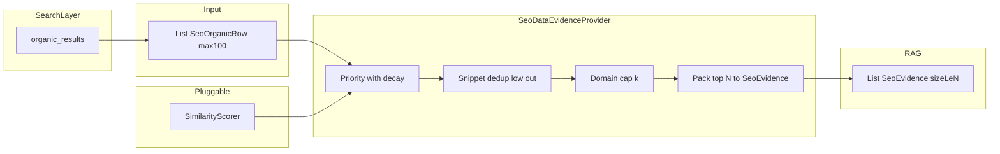

# フェーズ1.3 第1回：RAGエビデンス・プロバイダー（計画・改訂版）

## 1. クラス構成とパッケージパス（確認）

ユーザー指定および疎結合要件に合わせ、**下記を確定パス**とする。

| クラス | パス |
|--------|------|
| `SimilarityScorer`（インターフェース） | [`geo-analytics/src/main/java/com/geo/analytics/domain/logic/SimilarityScorer.java`](geo-analytics/src/main/java/com/geo/analytics/domain/logic/SimilarityScorer.java) |
| `KeywordSimilarityScorer` | [`geo-analytics/src/main/java/com/geo/analytics/domain/logic/KeywordSimilarityScorer.java`](geo-analytics/src/main/java/com/geo/analytics/domain/logic/KeywordSimilarityScorer.java) |
| `SeoDataEvidenceProvider` | [`geo-analytics/src/main/java/com/geo/analytics/domain/logic/SeoDataEvidenceProvider.java`](geo-analytics/src/main/java/com/geo/analytics/domain/logic/SeoDataEvidenceProvider.java) |
| `SeoEvidence` | [`geo-analytics/src/main/java/com/geo/analytics/domain/model/SeoEvidence.java`](geo-analytics/src/main/java/com/geo/analytics/domain/model/SeoEvidence.java)（**record** 推奨） |

**`SeoEvidence` 保持項目（設計要件どおり）**

- `url`, `title`, `snippet`, `priorityScore`, `publishedAt`, `relevanceCategory`（業種適合度：`IndustryType` または専用 enum／ラベル）

**補助型（内部入力行）**

- `SeoOrganicRow`（Serp `organic_results` 1件相当: `link`, `title`, `snippet`, 日付パース結果など）は **domain.model** または **infrastructure.api.dto**。プロバイダーは `List<SeoOrganicRow>` を受け取る想定。

**依存注入**

- `SeoDataEvidenceProvider` は **`SimilarityScorer` をコンストラクタ（またはファクトリ引数）で受け取る**。第1回は `KeywordSimilarityScorer` を Spring `@Bean` 等で束ねる。フェーズ2で Oracle AI Vector Search 連携の実装に差し替えても、**プロバイダーの選別式・多様性ロジックは変更不要**。

---

## 2. `SimilarityScorer` と `KeywordSimilarityScorer`

### 2.1 インターフェース

```java
double score(String query, String content);
```

- **契約**: 戻り値は **[0, 1]** に正規化。非有限値は **呼び出し側で 0 扱いまたは行スキップ**（プロバイダー内で防御）。
- **content**: 実装では `title + " " + snippet` を連結した文字列を渡す運用を推奨（呼び出し規約を JavaDoc で固定）。

### 2.2 `KeywordSimilarityScorer`

- **第1回**: **Jaccard**（正規化トークン集合または文字 bigram 集合）**または** **共有文字 n-bigram 比率**のいずれか一方（またはハイブリッドの最大／平均）。日本語は **NFKC** 正規化。
- **Oracle 移行時**: 本クラスの代わりに **ベクトルコサイン**を返す `OracleVectorSimilarityScorer`（別パッケージ・別モジュール可）を差し替え。RDB アクセスは **インターフェース背後**に閉じ、プロバイダーは `SimilarityScorer` のみを知る。

---

## 3. `SeoDataEvidenceProvider` 選別ロジック

### 3.1 プライオリティ

$$S_{priority} = (S_{sim} \cdot W_{sim}) \cdot e^{-\lambda \Delta t}$$

- $S_{sim} =$ `similarityScorer.score(query, title + " " + snippet)`。
- $W_{sim}$: 初期 **1.0**（後から業種・ソース品質で拡張）。
- $\Delta t$: **年**単位。$t_i$ から $t_{ref}$ までの経過年（非負）。**日付不明**: **最大減衰**（例: $\Delta t = \Delta t_{max}$ として `DOUBLE_MAX_YEARS` など定数、または `λ·Δt` をクリップ上限で打ち止め）— ユーザ要件「日付不明時は最大減衰」を採用。

### 3.2 鮮度減衰定数 $\lambda$ の初期案

- **推奨初期値: $\lambda = 0.5$（年⁻¹）**  
  - 1年後の重み: $e^{-0.5} \approx 0.607$ → **残り約 61%**（ユーザー例「1年で約60%」に整合）。
- 設定箇所: 定数または `AppProperties`（後から運用チューニング）。

### 3.3 多様性ガード（Domain Capping）

- URL から正規化 **host** を抽出（`java.net.URI` 等）。
- 同一 host あたり採用上限 **$k$ 件**（初期 **2** を推奨）。
- パッキングは **$S_{priority}$ 降順**で貪欲に走査し、ホスト別カウントが $k$ に達した行は **スキップ**（他ドメインが埋まるまで続行）。

### 3.4 内容重複排除（Snippet Dedup）

- `title` + `snippet` を正規化し、**文字 n-gram の集合**または **軽量ハッシュ**で近接度を定義。
- **閾値超の近接**が検出されたペアでは、**$S_{priority}$ が低い行を即除外**（リストから候補除去）。高スコア側のみ残留。
- 実装順序の提案: （1）全行にスコア付与 →（2）スコア降順ソート →（3）dedup で行インデックスまたは中間リストを削る →（4）domain cap で N 件まで詰める。**または** dedup を「採用確定時」に逐次適用してもよいが、要件「低スコア即除外」は **比較対象を明確にするため、スコア付与後の一括処理**が読みやすい。

### 3.5 物理的トークン保護（Physical Truncation）

- 最終的に **`List<SeoEvidence>` のサイズは高々 $N$**。$N$ はコンストラクタまたはメソッド引数で指定。
- **下位行は `SeoEvidence` を生成しない**。中間 `ArrayList` も、実装では **N 件確定後は以降のパッキングループを回さない**、または **サブリストで切る**後に元リスト参照を破棄するなど、**LLM 入力経路に流れない**ことをコードレビュー観点で担保。
- 既存計画の宣誓を維持: **スコア下位は LLM 入力リストに含めない**。

---

## 4. データフロー（改訂）



---

## 5. 将来の Oracle AI Vector Search 移行（設計方針の宣誓）

本 RAG 証拠選別層は **標準的な JDBC / JPA のデータアクセスに限定**し、**PostgreSQL 固有型・演算子（例: 専用ベクトル演算子）にプロバイダーや `SimilarityScorer` の契約を束縛しない**。ベクトル検索は **`SimilarityScorer` の実装クラス**（＋必要な Repository）の差し替えで吸収し、**Oracle へ移行した際も `SeoDataEvidenceProvider` と `SeoEvidence` の契約を変えない**方針とする。永続層の方言差はインフラモジュールに閉じ、**domain.logic は疎結合を維持**する。

---

## 6. テスト方針（実装フェーズ用）

- `SimilarityScorer` の **Fake / モック**（固定スコア）で `SeoDataEvidenceProvider` を単体テスト。
- $\lambda$・$\Delta t$（年）・日付不明＝最大減衰のケース。
- 同一ドメイン $k+1$ 本がいても出力は高々 $k$ 本までそのドメインから入ること。
- 近接スニペット2本で低スコアが落ちること。
- **出力 `list.size() <= N`**。

---

## 7. 既存宣誓（物理カット・API予算）の再掲

本プロバイダーは、プライオリティに基づき **下位候補を LLM 入力用集合から排除**し、**N 件を超えて `SeoEvidence` を生成・返却しない**。検索100件から **最終プロンプトに載るのは高々 N 件**とする。
