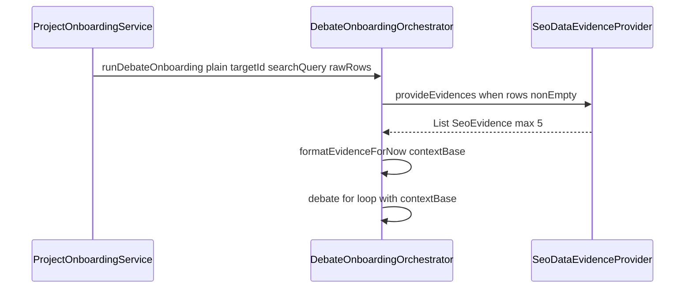

# フェーズ1.3 第2回：オーケストレーターへの配線（計画）

## 現状

- [`DebateOnboardingOrchestrator`](geo-analytics/src/main/java/com/geo/analytics/application/service/DebateOnboardingOrchestrator.java): `runDebateOnboarding(String plainText, UUID targetId)` のみ。ループ基底は `wrapped`（スクレイプ XML）。
- [`ProjectOnboardingService.runGeoPipeline`](geo-analytics/src/main/java/com/geo/analytics/application/service/ProjectOnboardingService.java): `plain` 取得後に `runDebateOnboarding(plain, projectId)` のみ。
- [`KeywordSimilarityScorer`](geo-analytics/src/main/java/com/geo/analytics/domain/logic/KeywordSimilarityScorer.java) / [`SeoDataEvidenceProvider`](geo-analytics/src/main/java/com/geo/analytics/domain/logic/SeoDataEvidenceProvider.java): Spring 未登録・`SeoDataEvidenceProvider` は `final class`。

Spring Boot の起動クラスは [`GeoAnalyticsApplication`](geo-analytics/src/main/java/com/geo/analytics/GeoAnalyticsApplication.java)（パッケージ `com.geo.analytics`）のため、**デフォルトコンポーネントスキャンに `com.geo.analytics.domain.logic` は含まれる**。

---

## 1. Spring Bean 化（改修 A）

| ファイル | 変更 |
|----------|------|
| [`KeywordSimilarityScorer.java`](geo-analytics/src/main/java/com/geo/analytics/domain/logic/KeywordSimilarityScorer.java) | `@Component` を付与（`SimilarityScorer` の唯一実装として単一 Bean）。 |
| [`SeoDataEvidenceProvider.java`](geo-analytics/src/main/java/com/geo/analytics/domain/logic/SeoDataEvidenceProvider.java) | `final` を外す（**推奨**: 将来の Spring 拡張・テストモックで無難）。`@Component` を付与。既存の `SimilarityScorer` 引数コンストラクタを維持し、Spring が `KeywordSimilarityScorer` を注入。**デフォルト引数なしのコンストラクタ**が1つでよい（delegate コンストラクタは `@Autowired` 対象を明示する場合は単一コンストラクタに集約）。 |

**注意**: `SimilarityScorer` が複数実装になるまでは `@Qualifier` 不要。

---

## 2. オーケストレーター（改修 B / C）

**シグネチャ（案）**

```java
GeoOnboardingLlmResult runDebateOnboarding(
    String plainText,
    UUID targetId,
    String searchQuery,
    List<SeoOrganicRow> rawSeoRows);
```

- `searchQuery`: null 安全に空文字へ正規化。
- `rawSeoRows`: **null または空**のときは `provideEvidences` を呼ばない、または `List.of()` を渡し既存ロジック（空証拠）で継続。**例外は投げない**。

**ループ直前**

1. `List<SeoEvidence> evidences = List.of()` を初期化。
2. `rawSeoRows` が null でなくかつ非空のときのみ:  
   `seoDataEvidenceProvider.provideEvidences(searchQuery, rawSeoRows, 5, SeoDataEvidenceProvider.DEFAULT_MAX_PER_DOMAIN, 既定 relevance ラベル)`  
   定数 `RAG_EVIDENCE_MAX = 5` をオーケストレータに置くか、`SeoDataEvidenceProvider` の既存デフォルトと揃える。
3. `String evidenceBlock = formatEvidenceForNow(evidences);`
4. **基底ユーザ文字列**を  
   `String contextBase = wrapped + (evidenceBlock.isEmpty() ? "" : "\n\n## 検索エビデンス（暫定）\n" + evidenceBlock);`  
   のように定義。
5. `for` ループ内で、現在最終的に `userForAnalystInnovator` の土台になっている **`wrapped` を `contextBase` に置換**（蓄積付き分は従来どおり `contextBase + "\n\n## これまでの議論の蓄積\n" + debateAccumulator`）。

**`formatEvidenceForNow`（private）**

- 各 `SeoEvidence` について `url` / `title` / `snippet` を改行で連結し、エビデンス間は空行または `---` で区切る程度の最小実装。
- リスト空なら `""`。

**DIRECTOR 用 `directorInput`**

- 第3回までの暫定方針として、**原文・議論ログは従来どおり**。オプションで evidence ブロックを1節追加してもよいが、要件が「ベースに結合」のみなら **ループ共有の `contextBase` 差し替え**を優先し、director は現状の `wrapped` のままでも可。一貫させるなら `contextBase` を director の「原文」節に合わせて置換するか、`## 検索エビデンス` を director にも同文追記 — **実装時はどちらか一方に揃える**（推奨: **A/N/S と同じ `contextBase` を原文ラベル内で使う**と、全員が同じ証拠を見られる）。

---

## 3. ProjectOnboardingService（改修 D）

- `runGeoPipeline(projectId, url)` 内で:
  - **検索クエリ案**: `URI` から host を取り出し `String searchQuery = host != null ? host : url`（または後でキーワード化）。
  - **プレースホルダ `List<SeoOrganicRow>`**:  
    - 第2回は **Serp 未呼び出し**のため、`buildPlaceholderSeoRows(String url)` のような **private メソッド**で **空リスト**、または **1件**（`url` を自サイト URL、`title/snippet` を短い固定日本語＋ページ url、`publishedAt` empty、`relevanceCategory` empty）を返す。  
    - 将来 Serp 連携時は同メソッドを JSON パースに差し替え可能な構造にコメント。
- 呼び出し:  
  `debateOnboardingOrchestrator.runDebateOnboarding(plain, projectId, searchQuery, seoRows);`

---

## 4. テスト・ビルド

- [`SeoDataEvidenceProviderTest`](geo-analytics/src/test/java/com/geo/analytics/domain/logic/SeoDataEvidenceProviderTest.java): `new SeoDataEvidenceProvider(scorer)` は継続可能（テストは手組み）。Bean 化でテストは壊さない。
- Spring コンテキストを起動するテストがある場合、**循環依存が無いか**のみ確認（本変更では通常問題にならない）。
- `mvnw -q -DskipTests compile` および、既存＋ `SeoDataEvidenceProviderTest` で回帰確認。

---

## 5. データフロー（概念）



---

## 6. 防衛的プログラミング（要件どおり）

- `rawSeoRows == null || rawSeoRows.isEmpty()` → 証拠なし、`contextBase = wrapped` のみ。
- `searchQuery == null` → `""`。
- プロバイダ呼び出し後も `evidences` は null にしない（常に `List`）。
