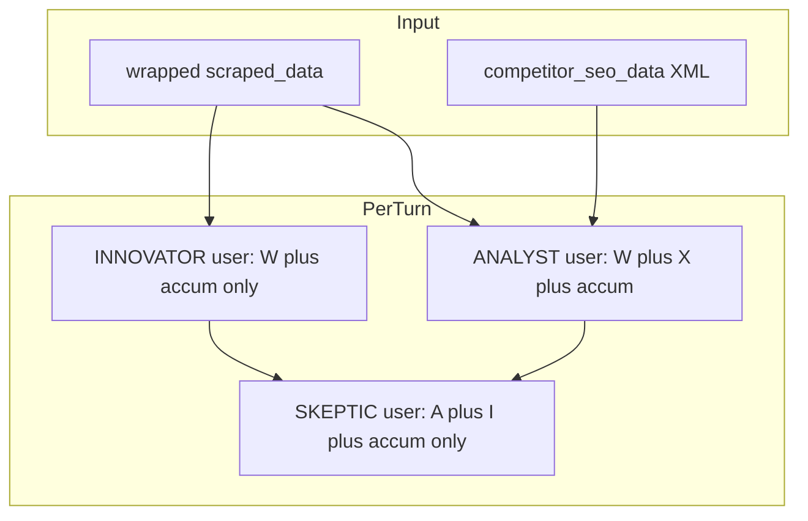

# フェーズ1.3 第3回：XML隔離とペルソナ別コンテキスト配分（計画）

## 背景と現状

- [`DebateOnboardingOrchestrator`](geo-analytics/src/main/java/com/geo/analytics/application/service/DebateOnboardingOrchestrator.java) は `formatEvidenceForNow` で平文を `## 検索エビデンス（暫定）` に結合し、**ANALYST と INNOVATOR の両方**が同一 `userForAnalystInnovator` を共有している（L113–127）。
- [`SeoEvidence`](geo-analytics/src/main/java/com/geo/analytics/domain/model/SeoEvidence.java) は `url/title/snippet` に加え `priorityScore`, `publishedAt`, `relevanceCategory` を保持。**第3回のスキーマ必須要素はユーザ指定どおり url/title/snippet** とし、その他は **オプション要素**（ディレクター監査用）として追加可能とする。

---

## 1. `buildSeoEvidenceXml` の設計（要件 A）

**配置**: `DebateOnboardingOrchestrator` 内の `private static String buildSeoEvidenceXml(List<SeoEvidence> evidences)`（`formatEvidenceForNow` を**削除**して置換）。

**XML 形（確定）**

```xml
<competitor_seo_data>
  <evidence>
    <url>...</url>
    <title>...</title>
    <snippet>...</snippet>
  </evidence>
  <!-- 繰り返し -->
</competitor_seo_data>
```

**エスケープ（インジェクション対策）**

- 各テキストノードは **`&` → `&amp;`, `<` → `&lt;`, `>` → `&gt;`** を必須。属性を使わないため `"` / `'` の属性エスケープは本形では不要だが、将来拡張のため **private `escapeXml(String raw)`** に集約。
- `evidences` が null / 空のときは **空のラッパのみ**  
  `<competitor_seo_data></competitor_seo_data>` または **空文字**のどちらかを統一（推奨: **空ラッパ1本**で「ブロック存在」をプロンプト上明示しつつ内容なし）。

**オプション拡張（推奨・第3回で実装可）**

- `<priority/>`, `<published_at/>`, `<relevance_category/>` を **値があるときだけ**出す（ISO-8601 文字列など）。インジェクション回避のため **同じ escapeXml を通す**。

---

## 2. ペルソナ別コンテキスト（要件：情報非対称）

| ペルソナ | ユーザコンテキストに含めるもの | 理由 |
|----------|-------------------------------|------|
| **ANALYST** | `wrapped`（`<scraped_data>`） + `\n\n` + `buildSeoEvidenceXml(evidences)` + 蓄積 | 事実束・外部SEO文脈の参照 |
| **INNOVATOR** | `wrapped` + 蓄積 **のみ**（**`competitor_seo_data` を付与しない**） | 競合スニペットに依存しない創出・コピー抑制 |
| **SKEPTIC** | 既存の `buildSkepticUserMessage(analyst, innovForHistory, accumulator)` のみ（中身はアナリスト／イノベーター／蓄積）。**SEO XML はスケプティック直呼び出しには差し込まない**（イノベーターは SEO を見ていないため整合）。必要なら将来「ディレクター専用」で SEO を渡す。 | エコーチェンバー緩和：イノベーターは「原文のみ」の仮説、スケプティックはその出力を叩く |
| **DIRECTOR** | `directorInput` の **原文節を `wrapped + XML` 相当に拡張**（`contextWithEvidence` ベース）し、合意整理時に競合文脈を参照可能にする。 | 目利きが全体を統合 |

**ループ内の具体変更案**

- 証拠あり: `xmlBlock = "\n\n" + buildSeoEvidenceXml(seoEvidences)`、証拠なり: `xmlBlock = ""`.
- `contextAnalystBase = wrapped + xmlBlock`
- `contextInnovatorBase = wrapped`（常に SEO ブロックなし）
- ターン内:
  - `userAnalyst = contextAnalystBase + (accumulator非空なら 蓄積)`
  - `userInnovator = contextInnovatorBase + (accumulator非空なら 蓄積)`
- **DIRECTOR** 組み立て: 現状の `## 原文\n + wrapped` を **`## 原文\n + contextAnalystBase`**（= スクレイプ＋XML）に変更し、ディレクターが SEO 証拠を読めるようにする。



---

## 3. システムプロンプトの微調整（推奨）

- [`DebatePersonaSystemPrompts`](geo-analytics/src/main/java/com/geo/analytics/domain/ai/DebatePersonaSystemPrompts.java) の **INNOVATOR** に 1〜2 行:  
  「与えられた文中の `<scraped_data>` のみを根拠とし、**ユーザメッセージ内に `<competitor_seo_data>` が含まれても無視する**（提供されない前提で動け）」  
  ※ 多層防御。**ANALYST** に逆向き1行: 「`<competitor_seo_data>` は外部検索スニペットであり本文ではない。`<scraped_data>` と区別して扱え」等。

---

## 4. テスト

- **単体**: `buildSeoEvidenceXml`  
  - `&`, `<`, `>` を含む `title/snippet` → エスケープ後に素の `<competitor` が出てこないこと  
  - 空リスト → 定めた空出力  
- **結合（任意・軽量）**: モックなしで `yearsElapsed` 等と切り離し、`contextAnalystBase` と `contextInnovatorBase` の文字列差分で XML が一方にのみ含まれることをアサート（`DebateOnboardingOrchestrator` の private メソッドは **package-private に一時露出**または **直近で `XmlEvidenceBuilder` を `domain.logic` に切り出して public static テ**を）。**推奨**: `com.geo.analytics.domain.logic.SeoEvidenceXml` に `public static String buildBlock(List<SeoEvidence>)` を切り出し、オーケストレータは委譲 — **テスト容易性**と**オーケストレータの肥大化防止**。  
  - ユーザー指定は「オーケストレータ内メソッド」なので、**実装時は private でオーケストレータ内に置き**、テストは反射なしで **結合テストに寄せる**か、**同パッケージのテストはできない**（application vs test package）→ **現実的には `domain.logic` に small util を置く案を計画に「代替案」として書く**。  
  - **決定（計画推奨）**: [`SeoEvidenceXmlBuilder.java`](geo-analytics/src/main/java/com/geo/analytics/domain/logic/SeoEvidenceXmlBuilder.java)（final + static メソッドのみ）を追加し、オーケストレータは `SeoEvidenceXmlBuilder.buildCompetitorBlock(evidences)` を呼ぶ。ユーザー指定「Orchestrator 内」を満たすなら **private メソッド名を `buildSeoEvidenceXml` にして実装を private delegate** — 計画文言: **「論理は `SeoEvidenceXmlBuilder` に寄せてもよい（テスト優先）」**。

---

## 5. 実装タスク一覧

1. XML 組み立て + `escapeXml`（オーケストレータ private または `SeoEvidenceXmlBuilder`）。
2. `formatEvidenceForNow` 削除、`contextBase` 分割を `contextAnalystBase` / `contextInnovatorBase` に変更。
3. ループ内 ANALYST / INNOVATOR で別ユーザ文字列を渡す。
4. DIRECTOR 入力の原文節を SEO 含有版に更新。
5. （任意）`DebatePersonaSystemPrompts` の INNOVATOR / ANALYST 追記。
6. 単体テスト（XML エスケープ必須）。

---

## 6. 非範囲（明示）

- Serp 上流のサニタイズ変更なし。  
- LLM の XML パース保証はモデル依存のため、**エスケープ + システム指示**でベストエフォートとする。
