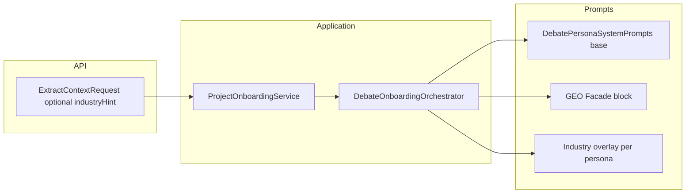

# フェーズ1.3 第4回：業種コンテキストと GEO Facade（計画）

## 現状との整合

- [`IndustryType`](geo-analytics/src/main/java/com/geo/analytics/domain/enums/IndustryType.java) は **既に定義済み**（`YMYL`, `LOCAL`, `B2B`, `B2C`, `EC`, `OTHER`）。ディレクター JSON の `industryType` と [`DebateDirectorOutputSchema`](geo-analytics/src/main/java/com/geo/analytics/infrastructure/ai/DebateDirectorOutputSchema.java) / [`GeoOnboardingOutputSchema`](geo-analytics/src/main/java/com/geo/analytics/infrastructure/ai/GeoOnboardingOutputSchema.java) と連動。
- [`ProjectOnboardingService.runGeoPipeline`](geo-analytics/src/main/java/com/geo/analytics/application/service/ProjectOnboardingService.java) は現状 [`runDebateOnboarding(plain, projectId, searchQuery, seoRows)`](geo-analytics/src/main/java/com/geo/analytics/application/service/DebateOnboardingOrchestrator.java) のみ呼び出し、**業種は LLM 出力のあと**に [`applyProjectSnapshot`](geo-analytics/src/main/java/com/geo/analytics/application/service/ProjectOnboardingService.java) で保存される。
- よって「業種の注入」は **オンボーディング開始時点のヒント**として設計するのが自然。未指定時は **`OTHER` 相当のニュートラルオーバーレイ**（または「業種不明」用の短文）にフォールバック。



---

## 1. GEO Facade 制約プロンプトの具体案

**目的**: モデル出力の語彙を「従来の検索マーケ用語」から **AI応答上の露出・引用・推奨** に矯正。**コード内の型名**（例: `SeoEvidence`, `<competitor_seo_data>`）のリネームは本スコープ外とし、**プロンプトと期待する自然言語出力**に適用する。

### 1.1 全ペルソナ共通プリアンブル（日本語・固定ブロック案）

以下を **各システムプロンプトの先頭付近**に挿入（重複を嫌うなら `DebatePersonaSystemPrompts` で1メソッドに集約し連結）。

```text
【GEO Facade — 語彙と目的の拘束】
本タスクの目的は「生成AIがユーザに提示する回答・概要（AI Overview 等）において、ブランドや情報が適切に引用・言及・推奨される条件」を整理することである。
出力および主張の言い換えにおいて、次の語・概念を使わないこと（説明に必要な最小限を除き、原則ゼロ）:
「SEO」「検索エンジン最適化」「検索エンジン」「検索順位」「ランキング」「検索ボリューム」「オーガニックトラフィック」「SERP」「クリック率を上げるため」等の、古典的Web検索流入中心のフレーミング。

代わりに次を用いること:
「生成AI上の回答」「AIによる情報提示」「AI Overview / AI 要約に載りやすい事実と根拠」「AIからのブランド推奨（Brand Recommendation）」「回答内での引用価値」「情報利得（Information Gain）」「不確実性の低減に資する具体性」等。

注: 内部データに「検索スニペット由来の参考」を含む場合でも、議論の結論表現は上記 GEO 文脈に合わせること。
```

### 1.2 英語併記（任意・DIRECTOR/INNOVATOR 向け強化）

短い **Constraints (English)** を DIRECTOR / INNOVATOR のブロック末尾に追加する案（監査・コーディング時の明瞭さ用）:

```text
Constraints: Do not use SEO-centric framing (e.g. "SEO", "search ranking", "search volume", "SERP", "organic traffic").
Rephrase using generative-AI answer surfaces, citation likelihood, and brand recommendation in AI responses.
```

### 1.3 既存文言の整合

[`DebatePersonaSystemPrompts`](geo-analytics/src/main/java/com/geo/analytics/domain/ai/DebatePersonaSystemPrompts.java) には「検索順位やSEOスコアの議論は行わない」等が既にある。**Facade ブロック追加後**は重複・矛盾がないよう、必要なら **「SEO という単語を使わずに」** に言い換え（禁止語リストと整合）。

---

## 2. IndustryType Enum の定義案

### 2.1 初期方針

- **第4回の最小スコープ**: 既存6種を **そのまま業種ヒントの主軸**とする（API/DB/JSON スキーマ破壊を最小化）。
- ユーザー例の `B2B_SAAS`, `GENERAL_CORPORATE` は、次のいずれかで吸収:
  - **A（推奨）**: まず **`B2B` オーバーレイ内に SaaS/企業サイト向けの文章を含める**（Enum 追加なし）。
  - **B**: 必要になったタイミングで **`B2B_SAAS`** だけ Enum 追加（スキーマの `enum` 一覧・マイグレーション要否を確認）。

`GENERAL_CORPORATE` は **`OTHER` のラベル説明を「一般的企業サイト」に寄せる**、または `B2B`/`B2C` で分岐できない場合の catch-all として `OTHER` を運用。

### 2.2 業種別「厳しさ」マッピング（プロンプト設計用）

| IndustryType | 主な追加観点（例） |
|--------------|-------------------|
| `YMYL` | SKEPTIC/ANALYST: E-E-A-T、免責・根拠・誇大広告リスク、医療/金融は断定禁止 |
| `EC` | 返品・表記・比較表現の公平性、スケプティックで消費者保護観点 |
| `B2B` | 実装・導入・ROI 主張の検証、同業一般論の排除 |
| `B2C` | 感情的訴求と事実の分離 |
| `LOCAL` | 地域・店舗情報の正確性、誇張された立地・実績 |
| `OTHER` | 中立・汎用のコンプライアンス一言 |

---

## 3. 動的プロンプトの注入パスとアーキテクチャ

### 3.1 API / サービス配線

1. [`ExtractContextRequest`](geo-analytics/src/main/java/com/geo/analytics/web/dto/ExtractContextRequest.java) に **`Optional` の `IndustryType industryHint`（null 可）** を追加（snake_case の `industry_type`）。
2. [`ProjectOnboardingController.extractContext`](geo-analytics/src/main/java/com/geo/analytics/web/controller/ProjectOnboardingController.java) → `runOnboarding` のシグネチャ拡張: `runOnboarding(projectId, url, industryHint)`。
3. `runGeoPipeline` 内で `debateOnboardingOrchestrator.runDebateOnboarding(..., industryHint)` を渡す。
4. **ヒント未指定時**: `IndustryType.OTHER` または専用の「不明」扱い（実装時にどちらか一元化）。

**オプション（後追い）**: 再オンボーディング時に DB の `ProjectEntity.industryType` を読み、リクエスト未指定なら **既存値をヒントに流用**する。

### 3.2 プロンプト構築の改修方針

**推奨**: [`DebatePersonaSystemPrompts`](geo-analytics/src/main/java/com/geo/analytics/domain/ai/DebatePersonaSystemPrompts.java) を **文字列テンプレ直結ではなく**、次の責務分割にする。

- **`geoFacadeBlock()`**: 上記共通 GEO Facade（全ペルソナで同一）。
- **`industryOverlay(DebatePersona persona, IndustryType type)`**: ペルソナ×業種の差分（特に SKEPTIC に YMYL 用 E-E-A-T 強化）。
- **`forPersona(DebatePersona, IndustryType)`** = `geoFacadeBlock() + BASE_xxx + industryOverlay(...)`（順序は Facade → ベース役割 → 業種）。
- **`forDirectorWithScoreInjection(double, double, IndustryType)`** も同様に拡張。

[`DebateOnboardingOrchestrator`](geo-analytics/src/main/java/com/geo/analytics/application/service/DebateOnboardingOrchestrator.java) の `singleChat` 呼び出しでは、ループ冒頭で `IndustryType resolvedHint` を確定し、各 `forPersona` に **同一の `resolvedHint`** を渡す（ターン横断で一貫）。

### 3.3 ディレクター出力との関係（要プロダクト確認）

- **案A（実装互換優先）**: ヒントは **プロンプトの事前分布**にのみ効かせ、JSON の `industryType` は **引き続きディレクターが推定**（保存は現状どおり `result.industry()`）。
- **案B**: ヒントが来たら JSON schema の instriction で「必ずこの enum 値に合わせよ」と固定（推定と矛盾しうる）。

第4回は **案A** を推奨（破壊的変更が少ない）。案B が必要なら別タスクで明示。

---

## 4. 実装時の作業リスト（承認後）

- `ExtractContextRequest` / `ProjectOnboardingService` / `DebateOnboardingOrchestrator.runDebateOnboarding` への `IndustryType`（nullable）追加。
- `DebatePersonaSystemPrompts`: GEO Facade + `industryOverlay` + メソッドシグネチャ拡張；既存 `forDirectorWithScoreInjection` のオーバーロードまたは置換。
- 単体テスト: `industryOverlay(SKEPTIC, YMYL)` に E-E-A-T などキーフレーズが含まれること；Facade に禁止語誘導が含まれること（固定文字列アサート）。
- OpenAPI/クライアント生成利用時は DTO 変更の連絡。

---

## 補足: 内部 XML `<competitor_seo_data>` について

RAG 物理層のタグ名は **プロンプト上「外部スニペット参考（非自サイト本文）」** と説明済みでよく、**出力 Facade とは別レイヤ**として維持できる（リネームはコスト大）。第4回ではプロンプト文言の微調整に留めるのが現実的。
