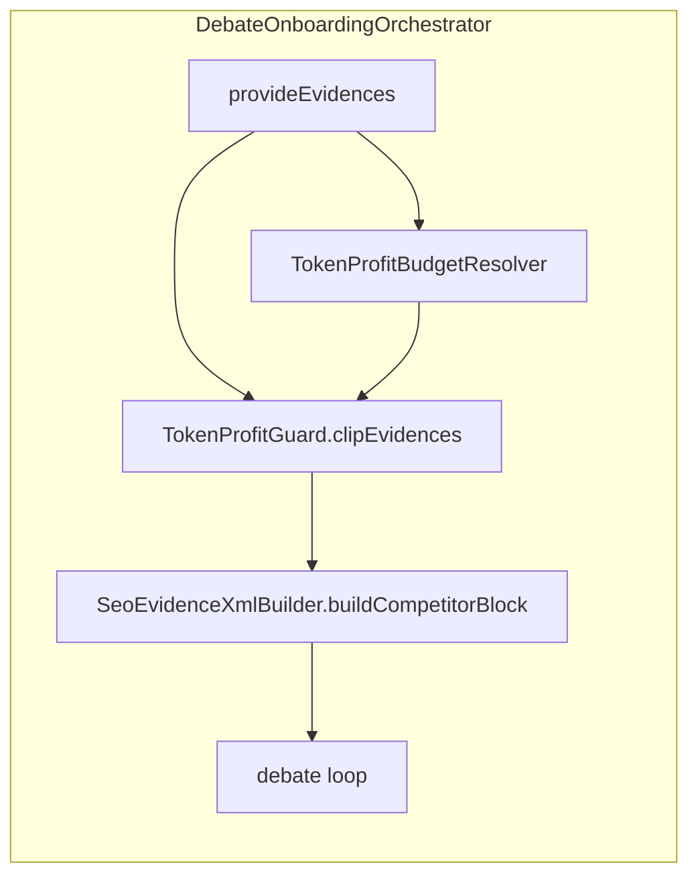

# フェーズ1.3 第5回：Token Profit Guard（計画）

## 背景（現状コード）

- 競合エビデンスは [`DebateOnboardingOrchestrator`](geo-analytics/src/main/java/com/geo/analytics/application/service/DebateOnboardingOrchestrator.java) 内で [`SeoDataEvidenceProvider.provideEvidences`](geo-analytics/src/main/java/com/geo/analytics/domain/logic/SeoDataEvidenceProvider.java) の直後に [`SeoEvidenceXmlBuilder.buildCompetitorBlock`](geo-analytics/src/main/java/com/geo/analytics/domain/logic/SeoEvidenceXmlBuilder.java) へ渡されている（**ディベートループ突入前**が挿入点）。
- 証拠1件は immutable な [`SeoEvidence` record](geo-analytics/src/main/java/com/geo/analytics/domain/model/SeoEvidence.java)（`url` / `title` / `snippet` / 他）。
- プラン enum は既に [`SubscriptionPlan`](geo-analytics/src/main/java/com/geo/analytics/domain/enums/SubscriptionPlan.java)（`STANDARD`, `PRO`, `EXPERT`）。リクエストで FREE/BASIC/PREMIUM を足す場合は **別 enum またはエイリアス**で `SubscriptionPlan` にマップする形が一貫的（現コードベースは 3 プランが主）。
- テナントスコープでプランが取れる [`TenantPlanScope`](geo-analytics/src/main/java/com/geo/analytics/infrastructure/tenant/TenantPlanScope.java) / [`WorkspaceEntity#setSubscriptionPlan`](geo-analytics/src/main/java/com/geo/analytics/domain/entity/WorkspaceEntity.java) があり、オンボーディング実行スレッドは通常 [`ContextPropagator`](geo-analytics/src/main/java/com/geo/analytics/infrastructure/tenant/ContextPropagator.java) 経由で同じプランが伝播している想定。

## 1. クラスパスと API 案（`domain.logic.TokenProfitGuard`）

**方針**: 既存の [`SeoEvidenceXmlBuilder`](geo-analytics/src/main/java/com/geo/analytics/domain/logic/SeoEvidenceXmlBuilder.java) と同様、**`final` クラス + private コンストラクタ + static メソッド**で十分。インターフェース必須ではない（テストは静的メソッドを直接検証）。

**入力・出力**:

- **入力**
  - `List<SeoEvidence> evidences`（**優先度降順**であること。現状 `provideEvidences` が `priorityScore` で並べているならそのまま利用可能。未ソートなら Guard 内でソートするか、Provider 契約を明文化。）
  - `TokenProfitSpec spec`（名前は任意だが、下面の数値を1か所にまとめる。**record 推奨**）
- **出力**
  - 予算内に収まるように調整した **`List<SeoEvidence>`**（新インスタンス。`snippet` などを切ったコピー）

**`TokenProfitSpec` に含めるフィールド案（実装時）**:

- `int maxCompetitorXmlChars` — **この第5回の実行可能な上限**（後述の式で算出した後の結果）。Guard の本体ロジックはチャー预算中心にし、金額計算は別メソッド／別 bean に分離すると単体テストしやすい。
- 任意: `double escapeSafetyFactor`（例 1.05）— XML エスケープ膨張の安全係数。

**公開 API 案**:

```text
TokenProfitSpec resolveMaxChars(SubscriptionPlan plan, AppProperties…または専用設定)
List<SeoEvidence> clipEvidences(List<SeoEvidence> priorityOrdered, TokenProfitSpec spec)
```

`resolveMaxChars` はオーケストレータではなく **小さな `TokenProfitBudgetResolver`（`@Component`）** に置いてもよい（設定注入のため）。計画レベルでは「Guard = 純粋ロジック、予算解決 = 設定＋プラン」で分離を推奨。

## 2. プラン別予算の定義場所

**推奨**: [`AppProperties`](geo-analytics/src/main/java/com/geo/analytics/infrastructure/config/AppProperties.java) の `Ai` 配下にネストを追加する。

例（概念）: `app.ai.token-profit-guard`

- **`reserved-margin-rate`**: 確保利益率 \(m\)（0〜1）。式: 許容コスト係数 \((1-m)\)。
- **`reference-input-usd-per-million-tokens`**: Gemini 1.5 Pro の **入力** の参照単価（USD/M input tokens）。価格改定時は設定だけ差し替え。
- **`chars-per-token-approx`**: 日本語寄り混合テキスト向けの **保守的** 近似（例 **1.0** = 「1コードユニット≒1トークン」寄りの安全側。要件の 0.7〜1.0 のうち、**最初は 1.0 で上限を厳しめ**にするのが実務的）。
- **`plan-budget-usd`**: `SubscriptionPlan` 名 → **オンボーディング1回あたりの competitor XML に許す推定原価上限（USD）**（ユーザー「予算」の解釈をここに紐づける。FREE 相当が無い場合は `STANDARD` を最小プランとする）。

計算の流れ（設計どおり）:

1. `effectiveUsd = planBudgetUsd * (1 - reservedMarginRate)`
2. `maxTokens ≈ (effectiveUsd / usdPerMillionTokens) * 1_000_000`
3. `maxChars ≈ maxTokens * charsPerTokenApprox`（**トークン→文字**なので、`maxTokens / tokensPerChar` で `tokensPerChar = 1/charsPerTokenApprox` と読み替え可能。実装では「1文字あたり最低 1 トークン」を仮定するなら `maxChars = maxTokens` が最悪ケース）。

**注意**: 式は **competitor XML ブロック専用**の予算に限定するか、将来 `plainText` も含めた統合予算にするかをタスクで固定する。**第5回は competitor XML のみ**に絞ると変更面が小さく、要件「エビデンスの量」とも一致。

**プラン名**: ユーザー例の FREE/BASIC/PREMIUM は、現状の `STANDARD`/`PRO`/`EXPERT` に **設定で割り当て**（将来 enum 追加時は `application.yml` のマップだけ足す）。

## 3. トランケーションアルゴリズム案（具体）

**前提**: リストは **先頭ほど高優先度**（末尾が削る対象）。`null` 要素はスキップ。

1. **予算文字数** `B = maxCompetitorXmlChars`（エスケープ安全係数を掛けた後の整数）。
2. **見積もり関数** `estimateXmlChars(List<SeoEvidence>)`:  
   - 実装は **`SeoEvidenceXmlBuilder` と同一のエスケープ規則**で文字列長を数えるヘルパを共通化するか、Guard 内で `buildCompetitorBlock` を呼んで `length()` する。**正確さ優先なら一度 build して長さ取得**（リストが最大5件程度ならコスト無視可）。パフォーマンス至上なら逐次加算で escape を複製。
3. **全体が `B` 以下** → そのまま返す。
4. **超過時** — **末尾から削る（重要度低い順）**:
   - **段階A**: 末尾の **完全な証拠行**を1件ずつ落とし、再見積もり。ゼロ件まで繰り返し。
   - **段階B**: まだ超過し、少なくとも1件残す必要がある場合（または「最低1件は残す」ポリシーがある場合）、**最後に残った1件（優先度最低の残件）の `snippet` のみ**を **末尾からコードポイント単位で切詰め**（`String` のサロゲート境界は `substring` + 簡易チェック、またはループで `codePointCount` ベース）。`title` / `url` は原則フル保持、`snippet` が主音量のため **snippet のみ短縮**が第1選択。
   - **段階C**（オプション）: `snippet` を最小長（例 0）まで縮めても超過なら、その要素を削除し次へ。

**ポリシー明記**: 「件数削減を優先し、残件についてのみスニペット途中切断」— これでユーザー要件の「最後の要素を途中でカット」と整合。

## 4. オーケストレーター統合



- `clipEvidences` は **`buildCompetitorBlock` の直前**。
- **プラン解決順**（推奨）: `SubscriptionPlan plan = TenantPlanScope.currentSubscriptionPlan().orElse(SubscriptionPlan.STANDARD)`（または既存の「未設定は STANDARD」のポリシーに合わせる）。
- **配線**: `TokenProfitBudgetResolver` に `AppProperties` を注入し、`runDebateOnboarding` 先頭付近で `spec` を生成して `clip` に渡す。

## 5. テスト方針（実装フェーズ）

- `TokenProfitGuardTest`: 人工リストで（1）全収まり（2）末尾削除（3）最終件 `snippet` だけ切断（4）`B=0` で空リスト、など。
- 設定バインディングのスモーク（任意）: `resolveMaxChars(PRO) > resolveMaxChars(STANDARD)`。

## 6. 承認後の実装タスク一覧（メモ）

- 新規: [`TokenProfitGuard.java`](geo-analytics/src/main/java/com/geo/analytics/domain/logic/TokenProfitGuard.java)、設定 record、`TokenProfitBudgetResolver`（`application` 層）または `AppProperties` 拡張のみ。
- 変更: [`DebateOnboardingOrchestrator`](geo-analytics/src/main/java/com/geo/analytics/application/service/DebateOnboardingOrchestrator.java)、[`application*.yml`](geo-analytics/src/main/resources/) にデフォルト値。
- `TenantPlanScope` からプラン取得失敗時のフォールバックを1行で文書化。
