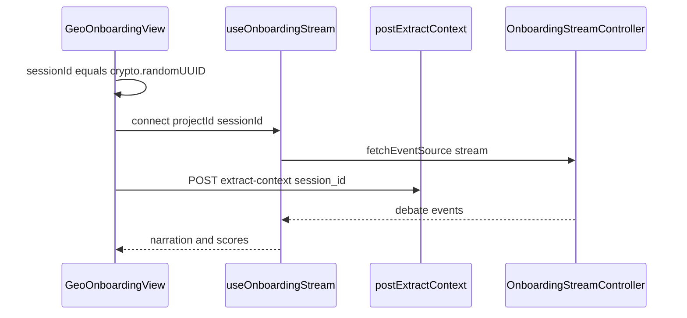

# フェーズ1.4 第5回：React SSE レシーバーと労働錯覚 UI（計画）

## 既存資産との整合

- **SSE 実装**: バックエンドはイベント名 **`debate`**、`data` に [`DebateOnboardingSseEvent`](c:\cursor\project\geo-analytics\src\main\java\com\geo\analytics\web\dto\DebateOnboardingSseEvent.java) の JSON（snake_case）。第3回の `ERROR` も同イベント内 `event_type: ERROR`。
- **フロント SSE 先例**: [`useJobStreaming.ts`](c:\cursor\project\geo-analytics\frontend\src\hooks\useJobStreaming.ts) が **`@microsoft/fetch-event-source`**、`keysToCamelDeep`、認証ヘッダ（`getAccessToken` + `X-Tenant-ID`）、`AbortController` を使用。**同一スタックでオンボーディング用フックを新設**するのが保守的に最良。
- **オンボーディング画面**: [`GeoOnboardingView.tsx`](c:\cursor\project\geo-analytics\frontend\src\pages\GeoOnboardingView.tsx) が [`postExtractContext`](c:\cursor\project\geo-analytics\frontend\src\api\geoOnboardingApi.ts) のみ呼び出し。**`session_id` を POST body にまだ載せていない**ため、第5回で **API + UI の両方を配線**する。
- **グラフ**: [`frontend/package.json`](c:\cursor\project\geo-analytics\frontend\package.json) に **Recharts 済み**。

---

## A. `useOnboardingStream`（カスタムフック）

**責務**

- URL: `GET /api/v1/projects/{projectId}/onboarding/stream?session_id={uuid}`（[`DebateOnboardingStreamController`](c:\cursor\project\geo-analytics\src\main\java\com\geo\analytics\web\controller\DebateOnboardingStreamController.java) と一致）。
- `onmessage`: `event.event === "debate"` 時に `event.data` を JSON パースし、**`keysToCamelDeep`** でフロント型へ（[`useJobStreaming`](c:\cursor\project\geo-analytics\frontend\src\hooks\useJobStreaming.ts) と同型の防御的パース）。
- **切断・エラー**: `onerror` で有限回の **指数バックオフ再接続**（例: 最大 5 回、`openWhenHidden: true` は継続）。**ユーザー主導の中止**（`AbortController.abort`）や **抽出フロー完了後の明示 `disconnect`** では再接続しない（フラグ `shouldReconnectRef`）。
- **セッション**: 親（`GeoOnboardingView`）が **`crypto.randomUUID()`** で 1 回発行し、ストリーム開始と `extract-context` の **同一 UUID** を渡す（バックエンド第2回の契約）。

**返却 API 案**

- `connectionState`: `"idle" | "connecting" | "open" | "reconnecting" | "closed"`
- `events` または `lastEvent` + `narrationLog`（実装詳細は下記「状態管理」）
- `latestPartialScores`（スコア可視化用スナップショット）
- `streamError` / `isSettled`（正常完走・切断・ERROR イベント検知）
- `connect` / `disconnect`

---

## 1. SSE の状態管理方針（確認事項への回答）

**推奨: ハイブリッド**

- **実況ログ（高頻度）**: **`useRef` にリングバッファ**（例: 最大 200 行）＋増分カウンタ。大量 `setState` による再描画負荷を避け、表示コンポーネントは **最新 N 件だけを `useMemo` でスライス**するか、**一定間隔（100–200ms）で `flush` して `useState` 更新**（バッチング）する二段構え。
- **数理スナップショット（低頻度）**: **`use state` の単一オブジェクト** `latestPartialScores`（SCORE_UPDATE のたびに更新）。Recharts 向け **時系列**は **Ref に配列保持 + チャートのみ state 更新を間引き**でも可。
- **Context**: 第5回スコープでは **ページローカル**（`GeoOnboardingView` 直下）で十分。将来ダッシュボード分割時に `OnboardingStreamContext` を切り出す。

---

## 2. スコア可視化ライブラリ（確認事項への回答）

**主: Recharts（既存依存）**

- **構造シグナル（元 `p_site`）**: `RadarChart` または正規化した **積み上げ `AreaChart`**（4 次元を「情報の偏り」として GEO 語彙の凡例で説明）。
- **時系列**: `LineChart` で「独自性スコア」（GEO-IG）と「合意形成の進み」（Wasserstein 正規化）を **ラウンド番号または時刻**でプロット。

**補助: MUI**

- `LinearProgress` / `Stack` で「議論の深さ」などセカンダリなメーター（数値ラベルは GEO Facade 用語）。

**重要なギャップ（実装判断）**

- 現行 [`DebatePartialScoresPayload`](c:\cursor\project\geo-analytics\src\main\java\com\geo\analytics\web\dto\DebateOnboardingSseEvent.java) には **`geo_ig` / `wasserstein1` がない**。要件どおり **GEO-IG・Wasserstein を正確に出すには**、第5回に **バックエンドで `partial_scores` にオプション数値を追加**（`DebateOnboardingOrchestrator` の `emitNarration` SCORE_UPDATE で `lastGeoIg` / 収束スナップショットの `wasserstein1` を載せる）**を同一マイルストーンに含めることを推奨**。フロントのみ先行する場合は **`q_intent` / `s_density` の合成表示**など**暫定プロキシ**と明記し、後で差し替え。

---

## B. ペルソナ・実況モニター（Narration Monitor）

- **UI**: 左にペルソナ（4 + SYSTEM）の **Lucide / MUI アイコン**、右にストリーム。現在アクティブ行は `persona` + `status` でハイライト（枠線・背景）。
- **表示**: `message` は **ターミナル風**（等幅フォント、フェードイン）か **チャット気泡**。**タイピングアニメーション**は **直近 1 件のみ**に適用し、過去ログは即時全文表示でパフォーマンスと可読性を両立。
- **`eventType`**: `NARRATION` / `SCORE_UPDATE` / `ERROR` で行スタイルを分岐。`ERROR` はアラート色だが **コピーは安抚**（下記 D）。

---

## C. 数理インジケーター（Math Score Visualizer）

| 概念 | UI ラベル案（SEO 禁止） | データソース |
|------|------------------------|--------------|
| GEO-IG | **独自性スコア**（AI検索文脈での情報の刺さり） | 推奨: SSE `partial_scores.geo_ig` 追加後 |
| Wasserstein | **合意形成の近さ**（数値が小さいほど揃ってきた） | 推奨: `partial_scores.wasserstein1` または正規化した「進捗 0–100%」 |
| `p_site` | **構造シグナルの内訳** | 既存リスト |
| `agent_mass` | **視点の重み**（匿名化ラベル） | 既存リスト |

チャート下に **1 行説明文**（固定ヘルプ）で「SEO」「検索順位」等を**一切出さない**。

---

## D. クリーンアップと例外表示

- **`AbortController` でストリーム切断**（ページ遷移・アンマウント）: 意図的切断として再接続しない。
- **ネットワーク切断 / サーバ切断**: 「接続を再開しています…」＋リトライ回数表示。
- **第3回の割り込み（クライアント切断）**: バックエンドは処理中断。UI は **「接続が切れました。実行済みの解析分のみ精算されています。残高はアカウント概要でご確認ください。」** のような **非技術的・不安低減**コピー（日本語）。
- **`event_type: ERROR`**: サーバからの `message` を要約表示し、精算文句と区別。

---

## 3. GEO Facade（確認事項への回答）

**UI コピー原則**

- **禁止語の例**: 「SEO」「検索エンジン」「順位」「SERP」「クロール（ユーザー向け文言）」。
- **推奨置換**: AI検索 / 生成回答上の見え方、構造的シグナル、独自性スコア、合意形成、GEO 提案、信頼できる示唆。

文言表を実装タスクに添付する形でレビュー固定化する。

---

## 実装タスク（承認後の想定順）

1. **型**: `frontend/src/types/onboardingDebateStream.ts`（`DebateOnboardingSseEvent` 相当、camelCase）。
2. **API**: [`geoOnboardingApi.ts`](c:\cursor\project\geo-analytics\frontend\src\api\geoOnboardingApi.ts) — `postExtractContext` に `sessionId` オプション、`session_id` を JSON に含める。
3. **フック**: `frontend/src/hooks/useOnboardingStream.ts`。
4. **UI コンポーネント**: `OnboardingNarrationMonitor.tsx`、`OnboardingMathVisualizer.tsx`（`pages` または `components/onboarding/`）。
5. **統合**: [`GeoOnboardingView.tsx`](c:\cursor\project\geo-analytics\frontend\src\pages\GeoOnboardingView.tsx) — 抽出開始前に `connect`、完了/エラー/アンマウントで `disconnect`。
6. **（推奨）バックエンド**: `DebatePartialScoresPayload` に `geoIg`、`wasserstein1`（nullable）追加と SCORE_UPDATE 送信箇所の拡張。

本計画は **実装前の設計承認用**です。
