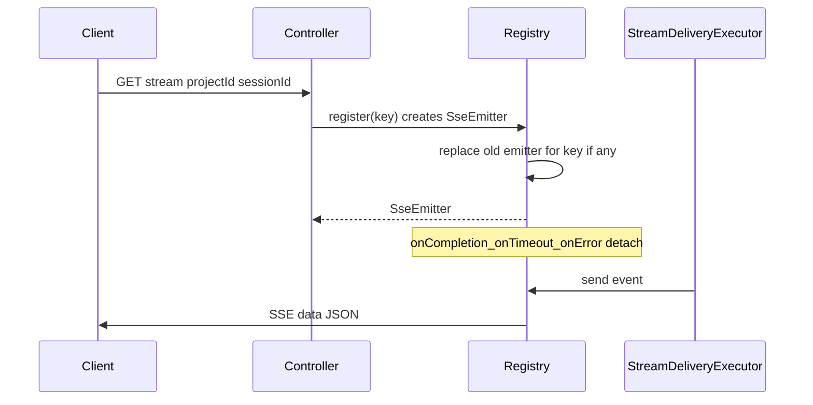

# フェーズ1.4 第1回：SSE イベント基盤と DTO（計画）

## 前提（コードベースとの整合）

- **既存 SSE 実装**: [`JobStreamRegistryService`](c:\cursor\project\geo-analytics\src\main\java\com\geo\analytics\application\service\JobStreamRegistryService.java) が `ConcurrentHashMap` + **接続ごとの `ReentrantLock`**、`onCompletion` / `onTimeout` / `onError` で `detach`、`ObjectMapper` で JSON 化してから `SseEmitter.event().data(json)` 送信、ハートビート用 `ScheduledExecutorService` を採用している。**プロジェクトルール**（[`.cursorrules`](c:\cursor\project\geo-analytics\.cursorrules)）では `completeWithError` 禁止・エラーは JSON イベント送信が既に明記されている。オンボーディング SSE も **同パターンを踏襲**するのが自然。
- **ペルソナ**: [`DebatePersona`](c:\cursor\project\geo-analytics\src\main\java\com\geo\analytics\domain\ai\DebatePersona.java) は ANALYST / INNOVATOR / SKEPTIC / DIRECTOR のみ。要件の **SYSTEM** はストリーム専用（進捗・集約メタ）として **別 enum**（例: `DebateStreamPersona`）に含めるか、DTO 上は `String` + `@JsonValue` 用の列挙を `web.dto` 側に置く（ドメイン `DebatePersona` を無理に変更しない）。
- **中間スコア（1.2）**: [`DebateTextMathHeuristics.RoundHeuristicResult`](c:\cursor\project\geo-analytics\src\main\java\com\geo\analytics\domain\logic\DebateTextMathHeuristics.java)（`pSite` 4要素、`agentMass` 3要素、`sDensity`、`qIntent` 等）およびオーケストレータ内の **収束系スカラー**（`CalibrationCalculator` 経由の trust 等）を、SSE では **JSON 向けに正規化した専用 DTO** として載せる（`double[]` をそのまま public API に出さず `List<Double>` 固定長または長さ検証付きでシリアライズ）。
- **API 前置詞**: 現状オンボードは [`ProjectOnboardingController`](c:\cursor\project\geo-analytics\src\main\java\com\geo\analytics\web\controller\ProjectOnboardingController.java) が `"/api/v1/projects"` 配下。ストリームは要件例の `/api/v1/onboarding/stream/{projectId}` と **完全一致は必須ではない**が、実装フェーズでは **`/api/v1/projects/{projectId}/onboarding/stream`** のようにリソース所有者（project）配下に寄せると一貫しやすい（最終 URL は実装時に確定で可）。

---

## 1. DTO のフィールド構成案（JSON）

**推奨ルート DTO**: `DebateOnboardingSseEvent`（名称は実装で調整可）

| 論理名 | JSON（snake_case） | 型・内容 |
|--------|-------------------|---------|
| イベント種別 | `event_type` | 列挙。例: `NARRATION`（実況）, `SCORE_UPDATE`（スコア中心）, `PHASE_CHANGE`, `DONE`, `ERROR`。フロントの分岐を単純化。 |
| ペルソナ | `persona` | `DebateStreamPersona`（`ANALYST`, `INNOVATOR`, `SKEPTIC`, `DIRECTOR`, `SYSTEM`）。Jackson は既存同様 [`@JsonNaming(SnakeCaseStrategy.class)`](c:\cursor\project\geo-analytics\src\main\java\com\geo\analytics\web\dto\VerifyStreamEvent.java) を推奨。 |
| フェーズ | `status` | `DebateStreamPhase`（`GATHERING`, `ANALYZING`, `DEBATING`, `CONVERGING` 等。将来フェーズ追加は enum に追加）。 |
| 表示文言 | `message` | `String`。人間可読の実況（現行の日本語コピー運用をそのまま載せられる）。 |
| 中間スコア | `partial_scores` | **nullable**。別 record `DebatePartialScoresPayload` をネスト。下記。 |
| 時刻 | `timestamp` | `Instant` → ISO-8601（`UTC` で統一推奨）。 |
| 相関 ID（任意） | `session_id` / `round` | クライアント購読とオーケストレータ進捗の突合用。第1回は最小でも `session_id` のみでも可。 |

**`DebatePartialScoresPayload`（案）**

- `round`（int, optional）: ディベートターン index。
- `p_site`: `List<Double>`（長さ 4、[`RoundHeuristicResult.pSite`](c:\cursor\project\geo-analytics\src\main\java\com\geo\analytics\domain\logic\DebateTextMathHeuristics.java) 対応）。
- `agent_mass`: `List<Double>`（長さ 3）。
- `s_density`, `q_intent`: `Double`。
- `calibrated_trust` 等、オーケストレータが既に保持するスカラーを **任意フィールド**として追加可能（実装時に [`DebateOnboardingOrchestrator`](c:\cursor\project\geo-analytics\src\main\java\com\geo\analytics\application\service\DebateOnboardingOrchestrator.java) の公開したい値だけに限定）。

**SSE イベント名**: 既存 verify ストリームは `chunk` / `error` でラップ。**オンボーディング**も第1回は **`debate`（data=上記 JSON 文字列）** と **`error`（`StreamErrorPayload` 互換または同型）** の2種類で足りる想定。必要なら `heartbeat` はコメントイベント（Job と同様）。

---

## 2. `SseEmitterRegistry` の排他・ライフサイクル（メモリリーク回避）

**購読キー**: `record OnboardingStreamKey(UUID projectId, UUID clientSessionId)` の **複合キー**を `ConcurrentHashMap` のキーにする。`sessionId` はクライアントがページロード時に生成して **クエリ `?sessionId=` またはヘッダ**で渡す想定（未指定時の扱いは実装時: 拒否 vs サーバ生成 UUID を一度だけ返す—第1回は **必須クエリ**が単純）。

**競合防止**

- **マップ操作**: `ConcurrentHashMap.put` / `compute` で登録。同一キー再接続時は [`JobStreamRegistryService`](c:\cursor\project\geo-analytics\src\main\java\com\geo\analytics\application\service\JobStreamRegistryService.java) 同様、**古い `SseEmitter` を `complete()` してから差し替え**（リークとゾンビ接続の抑止）。
- **送信**: `SseEmitter` への `send` は **接続単位 `ReentrantLock`** で直列化（仮想スレッドでも安全。オブジェクト監視ロックに依存しない）。
- **配信 executor**: 既存の `@Qualifier(StreamingExecutorConfig.STREAM_DELIVERY_VIRTUAL_EXECUTOR) ExecutorService` を **注入して再利用**し、送信処理をキューイング（長時間ディベート処理スレッドをブロックしない）。

**パージ（リーク回避の要点）**

- `onCompletion` / `onTimeout` / `onError` いずれでも **`detach(key, emitter)`**: `map.computeIfPresent` で **インスタンス一致**を確認した場合のみ `remove` + ハートビート `cancel`（Job の `detachRegistration` パターンの踏襲）。
- **ハートビート失敗**時も `detach`（送信例外で地図から外す）。
- **明示終了 API**（将来オーケストレータ完了時）: `complete(key)` で `remove` → `emitter.complete()`。

**同一 project の複数セッション**: キーに `sessionId` を含めるため **タブ別に独立**。将来「プロジェクト単位ブロードキャスト」が必要なら、`ConcurrentHashMap<UUID, CopyOnWriteArrayList<Registration>>` の第二索引や、`publish(projectId, event)` でキーをスキャンする設計に拡張（第1回スコープ外でも設計メモに残せる）。

---

## 3. ペルソナ別メッセージの型定義（String vs MessageKey）

**推奨（段階的）**

1. **第1回（本フェーズ）**: `message` は **`String` 必須**（サーバが既存の日本語トーンで生成）。フロントは表示専用。実装・デバッグが最速。
2. **拡張（任意フィールド）**: `message_key` を **列挙 `DebateNarrationKey`**（例: `INNOVATOR_HYPOTHESIZING`）として **optional** で追加。用途: 同一文面の安定識別、将来 i18n、分析。
3. **多言語**: フル i18n に進む際は **`message_key` + `message_params`（マップ）** を主とし、`message` はフォールバック用ロケール一次解決結果にするか、フロントのみ翻訳に切り替え。**第1回で `MessageKey` のみにして `message` を廃止**するのはフロント工数が増えるため非推奨。

**SYSTEM ペルソナ**: フェーズ遷移・システム通知は `persona=SYSTEM` とし、列挙で表現してフィルタしやすくする。

---

## 4. Controller 骨組み（シグネチャ案）

- **クラス**: 例 [`ProjectOnboardingController`](c:\cursor\project\geo-analytics\src\main\java\com\geo\analytics\web\controller\ProjectOnboardingController.java) に集約するか、専用 `DebateOnboardingStreamController` を新設（単一責務なら後者推奨）。
- **メソッド案**:
  - `@GetMapping(value = "/{projectId}/onboarding/stream", produces = MediaType.TEXT_EVENT_STREAM_VALUE)`
  - `SseEmitter streamOnboarding(@PathVariable UUID projectId, @RequestParam UUID sessionId)`（または `@RequestHeader`）
  - 戻り値: `registry.register(OnboardingStreamKey(projectId, sessionId))`
- **セキュリティ**: 既存プロジェクトと同じ認可（あれば `projectId` へのアクセス検証）を **実装フェーズで必ず同一ポリシーに揃える**（本計画では認可詳細は触れないが、公開エンドポイント化は避ける）。

---

## 5. 実装フェーズでのファイル配置（予定・参考）

- DTO / enum: [`geo-analytics/src/main/java/com/geo/analytics/web/dto/`](c:\cursor\project\geo-analytics\src\main\java\com\geo\analytics\web\dto\) 配下（verify と並ぶ）。
- レジストリ: [`geo-analytics/src/main/java/com/geo/analytics/application/service/`](c:\cursor\project\geo-analytics\src\main\java\com\geo\analytics\application\service\) に `OnboardingDebateStreamRegistry` 等（`@Service`、Job レジストリと対称）。
- 第1回は **オーケストレータへのフェーズ2配線は未接続でも可**（レジストリ + 空送信 or 手動テスト用イベント）—ユーザー要件「論理を壊さない」範囲で段階接続。

---

## 承認後の次ステップ（実装時メモ）

1. DTO・enum・`OnboardingStreamKey` を追加。
2. `OnboardingDebateStreamRegistry` を `JobStreamRegistryService` と同等のライフサイクルで実装。
3. GET エンドポイント追加 + 既存 `StreamingExecutorConfig` / `ObjectMapper` Bean 再利用確認。
4. 単体テスト: レジストリの replace / detach / 同一キー再登録でリークが起きないこと（モック emitter または短タイムアウト）。
