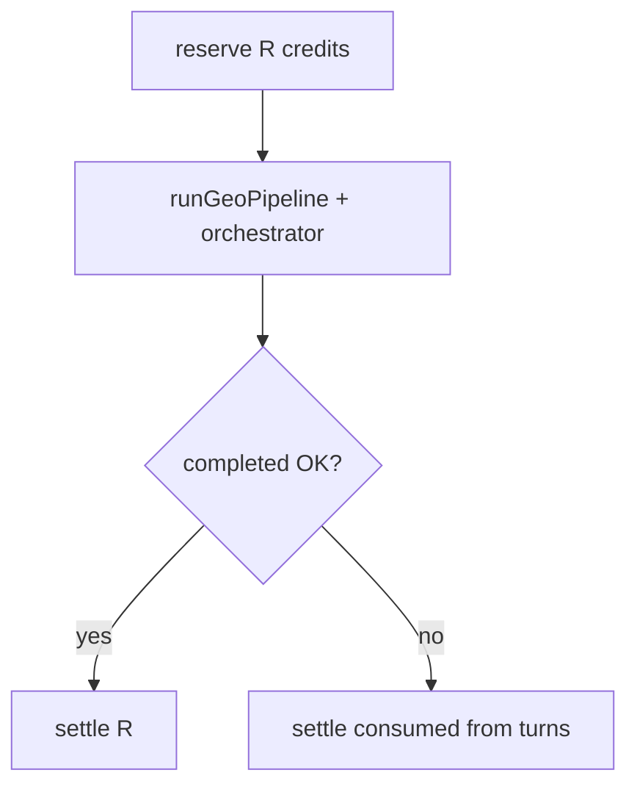

# フェーズ1.4 第4回：物理的 Refund（差分返還）ロジック統合（計画）

## 現状の整理（実装の出発点）

- [`ProjectOnboardingService`](c:\cursor\project\geo-analytics\src\main\java\com\geo\analytics\application\service\ProjectOnboardingService.java): `ONBOARDING_CREDIT = 1_000L` を [`reserve`](c:\cursor\project\geo-analytics\src\main\java\com\geo\analytics\application\service\CreditVaultService.java) し、成功時 **`settle(resId, 1_000L)`**（全額消費）、失敗時 **`refund(resId)`**（リザーブ全額を残高へ戻す）。
- [`CreditVaultService.settle`](c:\cursor\project\geo-analytics\src\main\java\com\geo\analytics\application\service\CreditVaultService.java): `consumedAmount ≤ reserved` のとき **`reserved - consumedAmount` を組織残高へ返却**し、`SETTLE` 行を 1 件残す。親 RESERVE に子が付いたら二重処理は [`existsByParentReservationId`](c:\cursor\project\geo-analytics\src\main\java\com\geo\analytics\application\service\CreditVaultService.java) で拒否。
- **`refund` と `settle` の排他**: いずれか一方のみ実行すれば二重返還は起きない（現設計のまま満たせる）。
- [`TokenProfitBudgetResolver`](c:\cursor\project\geo-analytics\src\main\java\com\geo\analytics\application\service\TokenProfitBudgetResolver.java): **ウォレットクレジットではなく**「競合 XML 最大文字数」のみ算出。**第4回の返還額をこのクラスから直接読むのは意味が一致しない**。計画としては、**(A) オンボーディング用の消費配分は `ONBOARDING_CREDIT` と `MAX_DEBATE_TURNS` ベースで定義**し、将来的に TokenProfit と同じ `AppProperties` 系から「1オンボーディングあたりのクレジット予算」を一元化する拡張余地を一文で残す、が現実的。

---

## A. 実行ターンのトラッキングと呼び出し元への伝達

**「1 ターン実行済み」の定義案（確認事項 1 への回答）**

- ディベート本体は [`DebateOnboardingOrchestrator`](c:\cursor\project\geo-analytics\src\main\java\com\geo\analytics\application\service\DebateOnboardingOrchestrator.java) の `for (turn = 0; turn < MAX_DEBATE_TURNS; turn++)`（`MAX_DEBATE_TURNS = 5`）。
- **推奨定義**: そのターンで **スケプティックの LLM 呼び出しが正常終了した直後**（同ターンの数理 `compute` の前でも後でもよいが、**「3 ペルソナ分の LLM が一通り終わった」**ことを基準にする）。こうすると、アナリスト直後に割り込まれたターンは **未完了ターン**とみなし **カウントに含めない**（ユーザーに有利で、実装も一意）。
- **ディレクター**は 5 ターン外の追加ステップ。**別フラグ** `directorLlmCompleted`（boolean）または `postDebatePhaseCompleted` で、ディレクター LLM まで完了したかだけ追う。

**伝達方式（ThreadLocal 禁止）**

- [`ContextPropagator` / `.cursorrules`](c:\cursor\project\geo-analytics\.cursorrules) 方針に合わせ、**可変ホルダを引数で下ろす**。
  - 例: `AtomicInteger executedDebateTurns`（と `AtomicBoolean directorCompleted`）を [`runDebateOnboarding`](c:\cursor\project\geo-analytics\src\main\java\com\geo\analytics\application\service\DebateOnboardingOrchestrator.java) に追加し、[`runGeoPipeline`](c:\cursor\project\geo-analytics\src\main\java\com\geo\analytics\application\service\ProjectOnboardingService.java) が生成して渡す。
  - 中断時も **これまでにインクリメント済みの値**が残るため、**CancellationException 後も参照可能**。

---

## B. 返還額（実質は「消費確定額」）の算出

**考え方**: 失敗パスで **`refund(全額)`** をやめ、**`settle(reservationId, consumedAmount)`** に統一する。`consumedAmount` が小さいほど残高に戻る金額は大きい。

**単純比例（ユーザー例に沿う）**

- `R = ONBOARDING_CREDIT`（1_000）、`N = MAX_DEBATE_TURNS`（5）。
- `t = executedDebateTurns`（0～5）。
- **ディレクターを含めない初版**:  
  `consumed = floor(R * t / N)`（整数演算: `Math.min(R, (R * t) / N)` で `t=N` 時にちょうど R）。
- **ディレクター分を配分に含める拡張案**（任意）: 総ユニット `U = N + 1`（5 ターン + ディレクター 1）、完了ユニット `u = t + (directorCompleted ? 1 : 0)`、`consumed = floor(R * u / U)`。

**丸め（確認事項 2）**

- クレジットは **`long` の最小単位 1**（[`WalletTransactionEntity.amount`](c:\cursor\project\geo-analytics\src\main\java\com\geo\analytics\domain\entity\WalletTransactionEntity.java)）。**消費側を常に切り捨て（floor）**し、余りはユーザーに戻す（過徴収回避）。
- `t` が 0 のとき `consumed = 0` → **`settle(0)`** で全額戻る（[`settle` 実装](c:\cursor\project\geo-analytics\src\main\java\com\geo\analytics\application\service\CreditVaultService.java)上、残高 `+ R`）。

**クロール前中断**

- `executedDebateTurns = 0`、ディレクター未 → 上式で **消費 0** を意図通り再現できる。

---

## C. CreditVaultService / finally の振る舞い（確認事項 3：正常終了）

| 経路 | 処理 | 二重ガード |
|------|------|------------|
| 正常完走 | 既存どおり **`settle(resId, R)`**（または比例式で `t=N`（+ ディレクター）なら同じく `consumed=R`） | 子トランザクション作成後は `refund` 不可 |
| 例外・キャンセル | **`settle(resId, consumed)`**、`consumed < R` | **`refund` は呼ばない**（全額戻しは `settle(0)` に統一可能） |
| `finally` | `!settled` のとき **常に `settle` で締める**（成功時は try 内、失敗時は finally または catch で 1 回だけ） | 同一 `reservationId` に対し settle/refund を二重実行しないよう、**成功時は `settled=true` のみ**とし、失敗時は **1 回だけ `settle(consumed)`** を呼ぶコードパスに整理 |

現状の **`refund(rid)`** は、中断時を **`settle(consumed)`** に置き換えると「全額戻し」は `consumed=0` で表現でき、`CreditVaultService` の整合性も保てる。

**監査用テキスト（要件 C）**

- 現行 [`WalletTransactionEntity`](c:\cursor\project\geo-analytics\src\main\java\com\geo\analytics\domain\entity\WalletTransactionEntity.java) に **備考カラムがない**。第4回実装では **いずれか**が必要:
  - **`wallet_transactions` に `note` または `metadata`（TEXT/JSONB）を追加**し、SETTLE 行に `SESSION_CANCELLED_SETTLE (Executed: N turns, consumed: X)` 等を保存（ユーザー例の `SESSION_CANCELLED_REFUND` は、実際の台帳操作が settle なら **`SESSION_CANCELLED_PARTIAL_SETTLE`** の方が正確）。
  - あるいは **アプリログのみ**（フィンテック要件が厳しければ DB 拡張を推奨）。

---

## D. 実装タスク（承認後）

1. **DB マイグレーション + エンティティ**: 台帳備考（任意だが要件があるなら必須）。
2. **`CreditVaultService`**: `settle` 時に `note` を保存できるようオーバーロードまたは引数追加（nullable）。
3. **`DebateOnboardingOrchestrator`**: ターン完了タイミングで `AtomicInteger` インクリメント、ディレクター完了フラグ更新；シグネチャにホルダを追加。
4. **`ProjectOnboardingService`**: ホルダ生成 → 割り込み／例外 catch で `consumed` 計算 → **`settle(resId, consumed, note)`**；成功時も **`settle(R, successNote)`** に統一するかはレビューで確定。
5. **テスト/検証**: `mvnw compile`、可能なら `CreditVaultService` の単体テストで `settle` 後の残高と子行 1 件を確認。

本ドキュメントは **計画のみ**（コード変更は承認後）。
