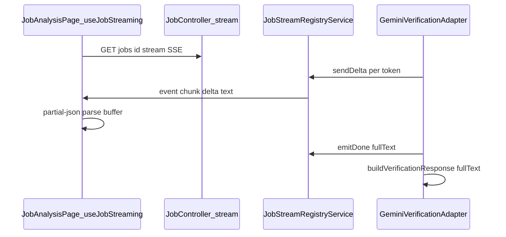

# フェーズ3.1 第1回：AIストリーミングUXの解体（調査結果と修正計画）

## 1. 特定された対象ファイル

### フロントエンド

| ファイル | 現状のロジック概要 |
|---------|-------------------|
| [geo-analytics/frontend/package.json](geo-analytics/frontend/package.json) | 依存: **`partial-json`**（^0.1.7）、**`@microsoft/fetch-event-source`**（SSE クライアント）。 |
| [geo-analytics/frontend/src/hooks/useJobStreaming.ts](geo-analytics/frontend/src/hooks/useJobStreaming.ts) | `GET /api/v1/jobs/{id}/stream` に **`fetchEventSource`** で接続。`event: chunk` の `kind: delta|done|error` でテキストをバッファし、**`partial-json` の `parse(json, Allow.ALL)`** で増分パース → `parsedByQueryId` を更新。完了は `done` か `onclose` で `onStreamSettled`。 |
| [geo-analytics/frontend/src/pages/JobAnalysisPage.tsx](geo-analytics/frontend/src/pages/JobAnalysisPage.tsx) | `useJobStreaming` を利用。解析中に **「ライブプレビュー（partial-json）」テーブル**を表示。`resultRows` が空のときチャート用の **`resolveChartTrendData` / `resolveChartShareData` / `resolveAverageSomScore`**（[geo-analytics/frontend/src/types/analysis.ts](geo-analytics/frontend/src/types/analysis.ts)）が **`parsedByQueryId`** 由来のライブ平均をフォールバックに使用。 |
| [geo-analytics/frontend/src/types/analysis.ts](geo-analytics/frontend/src/types/analysis.ts) | `averageLiveScoresFromParsed` / `resolveChartTrendData` 等が **`isStreaming` + `parsedByQueryId`** に依存（ストリーム廃止時は空オブジェクト＋ `isStreaming=false` で既存 `resultRows` 優先の動きへ寄せられる）。 |

**スコープ外（今回の「partial-json解体」とは別チャネル）**

- [geo-analytics/frontend/src/hooks/useOnboardingStream.ts](geo-analytics/frontend/src/hooks/useOnboardingStream.ts)：オンボーディング／ディベート用 SSE。ペイロードは **`JSON.parse` で完全オブジェクト**を想定しており **`partial-json` 未使用**。

### バックエンド

| ファイル | 現状のロジック概要 |
|---------|-------------------|
| [geo-analytics/src/main/java/com/geo/analytics/web/controller/JobController.java](geo-analytics/src/main/java/com/geo/analytics/web/controller/JobController.java) | `GET /api/v1/jobs/{jobId}/stream` が **`SseEmitter`** を返却。ジョブ状態に応じて即座に `done`／エラー用エフェメラル emitter、または **`JobStreamRegistryService.register`**。 |
| [geo-analytics/src/main/java/com/geo/analytics/application/service/JobStreamRegistryService.java](geo-analytics/src/main/java/com/geo/analytics/application/service/JobStreamRegistryService.java) | `VerifyStreamEvent`（`kind`, `text`, `queryId`）を **`chunk`** イベントとして SSE 送信。`sendDelta` / `emitDone` / `failWithError` / `complete`。 |
| [geo-analytics/src/main/java/com/geo/analytics/infrastructure/ai/GeminiVerificationAdapter.java](geo-analytics/src/main/java/com/geo/analytics/infrastructure/ai/GeminiVerificationAdapter.java) | `jobId == null` 時は非ストリーム **`geminiGbvsChatModel.chat`（`verifyWithoutJobStream`）**。`jobId != null` 時は **`GoogleAiGeminiStreamingChatModel` + `StreamingResponseHandler`**（`verifyWithJobStream`）。各トークンで **`jobStreamRegistryService.sendDelta`**、完了で **`emitDone`** と **`buildVerificationResponse(fullText, ...)`**（**パース・GEO計算は従来どおり `buildVerificationResponse` 側**）。 |
| [geo-analytics/src/main/java/com/geo/analytics/web/dto/VerifyStreamEvent.java](geo-analytics/src/main/java/com/geo/analytics/web/dto/VerifyStreamEvent.java) | SSE ペイロード用レコード（snake_case JSON シリアライズ）。 |

**参考（ジョブSSE以外のSSE）**

- [DebateOnboardingStreamController](geo-analytics/src/main/java/com/geo/analytics/web/controller/DebateOnboardingStreamController.java) / [OnboardingDebateStreamRegistry](geo-analytics/src/main/java/com/geo/analytics/application/service/OnboardingDebateStreamRegistry.java) はオンボーディング用。**第1回スコープ外**。

---

## 2. 修正計画（フロントエンド）

1. **依存関係**  
   - `package.json` / `package-lock.json` から **`partial-json` を削除**（実装フェーズで実行）。  
   - **`@microsoft/fetch-event-source`** は、ジョブ用 SSE を完全撤去するなら **ジョブ経路では不要**にできる。残すかは「オンボーディングのみで使用」かで判断（現状オンボーディングでも使用中）。

2. **[useJobStreaming.ts](geo-analytics/frontend/src/hooks/useJobStreaming.ts)**  
   - **案A（推奨・最小・コア非接触）**: フック自体を **薄くするか撤去**し、解析中は **`isStreaming=false`・`parsedByQueryId={}`** 固定。完了・失敗は既存の **ジョブ状態取得（`/api/v1/jobs/{id}` や分析結果GET、STOMP 等）** に寄せる。  
   - **`JSON.parse` は「サーバーから返る完全な JSON 文字列」に対してのみ**使用（増分バッファ＋`partial-json`は廃止）。

3. **[JobAnalysisPage.tsx](geo-analytics/frontend/src/pages/JobAnalysisPage.tsx)**  
   - **`connectJobStream` の `useEffect` を削除**し、解析中は **スピナー／固定メッセージのみ**（既存「解析中です」ブロックを維持）。  
   - **「ライブプレビュー（partial-json）」ブロックを削除**。  
   - チャートは **`resultRows` が埋まるまで** [analysis.ts](geo-analytics/frontend/src/types/analysis.ts) のデフォルト（空トレンド等）に依存するか、必要なら軽い **ポーリングで `resultRows` 更新**（別エンドポイントの有無は実装フェーズで確認）。

4. **[analysis.ts](geo-analytics/frontend/src/types/analysis.ts)**  
   - `parsedByQueryId` / `isStreaming` 分岐は **互換のため残してもよい**が、常に空＋非ストリームなら **デッドコード化**する場合は段階的に整理。

---

## 3. 修正計画（バックエンド）

現状、**ジョブ付き検証は既に Gemini から完全テキストで `buildVerificationResponse` しており、SSEは「転送用」**です。

1. **[GeminiVerificationAdapter.java](geo-analytics/src/main/java/com/geo/analytics/infrastructure/ai/GeminiVerificationAdapter.java)**  
   - **`jobId != null` でも `verifyWithoutJobStream` と同様に非ストリーム `chat` に統一**する、またはストリーム API のまま **`sendDelta`/`emitDone` 呼び出しのみ停止**し、集約テキストは `onComplete` のみ使用（**プロンプト・`buildVerificationResponse` は不変**）。

2. **[JobStreamRegistryService](geo-analytics/src/main/java/com/geo/analytics/application/service/JobStreamRegistryService.java) / [JobController.streamJob](geo-analytics/src/main/java/com/geo/analytics/web/controller/JobController.java)**  
   - フロントが接続しなくなる場合:  
     - **案A**: `GET .../stream` を **404 または即時 `done` のエフェメラルのみ**に縮退（後方互換）。  
     - **案B**: エンドポイントを **非推奨コメント＋短期 Deprecation** のうえ削除（モバイル等の利用有無は実装前に確認）。  
   - **`JobQuerySubmissionService` の `jobStreamRegistryService.complete(jobId)`** は、レジストリが残るなら維持、不要なら整理。

3. **「すでに一括JSONを返すREST」**  
   - ジョブ完了後の分析表示用 API は既存フロー利用。**Gemini の生 JSON を「一つの HTTP 200 で返す」専用新規 API は必須ではない**（検証結果は永続化＋GETで足りる想定）。

---

## 4. セーフティ確認（コアGEOロジック非接触の宣言）

- **変更対象はトランスポート層（SSE／ストリーミング転送）とフロントの増分パース・ライブ UI のみ**とする。  
- **`GeminiVerificationAdapter.buildVerificationResponse`、`SomScoreParser`、プロンプト本文、名寄せ（`EntityNormalizer` / Jaro‑Winkler 等）、Z-score／SoM・GBVS 系の** **[domain / application の計算・パース本体](geo-analytics/src/main/java/com/geo/analytics)** には、本計画では **手を入れない**（`verify` の入口を「非ストリーム1本化」にする場合も **`buildVerificationResponse` の呼び出し経路は同一**）。  
- オンボーディング SSE・別Controllerは **第1回の解体対象から除外**し、必要なら後続タスクで扱う。
