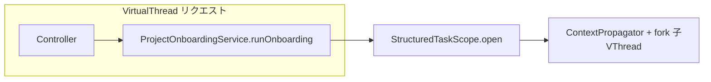

# Phase 1.1 第6回: API & UI 実装計画

## 1. 修正・新規作成するファイルのパス一覧

### バックエンド（Spring Boot）

| 操作 | パス | 内容 |
|------|------|------|
| 新規 | [geo-analytics/src/main/java/com/geo/analytics/web/controller/ProjectOnboardingController.java](geo-analytics/src/main/java/com/geo/analytics/web/controller/ProjectOnboardingController.java) | `POST /api/v1/projects/{id}/extract-context`（body: URL）、`PATCH /api/v1/projects/{id}/context`（body: 修正 DTO）。既存の [ProjectAnalyticsController](geo-analytics/src/main/java/com/geo/analytics/web/controller/ProjectAnalyticsController.java) は `/api/v1/projects` だが、パスが `.../extract-context` / `.../context` のため衝突なし。 |
| 新規 | [geo-analytics/src/main/java/com/geo/analytics/web/dto/ExtractContextRequest.java](geo-analytics/src/main/java/com/geo/analytics/web/dto/ExtractContextRequest.java) | `url` に `@NotBlank`、HTTPS/HTTP 等は `@Pattern` または専用バリデータ（既存 [KeywordController](geo-analytics/src/main/java/com/geo/analytics/web/controller/KeywordController.java) 系と整合）。 |
| 新規 | [geo-analytics/src/main/java/com/geo/analytics/web/dto/ProjectContextPatchRequest.java](geo-analytics/src/main/java/com/geo/analytics/web/dto/ProjectContextPatchRequest.java) | Profit Guard: `industryType`（`@NotNull` + `IndustryType`）、`extractedStrengths` / `targetAudience` に `@Size(max=1000)`（要件どおり。必要なら `min` は任意）。JSON は既存方針に合わせ [ProjectSettingsPatchRequest](geo-analytics/src/main/java/com/geo/analytics/web/dto/ProjectSettingsPatchRequest.java) と同様に `@JsonProperty` で snake_case も可。 |
| 新規 | [geo-analytics/src/main/java/com/geo/analytics/web/dto/ProjectContextResponse.java](geo-analytics/src/main/java/com/geo/analytics/web/dto/ProjectContextResponse.java) | POST 成功時および PATCH 返却用に `industryType`・`extractedStrengths`・`targetAudience` 等（プレビュー用）。 |
| 新規 | [geo-analytics/src/main/java/com/geo/analytics/application/service/ProjectContextService.java](geo-analytics/src/main/java/com/geo/analytics/application/service/ProjectContextService.java)（仮名） | PATCH: 短い `@Transactional` で [ProjectEntity](geo-analytics/src/main/java/com/geo/analytics/domain/entity/ProjectEntity.java) 更新。テナント/ワークスペースは [ProjectSettingsService](geo-analytics/src/main/java/com/geo/analytics/application/service/ProjectSettingsService.java) の `readWorkspaceId` + `TenantPlanScope.executeWithTenant` パターンに揃えるのが一貫。 |
| 参照のみ | [geo-analytics/src/main/java/com/geo/analytics/application/service/ProjectOnboardingService.java](geo-analytics/src/main/java/com/geo/analytics/application/service/ProjectOnboardingService.java) | POST から `runOnboarding(projectId, url)` を呼ぶ（変更は「公開メソッドの戻り値を 204→レスポンス用 DTO返却」にするかは任意。戻り `void` のままなら POST 後に `ProjectContextService` または Repository で再読込して返却）。 |
| 任意 | [geo-analytics/src/main/java/com/geo/analytics/web/dto/ProjectSettingsResponse.java](geo-analytics/src/main/java/com/geo/analytics/web/dto/ProjectSettingsResponse.java) 等 | 既存 DTO 拡張より、コンテキスト専用 `ProjectContextResponse` を分離する方針推奨。 |
| テスト（推奨） | `src/test/java/.../ProjectOnboardingControllerTest.java` または `...IntegrationTest` | MockMvc + 400 `validation_failed` のスモーク。 |

### フロントエンド（Vite + React + MUI + Tailwind）

| 操作 | パス | 内容 |
|------|------|------|
| 新規 | [geo-analytics/frontend/src/pages/GeoOnboardingView.tsx](geo-analytics/frontend/src/pages/GeoOnboardingView.tsx) | URL 入力、ローディング、プレビュー＆業種 Select、強み（Chip または TextField）、保存（PATCH）、トースト。 |
| 新規（推奨） | [geo-analytics/frontend/src/api/geoOnboardingApi.ts](geo-analytics/frontend/src/api/geoOnboardingApi.ts) | `apiFetch` ラッパ。POST 抽出は長時間のため `signal` + 長め `RequestInit` の検討（下記「フォロー」）。 |
| 更新 | [geo-analytics/frontend/src/App.tsx](geo-analytics/frontend/src/App.tsx) | 例: `/projects/:projectId/onboarding` ルート追加（要認証の `RequireAuthLayout` 配下）。 |

**既存の利用**: [apiFetch](geo-analytics/frontend/src/api/apiFetch.ts)、[ProjectSettingsPage](geo-analytics/frontend/src/pages/ProjectSettingsPage.tsx) の MUI + `Snackbar` パターン、[`parseJsonTextAsCamel` / `responseJsonAsCamel`](geo-analytics/frontend/src/api/apiFetch.ts) でレスポンスを camelCase 化。

---

## 2. API バリデーションエラー時のフロント通知方針

**サーバー側（既存）**: [GlobalExceptionHandler](geo-analytics/src/main/java/com/geo/analytics/web/exception/GlobalExceptionHandler.java) の `MethodArgumentNotValidException` ハンドラが **HTTP 400** と [ApiErrorResponse](geo-analytics/src/main/java/com/geo/analytics/web/dto/ApiErrorResponse.java) を返却する。`errorCode` は `validation_failed`、人向け `message`、**フィールド別**は `details.fields`（`Map<フィールド名, メッセージ>`）。

**クライアント側**:
- `!res.ok` かつ `res.status === 400` のとき、本文を `parseJsonTextAsCamel` でパースし、`errorCode === "validation_failed"` なら:
  - **トップ**: `message`（例:「入力内容を確認してください。」）を **Snackbar**（`ProjectSettingsPage` 同様）で表示
  - **補足**: `details.fields` を MUI `Alert` 下に箇条書き、または各フィールド直下に `TextField` の `error` / `helperText` へ割当（`fields` キーは **Java のフィールド名**のため、DTO のプロパティ名とフロント state 名を揃えると実装が簡単）
- ネットワーク・5xx ・認証失敗は既存 `apiFetch` 挙動（401 リフレッシュ等）に従い、**バリデーション専用分岐**のみ追加

---

## 3. 仮想スレッド（Virtual Threads）を活かす際の注意点

- **既存設定**: [application.yml](geo-analytics/src/main/resources/application.yml) の `spring.threads.virtual.enabled: true` により、Tomcat 上のリクエスト処理が仮想スレッド上で行われやすい。コントローラは **追加の `Executor` でラップせず** `projectOnboardingService.runOnboarding(...)` を **そのまま同期呼び出し**する（内部で既に [StructuredTaskScope](geo-analytics/src/main/java/com/geo/analytics/application/service/ProjectOnboardingService.java) + [ContextPropagator](geo-analytics/src/main/java/com/geo/analytics/infrastructure/tenant/ContextPropagator.java) により子タスクが仮想スレッド化されている）。
- **避ける**: リクエスト全体を `platform` スレッド向け `ForkJoinPool.commonPool()` や固定サイズ `ThreadPool` に `CompletableFuture` だけ流す（VT と二重化し、意図が不明確になる）。非同期化が必要なら、別途 Spring MVC の `DeferredResult` / リッチな設計を検討するが、本要件は同期 POST でよい。
- **ピン留め（pinning）**: 深い入れ子 `synchronized` や、ブロッキング I/O 直前の不適切な `synchronized` はキャリアスレッドを占有しうる。本フローでは新規にそのような箇所を足さない。JDBC/HTTP は既存使用に委ねる。
- **接続の占有**: [ProjectOnboardingService](geo-analytics/src/main/java/com/geo/analytics/application/service/ProjectOnboardingService.java) は長い I/O 中に `@Transactional` を保持しない設計済み。コントローラに `@Transactional` を付けない（要件どおり）、PATCH 専用サービスは短いトランザクションに限定。
- **タイムアウト**: 抽出が数十秒～数分かかるため、[server 側](geo-analytics/src/main/resources/application.yml) の接続/読み取りタイムアウトと、フロントの `fetch` 用に **長めの `signal` または専用オプション**を POST にだけ付与し、失敗時はユーザー向けメッセージ（タイムアウト／再試行）を表示する方針を明記する。

---

## 実装時の小さな決定事項（コード着手時）

- POST `/extract-context` のレスポンス: オンボーディング完了後の `ProjectContextResponse` を返し、フロントは **追加 GET なし**でプレビュー可能にするのが UX 的に望ましい。
- `industry` の表記: API は `IndustryType` 列挙名（`YMYL` 等）で統一、フロントの Select `value` と一致させる。
