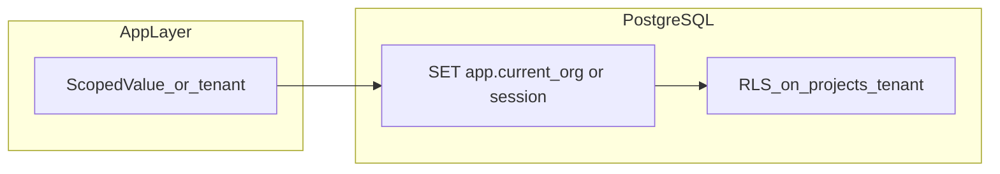

# Phase 1.1 第1回：DB・ドメイン・不変定義 実装計画

## 前提（リポジトリ事実）

- [`projects`](geo-analytics/src/main/resources/db/migration/V1__init_schema.sql) には **`tenant_id`（ワークスペースID）** があり、RLS は `workspaces` 経由で **`organization_id`** と突き合わせる式で行われている。`projects` テーブルに `organization_id` 列は**無い**（ドキュメント上の「organization_id による隔離」は**論理的な隔離＝RLS 式**の意図と読むのが正確）。
- 既に [`V104__audit_histories_rank_position_nullable.sql`](geo-analytics/src/main/resources/db/migration/V104__audit_histories_rank_position_nullable.sql) が存在するため、指定名 **`V104__add_geo_context_to_projects.sql` は Flyway 衝突で適用不能**。新規マイグレーションは [**`V108__add_geo_context_to_projects.sql`**](geo-analytics/src/main/resources/db/migration/)（現状最新が V107 の次）とする。設計士レビュー時に、履歴の都合で別番号にしたい場合は番号だけ調整。

---

## 1. 修正・新規作成するファイルのパス一覧

| 操作 | パス |
|------|------|
| 新規 | [`geo-analytics/src/main/java/com/geo/analytics/domain/enums/IndustryType.java`](geo-analytics/src/main/java/com/geo/analytics/domain/enums/IndustryType.java) |
| 変更 | [`geo-analytics/src/main/java/com/geo/analytics/domain/entity/ProjectEntity.java`](geo-analytics/src/main/java/com/geo/analytics/domain/entity/ProjectEntity.java) |
| 新規 | [`geo-analytics/src/main/resources/db/migration/V108__add_geo_context_to_projects.sql`](geo-analytics/src/main/resources/db/migration/V108__add_geo_context_to_projects.sql)（V104 では不可、上記理由） |

**今回のスコープ外（要件に含まれないため計画に含めない）**

- API / `ProjectSettingsResponse` 等の公開フィールド追加（次チケットで可）
- `ScopedValue` / DB 接続 GUC 設定まわりの変更（**スキーマだけでは不要**）
- 既存 SEO 系データの削除（**行わない**）

**Envers について**

- [`BaseTenantEntity`](geo-analytics/src/main/java/com/geo/analytics/domain/entity/BaseTenantEntity.java) に `@Audited` があり、子の [`ProjectEntity`](geo-analytics/src/main/java/com/geo/analytics/domain/entity/ProjectEntity.java) も監査対象。新列を JPA に載せるなら、**Hibernate Envers 用**に [`projects_aud`](geo-analytics/src/main/resources/db/migration/V1__init_schema.sql) にも**同型の列を追加**する（V102 の `audit_histories_aud` 修正パターンと同様）。さもなくば新フィールドに `@org.hibernate.envers.NotAudited`（実装時に要判断）—**本計画では「監査行も一貫させる」方針を推奨**（WORM/履歴方針と整合）。

---

## 2. Flyway SQL の具体的な定義（DDL 案）

**ファイル名**: `V108__add_geo_context_to_projects.sql`（V104 指定の場合はリネーム衝突解消必頡）

```sql
-- projects: GEO オンボーディング用コンテキスト（既存 RLS 式は tenant_id ベースのまま → ポリシー再定義不要）
ALTER TABLE public.projects
    ADD COLUMN industry_type VARCHAR(32),
    ADD COLUMN extracted_strengths TEXT,
    ADD COLUMN target_audience TEXT;

COMMENT ON COLUMN public.projects.industry_type IS '業種分類 (IndustryType 名の文字列; null は未設定)';
COMMENT ON COLUMN public.projects.extracted_strengths IS 'クローラ/LLM 等で抽出した自社の強み（テキスト）';
COMMENT ON COLUMN public.projects.target_audience IS '想定ターゲット層（テキスト）';

-- Envers: ProjectEntity の監査行とスキーマを揃える
ALTER TABLE public.projects_aud
    ADD COLUMN industry_type VARCHAR(32),
    ADD COLUMN extracted_strengths TEXT,
    ADD COLUMN target_audience TEXT;
```

**列設計の補足**

- `industry_type`: JPA `@Enumerated(STRING)` と一致させ、値は `YMYL`, `LOCAL`, `B2B`, `B2C`, `EC`, `OTHER`（Enum 定数名どおり）。**既存行は NULL 可**（マイグレーション安全。デフォルトを `OTHER` に固定するかはプロダクト判断）。
- `extracted_strengths` / `target_audience`: 可変長のため `TEXT`。
- **新規 `CREATE POLICY` / `DROP POLICY` / RLS 再有効化は不要**（既存 policy は行単位。列追加は行の属するテナントを変えない）。

`GRANT` 再実行も通常不要（テーブル単位付与のまま新列に継承）。

---

## 3. マルチテナント（RLS / ScopedValue）を壊さないための注意点



- **RLS**: [`V1__init_schema.sql`](geo-analytics/src/main/resources/db/migration/V1__init_schema.sql) の `projects` / `projects_aud` ポリシーは、**`tenant_id` 経由で `workspaces.organization_id` を照合**している。今回の `ALTER TABLE ... ADD COLUMN` は**式・結合先を変えない**ため、**ポリシー改変は原則不要**。誤って `DISABLE ROW LEVEL SECURITY` や全 `DROP POLICY` を行わないこと。
- **organization_id 列の誤解**: 物理列として `projects.organization_id` を足さない限り、既存の「ワークスペース紐づけ」モデルは維持される。必要なのは**列追加のみ**。
- **Envers 監査表 `projects_aud`**: ポリシーは [`projects_aud.tenant_id`](geo-analytics/src/main/resources/db/migration/V1__init_schema.sql) ベース。こちらも同様に**列追加のみ**で RLS 破壊リスクは低い。
- **ScopedValue / 接続スコープ**: 本チケットは**スキーマ＋エンティティ**中心。`ThreadLocal` 禁止・`ScopedValue` 方針は、**新コードで ThreadLocal を導入しない**こと。DB 接続の GUC 設定箇所は**変更不要**（既存の `app.current_*` 設定があればそのまま）。

---

## `IndustryType.java` 実装方針（実装フェーズ用メモ）

- パッケージ: 既存と揃え [`com.geo.analytics.domain.enums`](geo-analytics/src/main/java/com/geo/analytics/domain/enums/)。
- 定数: `YMYL`, `LOCAL`, `B2B`, `B2C`, `EC`, `OTHER`。
- 各定数に **日本語 `label`（例: getter `getLabel()`）** を持たせる。既存 `PreferredEngine` はラベル無しのため、**新設 Enum だけ**が表示用ラベルを持てばよい。

## `ProjectEntity` 実装方針（実装フェーズ用メモ）

- `industryType`: `@Enumerated(EnumType.STRING)`、`@Column(name = "industry_type", length = 32)`、**nullable**（既存行・段階的入力を許容するため）。
- `extractedStrengths` / `targetAudience`: `TEXT` 相当。`@Lob` は方言次第で不都合が出る場合があるため、**`@Column(columnDefinition = "text")` または素の `@Column` で JPA デフォルトに任せる**形は既存エンティティ方針に合わせる（実装時に他 Entity の TEXT 使用を1ファイル参照で統一）。

---

**設計士への確認事項（1点）**

- マイグレーション名を **必ず `V104__...` にしたい**場合: 既存 V104 との**リナンバリング**（チーム合意＋全環境の `flyway_schema_history` 照合）が必要。新規 alone では不可。
