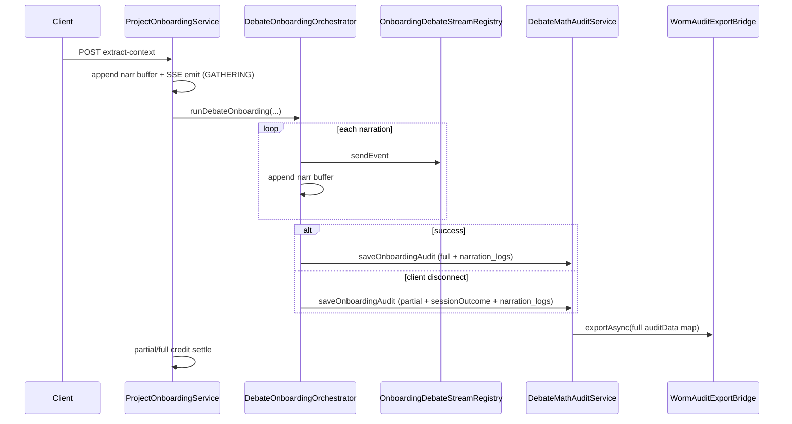

# フェーズ1.4 第6回：実況履歴のWORMアーカイブと最終統合（計画）

## 現状整理（コード根拠）

- 実況送信は **2経路** あり、いずれも `DebateOnboardingSseEvent` を生成している。
  - [`ProjectOnboardingService`](c:\cursor\project\geo-analytics\src\main\java\com\geo\analytics\application\service\ProjectOnboardingService.java) の `emitNarration`（GATHERING 前半）
  - [`DebateOnboardingOrchestrator`](c:\cursor\project\geo-analytics\src\main\java\com\geo\analytics\application\service\DebateOnboardingOrchestrator.java) の `emitNarration`（ディベート本編）
- 監査永続化は [`DebateMathAuditService.saveOnboardingAudit`](c:\cursor\project\geo-analytics\src\main\java\com\geo\analytics\application\service\DebateMathAuditService.java) のみ。現状は **ディレクター LLM 完了後**（[`runDebateOnboarding` 末尾付近](c:\cursor\project\geo-analytics\src\main\java\com\geo\analytics\application\service\DebateOnboardingOrchestrator.java)）に **1回だけ** 呼ばれる。`CancellationException` / 中断では **到達しない**。
- WORM 側は保存直後に `new LinkedHashMap<>(saved.getAuditData())` で **JSONB 全体をコピー**して [`WormAuditExportBridge.exportAsync`](c:\cursor\project\geo-analytics\src\main\java\com\geo\analytics\application\service\WormAuditExportBridge.java) に渡すため、`audit_data.narration_logs` を追加すれば **ブリッジのシグネチャ変更なし**でエクスポート対象に含まれる（[`LocalWormAuditAdapter`](c:\cursor\project\geo-analytics\src\main\java\com\geo\analytics\infrastructure\adapter\LocalWormAuditAdapter.java) の実装確認を含める）。

## 実装方針（承認後に着手）

### A. 実況ログの収集と一時保持

- **単一の「セッション単位バッファ」**を `runGeoPipeline` で生成し、**GATHERING の `emitNarration` と `runDebateOnboarding` の両方**から同じバッファへ追記する。
  - 追記は **SSE 送信成功/失敗に依存せず**「意図したイベント」を記録するか、送信に成功したものだけ記録するかを決める。**推奨**: **送信直前に組み立てた `DebateOnboardingSseEvent` と同一内容**をバッファへ `append`（SSE 失敗時も「配信を試みた実況」が監査に残る）。APPI 的には「表示遅延」と「監査」の差分説明が必要なら別途ドキュメント化。
- **実装形態**: 仮想スレッド内での `ArrayList` + `List.copyOf` でスナップショット化、または **追記専用の小さなクラス**（`synchronized` / `ReentrantLock` で `emit` と `snapshot` を直列化）。ワーカーは原則シングルスレッドだが、配信 Executor との境界を鑑み **スレッドセーフは最小限確保**。
- **メモリ効率（ご質問1への回答）**:
  - `ArrayList` の **初期容量**を「典型的ラウンド数」に合わせて予約（例: 32〜64）。不要な再アロケーションを抑制。
  - 監査用エントリは **`Map<String,Object>` または専用 record → Map 変換** とし、`partialScores` のような **大きな配列は監査にフルコピーしない**方針を推奨。要件で必須なのは `timestamp`, `persona`, `status`, `message` に加え **`eventType`**（`NARRATION` / `SCORE_UPDATE` 等の区別）程度。`SCORE_UPDATE` は必要なら **`round`, `geo_ig` などスカラー数個**に要約した `scoreSummary` のみを追加（フル `p_site` は数理フィールドは既に `audit_data` 別キーで保持しているため重複を避ける）。

### B. `audit_data` への `narration_logs` 統合

- [`DebateMathAuditService.saveOnboardingAudit`](c:\cursor\project\geo-analytics\src\main\java\com\geo\analytics\application\service\DebateMathAuditService.java) を拡張し、`audit.put("narration_logs", ...)` を追加。
- 各要素は少なくとも:
  - `timestamp`（`Instant` → ISO-8601 文字列または epoch ms で **一貫した形式**）
  - `persona`（列挙名文字列）
  - `status`（`DebateStreamPhase`、null 許容なら `"GATHERING"` 等と揃える）
  - `message`
  - **`eventType`**（必須推奨）
- 追加で **`sessionId`**（UUID 文字列）を各行または `audit_data` トップレベルに含めると、後追いの相関が容易。

### C. 中断時の保存方針（ご質問2への提案）

**推奨: 第6回で方針変更し、「中断理由を含めて保存」する。**

- **理由**: 透明性要件では「結論だけでなく途中経緯」が重要で、中断こそ紛争トリガーになりやすい。現状の「監査なし + 部分精算のみ」では説明が弱い。
- **振る舞い**:
  - `DebateOnboardingOrchestrator.runDebateOnboarding` を **`try / catch / finally` で囲み、監査保存は原則 `finally` で最大1回**（二重 INSERT を防ぐ `boolean auditSaved` フラグ）。
  - 正常完了: 既存の数理・証拠と同一の意味で `stopReason` / `turnCount` を保存。
  - **クライアント切断**（`CancellationException` または interrupt 起因）: `audit_data.sessionOutcome = CLIENT_DISCONNECT`（または `USER_ABORT`）のような **固定語彙**、`stopReason` / `turnCount` / 最後に分かっている `lastSnapshot`・`lastGeoIg` 等を **「途中値として」**保存。
  - 監査末尾に **合成の最終行**（例: `SYSTEM` + `message` に `SESSION_END: CLIENT_DISCONNECT, executedTurns=N`）を **オプションで**追加し、ログとトップレベルフィールドの両方で中断を突き止められるようにする。
- **`ProjectOnboardingService` の部分精算**（[`SESSION_CANCELLED_PARTIAL_SETTLE`](c:\cursor\project\geo-analytics\src\main\java\com\geo\analytics\application\service\ProjectOnboardingService.java)）との整合:
  - 監査のトップレベルに `executedTurnsAtEnd`（`AtomicInteger` の値）と、**消費額計算に使う定数**（`ONBOARDING_CREDIT`, `MAX_DEBATE_TURNS` 参照名 or 値）を記録し、レジャー説明と **突合可能**にする（レジャー `note` 文字列の完全コピーは二重真実源になりやすいので、**構造化フィールド + 既存 note パターン**の併記を推奨）。

### D. 非同期 WORM エクスポートの確認

- [`DebateMathAuditService`](c:\cursor\project\geo-analytics\src\main\java\com\geo\analytics\application\service\DebateMathAuditService.java) は保存後に **拡張済み `auditData` をそのまま** `MathDebateAuditExportEvent` に載せているため、**追加コードは「監査 Map に key を足すだけ」で足りる想定**。
- 承認後の作業で、`LocalWormAuditAdapter` の出力 JSON に `narration_logs` が含まれること、`@Async` 実行スレッドで例外が飲み込まれても本処理が壊れないこと（現状どおり）を **統合テストまたは手動検証手順**で確認。

## フェーズ1全体の総括検証（ご質問3）

**「1回のリクエスト」で矛盾なく動くこと**の確認は、次の **3層**を組み合わせるのが現実的。

1. **契約テスト / 統合テスト（自動）**
   - 認証・テナントヘッダ（1.1 系）を付けた **`/extract-context` 1回**で、`project` 更新 + `math_debate_audit_events` 1行 + （テスト用）WORM出力に `narration_logs` が存在すること。
   - **SSE 登録 → 即切断**シナリオで、**部分精算**が走り、かつ **監査行が `sessionOutcome=CLIENT_DISCONNECT` 相当で残る**こと。
2. **観測可能性（ログ/DB）**
   - 同一 `sessionId` で SSE イベント数と `narration_logs` 件数の **相関**（完全一致は送信失敗ポリシー次第だが、**差分説明可能**ならよい）。
3. **手動チェックリスト（リリース前）**
   - 1.4.2 の物理 Refund / 部分消費の **クレジット台帳**と、監査 JSON の `executedTurns` / 記載された計算根拠が **説明可能に一致**すること。

（1.1 の「セキュリティ」具体項目がプロジェクト内にチェックリスト化されていれば、それを **同じ E2E シナリオの前提条件**に組み込む。）

## リスク・オープン項目

- **監査保存とビジネス例外**: LLM 失敗・HTTP 失敗など「切断以外の失敗」でも監査を残すかは、**個人情報・トークンコスト**と相談。最低限 **CLIENT_DISCONNECT** は必須、その他は `sessionOutcome=FAILED` + 安全なエラークラス名のみ、等の **マスキング方針**を承認時に固定するとよい。
- **二重保存**: 正常系で `saveOnboardingAudit` を try と finally の両方に置くと重複しうるため、**単一出口（finally か private メソッド1箇所）**に集約する。

## 承認後の主な変更ファイル（予定）

- [`ProjectOnboardingService.java`](c:\cursor\project\geo-analytics\src\main\java\com\geo\analytics\application\service\ProjectOnboardingService.java) — バッファ生成・`runDebateOnboarding` への引き渡し・GATHERING `emit` の統合
- [`DebateOnboardingOrchestrator.java`](c:\cursor\project\geo-analytics\src\main\java\com\geo\analytics\application\service\DebateOnboardingOrchestrator.java) — バッファ追記、`try/catch/finally` での監査保存、中断時メタデータ
- [`DebateMathAuditService.java`](c:\cursor\project\geo-analytics\src\main\java\com\geo\analytics\application\service\DebateMathAuditService.java) — `narration_logs` / `sessionOutcome` 等のマップ構築
- （必要なら）新規 `OnboardingNarrationAuditBuffer.java`（`application/service` または `domain/model`）

スキーママイグレーションは **`audit_data` JSONB 内の拡張のみ**なら **DB マイグレーション不要**（現行 [`MathDebateAuditEventEntity`](c:\cursor\project\geo-analytics\src\main\java\com\geo\analytics\domain\entity\MathDebateAuditEventEntity.java) が Map で保持）。
