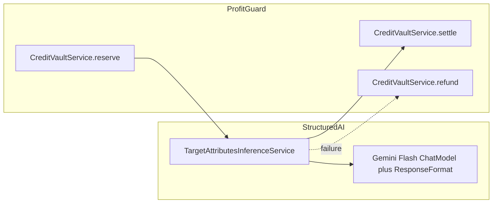

# 第2回：自社 URL 属性推論エンジン（AI）設計計画

## コードベースから読み取った前提

- **モデル名**: リポジトリに **`gemini-1.5-flash` の文字列は無く**、[`LlmModelNames`](geo-analytics/src/main/java/com/geo/analytics/infrastructure/ai/LlmModelNames.java) は **`gemini-2.5-flash` / `gemini-2.5-pro`**（実質 Flash 相当は `GEMINI_25_FLASH`）。要件の「1.5 Flash」は **運用上の意図**として **`GEMINI_25_FLASH` を採用**し、将来 YAML で差し替え可能にするのが現実的。
- **Structured Output**: [`GeoOnboardingOutputSchema`](geo-analytics/src/main/java/com/geo/analytics/infrastructure/ai/GeoOnboardingOutputSchema.java)、[`DomainAnalysisOutputSchema`](geo-analytics/src/main/java/com/geo/analytics/infrastructure/ai/DomainAnalysisOutputSchema.java) と同様に **`ResponseFormat` + `JsonSchema.builder()`** を [`GoogleAiGeminiChatModel`](geo-analytics/src/main/java/com/geo/analytics/infrastructure/config/AiConfig.java) の **`.responseFormat(...)`** にバインドする方式が踏襲できる。
- **`@CreditReservation`**: **現状存在しない**。ウォレット原価は [`CreditVaultService#reserve`](geo-analytics/src/main/java/com/geo/analytics/application/service/CreditVaultService.java) / **`settle`** / **`refund`** と [`TransactionType`](geo-analytics/src/main/java/com/geo/analytics/domain/enums/TransactionType.java) が実体。[`ProjectOnboardingService`](geo-analytics/src/main/java/com/geo/analytics/application/service/ProjectOnboardingService.java) が **`ONBOARDING_CREDIT`** 固定額で **try 内 reserve → 成功時 settle / 失敗時 refund** に近いパターンを実装済み。
- **tenant**: `CreditVaultService` は **`TenantContextHolder.requireContext().organizationId()`** 前提のため、呼び出し側は **ワークスペース／組織コンテキストが束ねられたトランザクション内**で実行する必要がある（フェーズ2.2 の ScopedValue 原則と整合）。

---

## 1. 新規作成・修正するファイルパス（案）

| 種別 | パス |
|------|------|
| 新規 | [`geo-analytics/src/main/java/com/geo/analytics/application/dto/TargetAttributes.java`](geo-analytics/src/main/java/com/geo/analytics/application/dto/TargetAttributes.java) — `record`（業種・商圏） |
| 新規 | [`geo-analytics/src/main/java/com/geo/analytics/infrastructure/ai/TargetAttributesOutputSchema.java`](geo-analytics/src/main/java/com/geo/analytics/infrastructure/ai/TargetAttributesOutputSchema.java) — `ResponseFormat` ファクトリ |
| 新規 | [`geo-analytics/src/main/java/com/geo/analytics/infrastructure/ai/TargetAttributesPrompts.java`](geo-analytics/src/main/java/com/geo/analytics/infrastructure/ai/TargetAttributesPrompts.java) — システム／ユーザ文言組み立て（GEO 用語のみ） |
| 新規 | [`geo-analytics/src/main/java/com/geo/analytics/application/service/TargetAttributesInferenceService.java`](geo-analytics/src/main/java/com/geo/analytics/application/service/TargetAttributesInferenceService.java) — **公開 API**: `TargetAttributes infer(UUID projectId, String targetUrl)`（wallet + LLM + JSON パース） |
| 修正 | [`geo-analytics/src/main/java/com/geo/analytics/infrastructure/config/AiConfig.java`](geo-analytics/src/main/java/com/geo/analytics/infrastructure/config/AiConfig.java) — `@Qualifier` 付き **`GoogleAiGeminiChatModel`**（`GEMINI_25_FLASH`、`responseFormat(TargetAttributesOutputSchema...)`、timeout/token は Domain Analysis に準拠） |
| 任意（要件どおりアノテーション化する場合） | [`geo-analytics/src/main/java/com/geo/analytics/application/credit/CreditReservation.java`](geo-analytics/src/main/java/com/geo/analytics/application/credit/CreditReservation.java) — メタデータ（`long amount()`、`String action()`） |
| 任意 | [`geo-analytics/src/main/java/com/geo/analytics/application/credit/CreditReservationAspect.java`](geo-analytics/src/main/java/com/geo/analytics/application/credit/CreditReservationAspect.java) — `@Around` で **reserve → proceed → settle/refund**（**メソッド引数から `UUID projectId` を解決する規約**が必要） |

**修正しない（Step 2 のスコープ外）**: [`DebateOnboardingOrchestrator`](geo-analytics/src/main/java/com/geo/analytics/application/service/DebateOnboardingOrchestrator.java) は参照パターンとして読むのみ。呼び出し配線は Step 5 以降でよい。

---

## 2. システムプロンプトの骨子（GEO 用語・レガシー禁止）

- **ロール**: 「GEO（生成エンジン最適化）コンサルタントとして、指定 URL の公開ページ情報から、AI が参照しやすい事業コンテキストを推論する」旨。
- **入力の前提**: ユーザメッセージに **正規化済み `targetUrl`**（必要ならホームページのタイトル／メタ／本文スニペットを別メッセージで渡すかは実装判断（フェッチはオプション）。URL のみでも動くよう指示）。
- **出力の義務**: **JSON のみ**（スキーマ外プロパティ禁止、`additionalProperties: false`）。  
- **禁止語**: 「SEO」「検索順位」「検索ボリューム」「検索エンジン順位」等の **古典 Web 検索フレーミングを禁止**し、「AI可視性」「GEO Readiness」「推奨ポテンシャル（地域・サービス範囲）」など **GEO ネイティブな説明**に寄せる。
- **誠実さ**: ページ情報が不足している場合は **`IndustryType` を `OTHER` に寄せる**、商圏は **粗い粒度（例: 日本・関東・東京都 など）を明示し Uncertainty を一文で書く**などのフォールバック方針をプロンプトで指示（スキーマ側は後述のフィールドで吸収）。

---

## 3. Structured Output の JSON Schema（`TargetAttributes` に対応）

LangChain4j の **`JsonObjectSchema`** で [`IndustryType`](geo-analytics/src/main/java/com/geo/analytics/domain/enums/IndustryType.java) を **`addEnumProperty("industry", industryNames)`**（[`GeoOnboardingOutputSchema`](geo-analytics/src/main/java/com/geo/analytics/infrastructure/ai/GeoOnboardingOutputSchema.java) と同型）。

商圏は **`IndustryType` に無い独立フィールド**として設計する（例）:

- **`tradeAreaLabel`**（必須・string）: 人間可読の商圏説明（例: 「東京都23区内を主商圏とするローカルサービス」）。
- **`tradeAreaIso3166`**（任意・string）: 国コードなど **パースしやすい短いタグ**（スキーマでは `pattern` は LC4j の制約次第なので、無理なら description で規約指定）。
- **`confidenceNote`**（任意・string）: 推論の不確実性（Places API 連携前の暫定値であることの宣言）。

**Java `record TargetAttributes`**: 上記 JSON と **1:1**（`IndustryType industry`、`String tradeAreaLabel`、`Optional` 相当は nullable フィールドで受けてから record に詰める）。

---

## 4. Profit Guard：`cost` と `action` の定義方針

- **`@CreditReservation` を新設しない場合（最短）**: [`ProjectOnboardingService`](geo-analytics/src/main/java/com/geo/analytics/application/service/ProjectOnboardingService.java) と同様に、`TargetAttributesInferenceService` 内で  
  - **`long TARGET_ATTRIBUTES_CREDIT = …`**（例: **単一回 Flash 呼び出しの固定ポイント**。`ONBOARDING_CREDIT`(1000) より **小さめ**に開始し、運用で調整）  
  - **`creditVaultService.reserve(projectId, TARGET_ATTRIBUTES_CREDIT)`**  
  - 成功終了時 **`settle(reservationId, TARGET_ATTRIBUTES_CREDIT, note)`**、例外時 **`refund(reservationId)`**（または一部消費なら **partial settle**）。  
  - **`note` / settle の説明文字列**に **`action` 相当**（例: **`target_attributes_inference`**）を入れて **wallet_transactions 上で追跡可能**にする。
- **`@CreditReservation` を新設する場合（要件への字面対応）**:  
  - **`amount()`** = 上記固定ポイント。  
  - **`action()`** = **`target_attributes_inference`**（列挙型にしてもよい）。  
  - **Aspect は `UUID projectId` をメソッド引数から取得する規約**（例: 第1引数固定）にし、**`reserve(projectId, amount)`** を多重実行しないよう **プロキシ／自己呼び出し**に注意（Spring AOP の典型的落とし穴）。
- **`PlanBasedQuotaManager`**: **tenant の日次トークン枠**であり **組織ウォレット（wallet_transactions）とは別系統**。Profit Guard の要件が「wallet_transactions を消費」なら **`CreditVaultService` 路線が正**。

---

## 5. テスト観点（実装フェーズ向けメモ）

- **単体**: JSON → `TargetAttributes` のパース（固定文字列フィクスチャ）。
- **結合（任意）**: `@SpringBootTest` + **`@MockitoBean` Gemini** ではなく **WireMock／録画レスポンス**が重ければ、**`ChatLanguageModel` をテスト用 `@Bean` で差し替え**。
- **wallet**: `reserve` が **`InsufficientCreditException`** を投げる経路を **モック Organization** で 1 ケース。

---

この設計方針でよろしければ実装指示をください。
