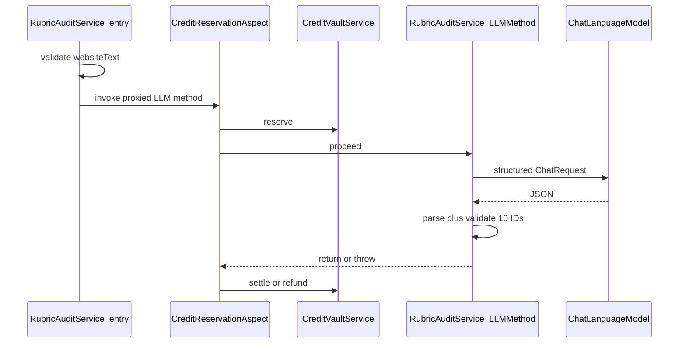

# 第2回：AIルーブリック監査エンジン（純粋 LLM層）— 設計計画（10項目版）

## モデルID

要件の Flash とコードベースを **`LlmModelNames.GEMINI_25_FLASH`** に統一。専用 `ChatLanguageModel` は [`AiConfig`](geo-analytics/src/main/java/com/geo/analytics/infrastructure/config/AiConfig.java) に既存の Flash Bean と同型で追加する。

---

## 1. 新規作成・修正するファイルパス

| 役割 | パス |
|------|------|
| 判定 Enum | [`geo-analytics/src/main/java/com/geo/analytics/domain/enums/RubricVerdictStatus.java`](geo-analytics/src/main/java/com/geo/analytics/domain/enums/RubricVerdictStatus.java) — `YES`, `PARTIAL`, `NO` |
| 項目ID Enum（固定10件） | [`geo-analytics/src/main/java/com/geo/analytics/domain/enums/RubricCriterionId.java`](geo-analytics/src/main/java/com/geo/analytics/domain/enums/RubricCriterionId.java) — 下記10値のみ（順序は Enum 定義順でよい） |
| 1行の監査結果 | [`geo-analytics/src/main/java/com/geo/analytics/application/dto/RubricItemAudit.java`](geo-analytics/src/main/java/com/geo/analytics/application/dto/RubricItemAudit.java) — `RubricCriterionId criterionId`, `RubricVerdictStatus status`, `String evidence` |
| ルートDTO | [`geo-analytics/src/main/java/com/geo/analytics/application/dto/RubricAuditResult.java`](geo-analytics/src/main/java/com/geo/analytics/application/dto/RubricAuditResult.java) — `List<RubricItemAudit> items` |
| ResponseFormat | [`geo-analytics/src/main/java/com/geo/analytics/infrastructure/ai/RubricAuditOutputSchema.java`](geo-analytics/src/main/java/com/geo/analytics/infrastructure/ai/RubricAuditOutputSchema.java) |
| プロンプト | [`geo-analytics/src/main/java/com/geo/analytics/infrastructure/ai/RubricAuditPrompts.java`](geo-analytics/src/main/java/com/geo/analytics/infrastructure/ai/RubricAuditPrompts.java) |
| アノテーション | [`geo-analytics/src/main/java/com/geo/analytics/application/credit/CreditReservation.java`](geo-analytics/src/main/java/com/geo/analytics/application/credit/CreditReservation.java)（パッケージは実装時に既存慣例に合わせてよい）— `amount` / `settleNote` 等、`projectId` をメソッド引数から解決するための属性 |
| AOP | [`geo-analytics/src/main/java/com/geo/analytics/application/credit/CreditReservationAspect.java`](geo-analytics/src/main/java/com/geo/analytics/application/credit/CreditReservationAspect.java) — `@Around` で `CreditVaultService.reserve` → `joinPoint.proceed()` → 正常終了時 `settle`、例外時 `refund` |
| サービス | [`geo-analytics/src/main/java/com/geo/analytics/application/service/RubricAuditService.java`](geo-analytics/src/main/java/com/geo/analytics/application/service/RubricAuditService.java) — LLM 実行メソッドに **`@CreditReservation` を必須付与**。**`reserve` / `settle` / `refund` の直接呼び出しは禁止** |
| AI Bean | 修正 [`geo-analytics/src/main/java/com/geo/analytics/infrastructure/config/AiConfig.java`](geo-analytics/src/main/java/com/geo/analytics/infrastructure/config/AiConfig.java) |

**固定する `RubricCriterionId`（10件・メタデータ判定は対象外）**

1. `DIRECT_ANSWER_FIRST` — 冒頭の直接的回答  
2. `ATOMIC_FACTS` — 数値化された実績データ  
3. `SOLUTION_SCENARIOS` — 具体的な解決シナリオ  
4. `VERIFIABLE_AUTHORITY` — 検証可能な権威性・資格  
5. `FAQ_PRESENCE` — FAQ の記述  
6. `NUMBERED_PROCESS_FLOW` — 番号付きの詳細フロー  
7. `ENTITY_BIOGRAPHY` — 具体的経歴とバイオグラフィー  
8. `LOCAL_CONTEXT` — 地域特有のコンテキスト  
9. `PRICE_AND_CONSTRAINTS` — 詳細な料金体系と制約  
10. `EXTERNAL_CITATIONS` — 外部ソースへの言及  

---

## 2. システムプロンプトの骨子（事実確認・ポジティブ拘束）

- **入力のスコープ**: ユーザーメッセージに貼られたサイト抽出テキストのみを根拠とする。**そのテキスト内に事実として書かれているかどうか**だけを各項目で判定する。
- **`YES` / `PARTIAL` / `NO`**: 要件どおり、部分的充足のみ `PARTIAL`。記載がなく判断できない場合は **`NO`**（「不明」のための第三の逃げ道は増やさない）。
- **`evidence`**: **入力テキストからの直接引用**（連続した抜粋）。該当が無い場合は **空文字**。入力に無い内容は書かない（ポジティブ指示で「引用できる根拠があるときだけ記載」）。
- **項目リスト**: 上記10の `criterionId`（Enum 名）と日本語の短い観点説明を対応表として載せ、出力では **`criterionId` はこの識別子のみ**を使うよう明示する。
- **出力件数**: **`items` にちょうど10要素**。各 `criterionId` は **一度ずつ**（欠落・重複禁止）。プロンプトで明示し、**サービス層でも検証**する。
- **ハルシネーション対策**: レガシー語や禁止語の列挙は避け、「提供テキストに記載された事実の有無のみ」「記載がない項目は NO とし evidence は空」という **ポジティブな手順**で縛る（フェーズ2.2のプロンプト方針と整合）。

---

## 3. Structured Output（JSON Schema と Record）構造

**ルート**: `{ "items": [ ... ] }`

**各要素オブジェクト**（`additionalProperties(false)`）:

| プロパティ | 型 |
|------------|-----|
| `criterionId` | string enum — `RubricCriterionId.values()` の `name()` 一覧（10個）を LangChain4j の `addEnumProperty` で拘束 |
| `status` | string enum — `YES`, `PARTIAL`, `NO` |
| `evidence` | string |

**実装上の注意**: LangChain4j の `JsonArraySchema` は環境によって **`minItems`/`maxItems`=10 をスキーマに載せられない**場合がある。その場合はスキーマは要素形のみ厳密化し、**パース後に「サイズ10・ID集合が Enum 全体と一致・重複なし」**をサービスで検証する。**検証失敗時は例外をスローし、`@CreditReservation` の AOP が `refund` を実施したうえで例外が伝播する**。

**デシリアライズ**: Jackson が `criterionId` / `status` を Enum にマップできるよう、JSON の文字列は **`Enum.name()` と一致**させる。

---

## 4. Profit Guard（`@CreditReservation` と AOP）・例外・バリデーション方針

- **強制**: **`RubricAuditService` 内で LLM を呼び出すメソッドには `@CreditReservation` を付与**し、**`CreditVaultService` の `reserve` / `settle` / `refund` をサービス本文から直接呼ばない**。[`TargetAttributesInferenceService`](geo-analytics/src/main/java/com/geo/analytics/application/service/TargetAttributesInferenceService.java) のような **手動 try-catch + 手動クレジット操作は本サービスでは禁止**。
- **`CreditReservationAspect`**: メソッド実行前に **`reserve(projectId, amount)`**（`projectId` はメソッド引数から取得）、**正常終了で `settle(reservationId, amount, settleNote)`**、**いずれかの例外で `refund(reservationId)`** を保証する（実装詳細は `@Around` の try-finally で統一）。
- **クレジット定数**: `RUBRIC_AUDIT_CREDIT = 80L`。`settle` のノートは `"rubric_audit"` 等に固定。
- **入力ガードと reserve の順序**: **`websiteText` が不正な場合は `@CreditReservation` が付いたメソッドに制御を入れない**ようにする（例: 公開の `audit` で検証後、プロキシ経由で自己注入した **`@CreditReservation` 付きメソッド**だけが LLM を実行）。これにより **無効入力で `reserve` が走らない**。
- **長文対策（任意・実装時決定）**: モデル上限を超えないよう `websiteText` を上限文字数で切り詰める等は、`@CreditReservation` 対象メソッド内の LLM 呼び出し前で実施する。
- **メソッド内処理**: Flash で structured JSON 取得 → `ObjectMapper` で `RubricAuditResult` にパース → **検証**（`items.size()==10`、各 `criterionId` が Enum 全件と一致し重複なし）→ 問題なければ return。**検証失敗やパース失敗は例外**とし、**AOP が refund**。

- **Spring AOP の前提**: `@CreditReservation` は **Spring がプロキシする経路**で効くよう、`RubricAuditService` 内の **同一クラス直接呼び出しによる self-invocation を避ける**（`@Lazy` 自己注入、`ApplicationContext#getBean`、または監査実行を別 `@Component` に分割する等）。

---

この設計方針でよろしければ実装指示をください。
