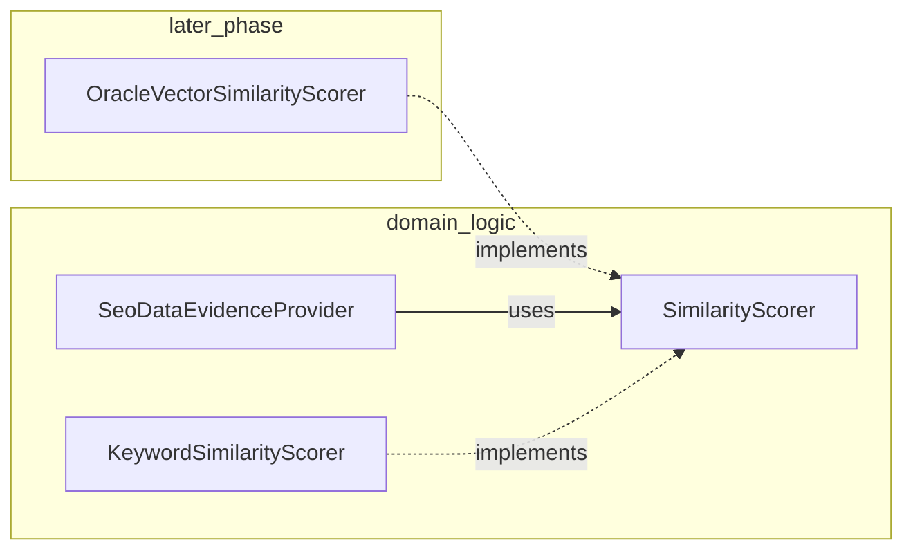

# フェーズ1.3 第1回：RAGエビデンス・プロバイダー（計画立案）

## 1. クラス構成とパッケージパス（確認）

本リポジトリの Java ルートは **`com.geo.analytics`** です。ユーザー提示の論理名と物理パスの対応は次のとおりです。

| 論理名 | 推奨フルパス |
|--------|----------------|
| `SimilarityScorer`（interface） | [`geo-analytics/src/main/java/com/geo/analytics/domain/logic/SimilarityScorer.java`](geo-analytics/src/main/java/com/geo/analytics/domain/logic/SimilarityScorer.java) |
| `KeywordSimilarityScorer` | 同一パッケージ [`.../domain/logic/KeywordSimilarityScorer.java`](geo-analytics/src/main/java/com/geo/analytics/domain/logic/KeywordSimilarityScorer.java) |
| `SeoDataEvidenceProvider` | [`.../domain/logic/SeoDataEvidenceProvider.java`](geo-analytics/src/main/java/com/geo/analytics/domain/logic/SeoDataEvidenceProvider.java) |
| `SeoEvidence`（record / DTO） | [`.../domain/model/SeoEvidence.java`](geo-analytics/src/main/java/com/geo/analytics/domain/model/SeoEvidence.java) |

**補助型（第1回で同時に定義する想定）**

- **上流1行の内部表現**（例: `SeoOrganicRow`）: `domain.model` に置き、Serp の `organic_results` 1要素相当（`link`, `title`, `snippet`, 任意の日付文字列 / 解析済み `Instant` 等）を保持。既存の [`SerpApiResponse`](geo-analytics/src/main/java/com/geo/analytics/infrastructure/api/dto/SerpApiResponse.java) は `organic_results` が `JsonNode` のため、**パーサで `List<SeoOrganicRow>` に正規化してから** Provider に渡す流れとする（パーサ本体は第2タスクに分離可）。

**既存コードとの整合**

- `domain.logic` には既に [`InformationGainCalculator`](geo-analytics/src/main/java/com/geo/analytics/domain/logic/InformationGainCalculator.java) のように **Spring 非依存の純粋ロジック**が存在する。`SeoDataEvidenceProvider` も同様に、テスト容易性のため **永続層・LLM クライアントに依存しない**形を推奨（設定はコンストラクタ注入または専用の設定 record）。
- 日本語向け正規化が必要な場合は、既存の [`JapaneseTextNormalizer`](geo-analytics/src/main/java/com/geo/analytics/domain/support/JapaneseTextNormalizer.java) の利用可否を実装時に検討（キーワード類似度の前処理として）。

---

## 2. インターフェース分離（SimilarityScorer）

- **`SimilarityScorer`**: `double score(String query, String content)` のみ。戻り値は **有限かつ [0, 1] にクランプ**する契約とする（非有限は呼び出し側で行除外または 0 扱い）。
- **`KeywordSimilarityScorer`**: 第1回は **Jaccard（正規化トークン集合）** または **共有文字 n-gram 比率**のいずれか（またはハイブリッド）を **軽量・決定的**に実装。クエリ結合テキストは仕様として `title + " " + snippet`（または `content` 引数に既に連結済みを渡す）を文書化する。
- **差し替え境界**: `SeoDataEvidenceProvider` は **`SimilarityScorer` にのみ依存**し、Oracle AI Vector Search 導入後は **`OracleVectorSimilarityScorer` 等の実装を差し替える**ことで Provider 本体を変えずに移行できるようにする（埋め込み取得は将来、別 Port / Client に分離する想定をコメントで明示してよい）。

---

## 3. 選別ロジック（SeoDataEvidenceProvider）

### 3.1 プライオリティ

\[
S_{\text{priority}} = (S_{\text{sim}} \cdot W_{\text{sim}}) \cdot e^{-\lambda \Delta t}
\]

- \(\Delta t\): **年単位**、\(t_{\text{ref}} - t_i\) を年に換算し **非負**にクランプ。
- **日付不明**: ユーザー要件どおり **最大減衰**（例: \(\Delta t = \Delta t_{\max}\) を定数化。具体値はテストで固定しやすいよう `Clock` / 参照時刻と共に定義）。

### 3.2 多様性ガード（Domain Capping）

- URL から正規化ホスト（ドメイン）を抽出し、同一ホストあたり最大 **\(k\) 件**（初期例: **2**）。スコア降順で貪欲に選ぶなど、単純で検証しやすい手順とする。

### 3.3 内容重複排除（Snippet Dedup）

- 正規化スニペット（必要ならタイトルを含める）について、**類似度が閾値以上**かつ **`S_{\text{priority}}` が低い方を除去**。第1回は **Jaccard / n-gram 率 / 正規化後の完全一致**など、実装コストの低い類似度で十分とする。

### 3.4 処理順序（推奨）

スコア付与 → **`S_{\text{priority}}` 降順ソート** → リストを走査しつつ **ドメインキャップ + スニペット重複除去** で候補を確定 → 確定リストの先頭から **最大 N 件**だけ `List<SeoEvidence>` に詰める。100 件規模では全件ソートで問題にならない。

---

## 4. 物理的トークン保護（Physical Truncation）

- 最終的に **`SeoEvidence` のリストサイズは高々 N**。下位行は **`List` に追加しない**（中間リストも、`SeoEvidence` を生成しない行はオブジェクト自体を構築しない方針とし、無駄な DTO を増やさない）。
- 「スコア下位でもメモリ上に残ってしまう」ケースは、**不要な中間コレクションの保持時間を最小化**する（実装フェーズで具体化）。

---

## 5. 鮮度減衰定数 \(\lambda\) の初期案

- **提案値: \(\lambda = 0.5\/\text{年}\)**  
  - 1年後の係数 \(e^{-0.5} \approx 0.607\)（約 **39%** 減衰、残り約 **61%**）。ユーザー記載の「1年で約60%に減衰」と整合。
- アプリーション設定に載せる場合は、既存の [`AppProperties`](geo-analytics/src/main/java/com/geo/analytics/infrastructure/config/AppProperties.java) のパターン（ネストクラス + `application.yml`）に **evidence/rag 用の小さなグループ**を追加する案を検討（実装フェーズ）。

---

## 6. Oracle 移行を見据えた設計方針（宣誓）

以下を満たすこととする。

- **標準 JDBC / JPA の範囲**でリポジトリとエンティティを書き、**PostgreSQL 固有 DDL / SQL 拡張**（特定のインデックス型や演算子等）に、この Provider と **`SimilarityScorer` の契約自体は依存しない**。
- **ベクトル検索・類似結合は `SimilarityScorer`（および将来的にそれを実装するクライアント層）に閉じる**。Provider は「クエリと行テキストからスカラーを得る」抽象のみに依存し、Oracle AI Vector Search へ移っても **Provider のシグネチャは変えず実装クラスを差し替える**運用が可能となる。
- 既存構成では [`AppProperties`](geo-analytics/src/main/java/com/geo/analytics/infrastructure/config/AppProperties.java) に **`Oracle` 設定ブロック**が存在するため、将来のデータソース設定とも矛盾しない構成とする。

---

## 7. テスト方針（実装フェーズ）

- \(\lambda\)・日付不明・同点ソートの安定性
- ドメイン上限 \(k\)（同一ホストが多い入力）
- 重複スニペット時に低スコアが落ちること
- 出力サイズが **`min(N, 許可数)`** であり、決して **N を超えない**こと

外部 I/O なしのユニットテストのみで十分。
