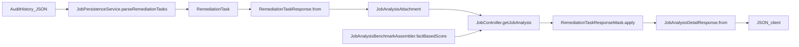

# 動的レベルキャップ（物理隠蔽）バックエンド実装計画

## 現状ハンドオフ（要点）

- タスク永続：`[AuditHistory の remediation JSON]` → `[JobPersistenceService.parseRemediationTasks]` → `[RemediationTask]`（Jackson）→ `[RemediationTaskResponse.from]`（唯一の構築箇所）→ `[JobPersistenceService.JobAnalysisAttachment]`。
- HTTP 経路：**[`JobController#getJobAnalysis`](geo-analytics/src/main/java/com/geo/analytics/web/controller/JobController.java)** が `bench.factBasedScore()` と `attachment.remediationTasks()` を両方とも既に所持し、[**`JobAnalysisDetailResponse.from`**](geo-analytics/src/main/java/com/geo/analytics/web/dto/JobAnalysisDetailResponse.java) に渡している。
- 他 API / PDF で `RemediationTaskResponse` が再公開されている形跡はない（コードベース上は本エンドポイントが実質的出口）。

---

## A. `RemediationTaskResponse` とドメイン周辺の拡張方針

| 項目 | 方針 |
|------|------|
| **永続モデル** | [`RemediationTask`](geo-analytics/src/main/java/com/geo/analytics/domain/model/RemediationTask.java) は AI 出力スキーマと一致させる。**`level` / `requiredScoreThreshold` は JSON に存在しないためドメインレコードには追加しない**（DB での読み書きオブジェクト形状を変えず、要件「エンティティ破壊なし」を厳守）。 |
| **API のタスクモデル** | [`RemediationTaskResponse`](geo-analytics/src/main/java/com/geo/analytics/web/dto/RemediationTaskResponse.java)（既存 record）へ **`Integer level`、`Double requiredScoreThreshold`、`boolean isMasked`** をコンポーネント順で追加。**Snake_case** が既に `@JsonNaming` で効いているため、新項目は適宜 `@JsonProperty` で `required_score_threshold`・`is_masked` に揃える（既存 `impact_score` と同様の扱い）。 |
| **`from(RemediationTask task)`** | これまでどおり全文 `content` を載せ、`isMasked` は常に **`false`（未キャップ状態）**。`task.priority()` から別途定める純ロジックで **`level`** と **`requiredScoreThreshold`** を埋める。 |

補足（要件「ドメイン / DTO」）：読み書きされるドメインモデルとは切り離し、`priority` に対するキャップ規則のみを **`record` で表現**する（後述 **`RemediationPriorityLevel`**）。これはレスポンス専用の付加情報の「ルール側の説明モデル」と位置づけ、永続層とは無関係。

---

## B. レベル・閾値の純関数（静的/`record`）

- **配置案（推奨）**: [`geo-analytics/src/main/java/com/geo/analytics/domain/model/RemediationPriorityLevel.java`](geo-analytics/src/main/java/com/geo/analytics/domain/model/RemediationPriorityLevel.java) に **`public record RemediationPriorityLevel(Integer level, Double requiredScoreThreshold)`** と、**ファイナルホルダクラス **`RemediationPriorityLevel`** 内に `public static RemediationPriorityLevel forPriority(TaskPriority p)`**（または隣接する `RemediationPriorityLevels` ファイナルユーティリティ）を置く。
- **割当（確定）**:
  - `TaskPriority.B` → level **1**, threshold **0.0**
  - `TaskPriority.A` → level **2**, threshold **60.0**
  - `TaskPriority.S` → level **3**, threshold **80.0**
- **振る舞い**: `switch` で網羅。将来列挙子追加時はコンパイルエラーで検知。**コメント/Javadoc は書かない**（要件）。
- **`RemediationTaskResponse.from`** は `RemediationPriorityLevel.forPriority(task.priority())` を呼び、返却 record に **`level`**・**`requiredScoreThreshold`** を流し込む。**マスキングはここでは行わない**。

未知の優先度は存在しないため `default`/null は実質不要だが、`null` 防御は `RemediationTask` 側のコンストラクタで既に **`priority`** 必須。

---

## C. 物理マスキングのインターセプト（Web レイヤ〜コントローラ境界）

### マスキング条件（仕様として固定）

「解放」判定を **`double` として**行う：

- `factBasedScore == null`、`Double.isNaN(factBasedScore)`、または **`factBasedScore.doubleValue() < requiredScoreThreshold.doubleValue()`** のとき、そのタスクをロック。
- **閾値 0.0（Level 1）**：上記のみだと「null と比較」で誤ロックしうるので、実装側で **`threshold <= 0` のときは常にアンロック（本文そのまま、`isMasked = false`）** とする。これで B タスクはスコア未取得でも常に全文表示。

### マスキング後の payload

- **`content`** を次の**一字一句固定**のプレースホルダへ置換（不可逆。元文字列はレスポンスに含めない）:  
  `🔒 基礎スコア {閾値}点 到達で解放されます`  
  ここで `{閾値}` は **`requiredScoreThreshold` の表示用**（例: `60.0` をそのまま埋め込むか、整数表示に正規化するかは実装で一貫させる一点のみ決める）。
- **`isMasked = true`**。未ロック時は **`isMasked = false`** で元 `content`。
- **`level` / `requiredScoreThreshold` / その他メタ**はロック中も**そのまま返す**（フロントがアンロック UI を出しやすい）。

### 配置と責務分割

1. **新規** [`geo-analytics/src/main/java/com/geo/analytics/web/dto/RemediationTaskResponseMask.java`](geo-analytics/src/main/java/com/geo/analytics/web/dto/RemediationTaskResponseMask.java)（ファイナルユーティリティ、Bean 不要）  
   - `public static List<RemediationTaskResponse> apply(Double factBasedScore, List<RemediationTaskResponse> tasks)`  
   - 入力リストを `List.copyOf` 相当で扱い、**新しい `RemediationTaskResponse` インスタンス**のリストを返す（record のイミュータブル保持）。
2. **[`JobController#getJobAnalysis`](geo-analytics/src/main/java/com/geo/analytics/web/controller/JobController.java)** で、`attachment.remediationTasks()` を **`JobAnalysisDetailResponse.from` に渡す直前**に `RemediationTaskResponseMask.apply(bench.factBasedScore(), …)` を噛ませる。

**[`JobPersistenceService`](geo-analytics/src/main/java/com/geo/analytics/application/service/JobPersistenceService.java)** の `parseRemediationTasks` は**現状どおり全文 DTO を生成**のまま（DB からの「事実」に相当）。マスキングは**コントローラで HTTP 応答専用にだけ適用**する。

**[`JobAnalysisDetailResponse.from`](geo-analytics/src/main/java/com/geo/analytics/web/dto/JobAnalysisDetailResponse.java)** 内部ではマスキングを行わず、**受け取ったリストをそのまま格納**（責務を分散させない）。将来別エンドポイントが同じ attachment を使う場合も、**マスクを通すかどうかを呼び出し側で明示**できる。

---

## データフロー（ステップ復唱）

1. **DB 読出**: `loadJobAnalysisAttachment` が最新監査履歴の remediation JSON を読む（**生のまま**）。
2. **ドメイン復元**: `List<RemediationTask>` としてパース（形状不変）。
3. **DTO 初期化**: 各 `RemediationTask` に対し `RemediationTaskResponse.from`。**`priority` → `RemediationPriorityLevel` で `level` / `requiredScoreThreshold` を付与**。**`content` は原文**、**`isMasked = false`**。
4. **HTTP 組み立て**: `getJobAnalysis` が `BenchmarkAttach` から **`factBasedScore`** を取得。
5. **物理マスキング**: `RemediationTaskResponseMask.apply(factBasedScore, tasks)` が閾値未達タスクの **`content` を固定文に差し替え**、**`isMasked = true`**。
6. **レスポンス record 構築**: `JobAnalysisDetailResponse.from(..., maskedTasks, objectMapper)` で JSON 化。

---

## 修正・新規ファイル一覧

| 操作 | パス |
|------|------|
| 変更 | [`RemediationTaskResponse.java`](geo-analytics/src/main/java/com/geo/analytics/web/dto/RemediationTaskResponse.java) |
| 新規 | `RemediationPriorityLevel.java`（`record` + `forPriority` 静的メソッド、配置は `domain/model` 推奨） |
| 新規 | `RemediationTaskResponseMask.java`（`web/dto`、マスキングのみ） |
| 変更 | [`JobController.java`](geo-analytics/src/main/java/com/geo/analytics/web/controller/JobController.java)（`apply` 呼び出し 1 箇所） |
| **変更しない** | `JobEntity`、監査エンティティ、`RemediationTask` の JSON 形状、`AiRemediationService` 永続、`RemediationTaskOutputSchema` |

---

## テスト方針（実装フェーズ）

- **単体**: `RemediationPriorityLevel.forPriority` の 3 パターン。
- **単体**: `RemediationTaskResponseMask.apply` — `factBasedScore` が null / NaN / 閾値境界（60.0 未満・以上、80.0 未満・以上）、Level 1 は常にアンロック。
- **結合（任意）**: `getJobAnalysis` の JSON に `is_masked`・`required_score_threshold` が期待どおり出ること（WireMock なしでマッパー＋Mask の薄いテストでも可）。

---

## フロントエンド（本計画の外だが追従タスク）

- [`geo-analytics/frontend/src/types/analysis.ts`](geo-analytics/frontend/src/types/analysis.ts) のタスク型に `level` / `required_score_threshold` / `is_masked` を追加し、UI は `is_masked` でアンロック案内を出す（バックエンド完了後の別コミットで可）。
