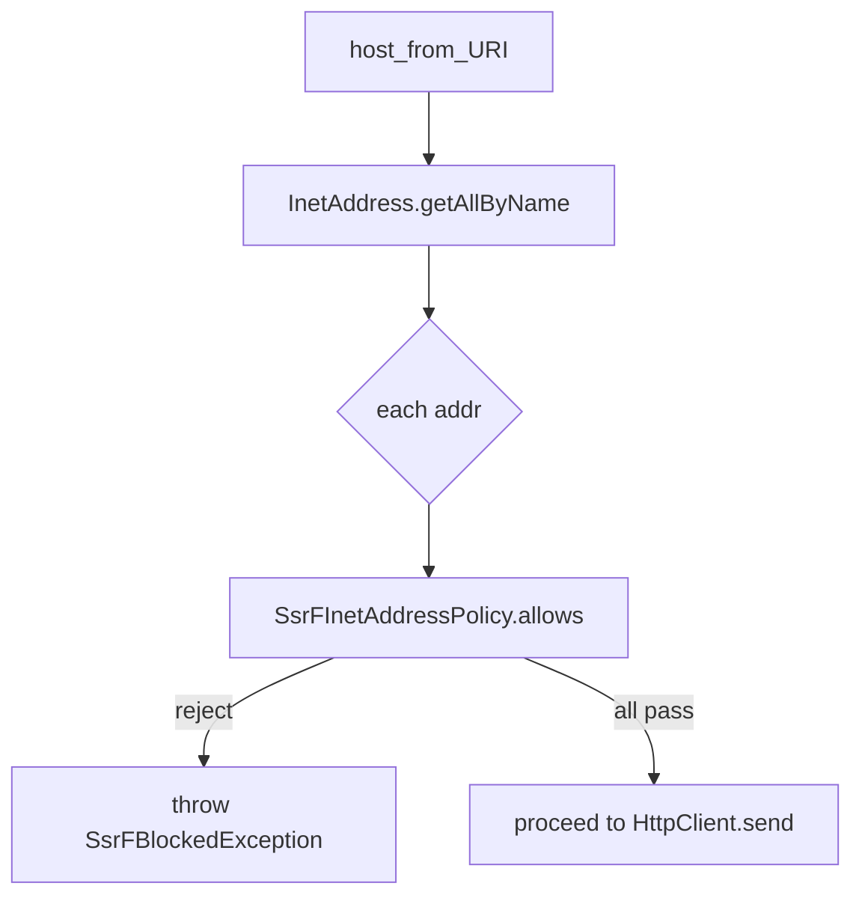

# フェーズ1.1 第2回: SSRF 絶対防衛レイヤー（計画書）

## 1. 修正・新規作成するファイルのパス一覧（案）

| 想定 | パス |
|------|------|
| 新規 | [geo-analytics/src/main/java/com/geo/analytics/infrastructure/crawler/safety/SsrFInetAddressPolicy.java](geo-analytics/src/main/java/com/geo/analytics/infrastructure/crawler/safety/SsrFInetAddressPolicy.java)（または `*Validator`）: `InetAddress` の許可/拒否の唯一の正規ロジック |
| 新規 | [geo-analytics/src/main/java/com/geo/analytics/infrastructure/crawler/safety/HostResolutionGuard.java](geo-analytics/src/main/java/com/geo/analytics/infrastructure/crawler/safety/HostResolutionGuard.java): ホスト名→`getAllByName`→全アドレスに `SsrFInetAddressPolicy` を適用。拒否なら専用例外 |
| 新規 | [geo-analytics/src/main/java/com/geo/analytics/infrastructure/crawler/safety/SafeHttpClient.java](geo-analytics/src/main/java/com/geo/analytics/infrastructure/crawler/safety/SafeHttpClient.java): `HttpClient` を内包 or 生成し、送信前に `HostResolutionGuard` を通す **ファサード**（`send` / 必要なら `sendAsync`） |
| 新規 | [geo-analytics/src/main/java/com/geo/analytics/infrastructure/crawler/safety/PerDomainRequestLimiter.java](geo-analytics/src/main/java/com/geo/analytics/infrastructure/crawler/safety/PerDomainRequestLimiter.java): 正規化ホスト毎 `Semaphore`（`ConcurrentHashMap` + `Semaphore` または `synchronized` でマップ＋遅延生成） |
| 新規 | [geo-analytics/src/main/java/com/geo/analytics/domain/exception/SsrFBlockedException.java](geo-analytics/src/main/java/com/geo/analytics/domain/exception/SsrFBlockedException.java): `SecurityException` 継承想定。ブロック理由を区別可能なら `InetAddress` やメッセージ保持 |
| 新規（推奨） | [geo-analytics/src/test/java/.../SsrFInetAddressPolicyTest.java](geo-analytics/src/test/java/com/geo/analytics/infrastructure/crawler/safety/SsrFInetAddressPolicyTest.java): 列挙IPのパラメタ化テスト（ループバック/リンクローカル/10・172.16/12・192.168/16・公網可） |
| 任意 | [geo-analytics/src/main/java/com/geo/analytics/infrastructure/config/CrawlerConfiguration.java](geo-analytics/src/main/java/com/geo/analytics/infrastructure/config/CrawlerConfiguration.java): `SafeHttpClient` + `PerDomainRequestLimiter` のBean化（`maxConcurrentPerHost` を `AppProperties` に追加） |

**既存**の [PlaywrightWebCrawlerAdapter](geo-analytics/src/main/java/com/geo/analytics/infrastructure/crawler/PlaywrightWebCrawlerAdapter.java) は本チケットのスコープ外でもよい。将来、HTTP ストリーム取得専用アダプタを差し替える **接点** として本ファサードを想定。

---

## 2. SSRF 判定（`InetAddress` 検証）の具体的なロジック案

**方針**: 「解決に含まれる **いずれか 1 つでも** 拒否帯域ならそのホストは利用不可（保守的）」。複数Aレコード片方だけ危険、という多角攻撃（DNS 応答二面性＋接続先選択）に対し、**全レコード**を点検する。

**IPv4 向け**（[InetAddress (Java 25)](https://docs.oracle.com/en/java/javase/25/docs/api/java.base/java/net/InetAddress.html) 標準メソッド中心）:

- 拒否: `isLoopbackAddress()`（`127.0.0.0/8`）
- 拒否: `isLinkLocalAddress()`（`169.254.0.0/16` を含み、**AWS メタデータ** `169.254.169.254` をカバー）
- 拒否: `isSiteLocalAddress()`（`10.0.0.0/8`・`172.16.0.0/12`・`192.168.0.0/16`）
- 拒否: `isMulticastAddress()` / `isAnyLocalAddress()`（0.0.0.0 等。用途次第で厳格化）

**`Inet4Address` のみ**に分岐して扱い、`getAddress()` 4バイトで範囲比較する拡張（**推奨**）:

- `100.64.0.0/10`（**CGNAT/キャリアグレード NAT**）: [RFC 6598](https://www.rfc-editor.org/rfc/rfc6598) — `isSiteLocal` に含まれないため **明示的なビット演算/整数比較**が必要
- オプション: `0.0.0.0/8` や予約帯域の厳格化

**IPv6 向け**:

- 拒否: `isLoopbackAddress()`（`::1`）
- 拒否: `isLinkLocalAddress()`（`fe80::/10`）
- 拒否: **ULA** `fc00::/7` / **ULA** 相当: `Inet6Address` のメソッドと byte 列で判定（[Inet6Address](https://docs.oracle.com/en/java/javase/25/docs/api/java.base/java/net/Inet6Address.html) の `isLinkLocal` / マスク）
- 拒否: **IPv4-mapped IPv6** `::ffff:0:0/96` — 内部で `getByName` 等になった `Inet4Address` に正規化してから上の IPv4 方針を適用
- オプション: ドキュメント用 `2001:db8::/32` 等

**Unicode ドメイン**: 検証前に `URI` / `IDN` でホスト名を正規化（小文字、Punycode）し、**`InetAddress` に渡す文字列**と一致させる。

---

## 3. `HttpClient` のカスタマイズ: 名前解決後 IP をどう使うか（技術的アプローチ）

**事実（JDK 25）**: 公開 [HttpClient.Builder](https://docs.oracle.com/en/java/javase/25/docs/api/java.net.http/java/net/http/HttpClient.Builder.html) には、**1 クライアント専用の `DnsResolver` や名前解決インターセプタ**のような **公式フックはない**。`localAddress`・`ProxySelector`・`connectTimeout` 等はあるが、**解決直前の挿入**は非対応。

**推奨アプローチ（本プロジェクト方針）**

1. **送信前カスタム層（ファサード）**  
   - `HttpRequest` から `URI` を取り、スキームは `https` / `http` のみ。ポートは allowlist または 80/443 既定。  
   - ホストは **非リテラル**であることを求める（`127.0.0.1` 形式の直 IP を弾く）→ 弾かない方針なら、リテラルIPも `getByName` 相当で `InetAddress` にし **同一 `SsrF`** を適用。  
   - `HostResolutionGuard` が `InetAddress.getAllByName(host)` を実行し、**全**アドレスを `SsrFInetAddressPolicy` で通過させたうえで、**既存の元 URI のまま** `HttpClient.send`（SNI/証明書はホスト名のまま）。  

2. **TOCTOU（二重解決差異）**  
   ファサード内で一度検証し、`HttpClient` が**内部で再度**名前解決する可能性がある。完全排除には OS/JVM レベル DNS 固定や、**IP リテラル＋`Host` ヘッダ＋SNI/証明書の扱い**（JDK のデフォルトでは TLS 検証と相性に難点）が絡む。本フェーズの計画では:  
   - ドキュメント化のうえ **事実上の低リスク**（同一秒・同一解決先）に留める。  
   - 将来、必要なら **JEP 418** [InetAddressResolver / InetAddressResolverProvider](https://openjdk.org/jeps/418) による**プロセス内グローバル**解決層、または専用プロキシ/サイドカー、もしくは**リダイレクト無効＋毎回フル再検証**等を検討。  

3. **リダイレクト**  
   デフォルト `HttpClient` の `followRedirects`（既定は `NEVER`）のまま、**自前で Location をパース**し、**毎跳び** 同じ `SsrF` を適用。自動追従を有効にする場合は **必ず** 各ターゲットURLで再ゲート。  

4. **Virtual Threads との相性**  
   `HttpClient` の `send` は **ブロッキング**。[HostResolutionGuard](`getAllByName`)、[Semaphore#acquire](`PerDomainRequestLimiter`)、[HttpClient#send] は **VT 上でブロッキングしてよい**設計。`Executor` は `HttpClient` 既定 or VT 用 `Executor` への注入は**オプション**（非同期 `sendAsync` を使う場合はコールバック/ファイバーの整理のみ）。

5. **Semaphore デザイン**  
   - キー: [URI] の正規化ホスト（Punycode、小文字化）。**同一ドメイン**（要件）なので、サブドメインは**別**キー。  
   - マップ: `ConcurrentHashMap<String, Semaphore>`。初回 `computeIfAbsent` で `new Semaphore(N)`。  
   - パターン: `acquire` → `try` / `try-with-resources` ラッパ → `finally` `release`。**VT のリーク防止**のため、割り当て数は**固定アッパ**（未使用 Semaphoreの除去はプロトでは任意）。  

---

## 4. 設計士向け: 採用しない/保留とする案

- **`HttpClient.Builder` への仮想 `DnsResolver` 注入** — 公開 API なし（JDK 25 時点）。  
- **JVM 全体の `InetAddressResolverProvider` の導入** — 有効だが、**アプリ全リゾリューション**に影響するため、本「クローラ専用」防衛層の第一選択にはしない。必要なら別 ADR。  

以上を実装前レビュー用の「第2回」計画とする。
