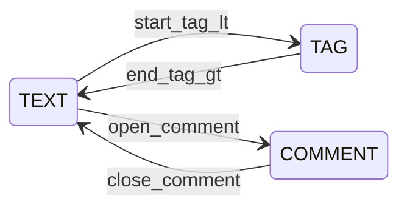

# フェーズ1.1 第3回: ゼロアロケーション（志向）・ストリーム型テキスト抽出 計画

## 1. 修正・新規作成するファイルのパス一覧（案）

| 種別 | パス |
|------|------|
| 新規 | [geo-analytics/src/main/java/com/geo/analytics/infrastructure/crawler/extraction/StreamTextExtractor.java](geo-analytics/src/main/java/com/geo/analytics/infrastructure/crawler/extraction/StreamTextExtractor.java) — 公開 API（`InputStream` + 最大バイト数 + `Charset` / `CharsetDecoder`）とメイン制御ループ（デコード＋FSM へ文字供給） |
| 新規 | [geo-analytics/src/main/java/com/geo/analytics/infrastructure/crawler/extraction/CappedInputStream.java](geo-analytics/src/main/java/com/geo/analytics/infrastructure/crawler/extraction/CappedInputStream.java)（名称は可） — 実読込バイト数の **`long` カウンタ** 付き `InputStream` デコレータ。上限制御はここに集約（単一責任） |
| 新規 | [geo-analytics/src/main/java/com/geo/analytics/infrastructure/crawler/extraction/HtmlTagStripper.java](geo-analytics/src/main/java/com/geo/analytics/infrastructure/crawler/extraction/HtmlTagStripper.java)（内部パッケージ非公開 or `final` クラス）— 文字（UTF-16 コードユニット）向け FSM 本体。`StreamTextExtractor` から再利用バッファへ書き出し |
| 新規 | [geo-analytics/src/main/java/com/geo/analytics/domain/exception/StreamSizeLimitExceededException.java](geo-analytics/src/main/java/com/geo/analytics/domain/exception/StreamSizeLimitExceededException.java) — 最大バイト超過（およびオプションで「出力文字上限」導入時）用。`RuntimeException` 系でよい（既存方針に合わせる） |
| 新規（推奨） | [geo-analytics/src/test/java/.../StreamTextExtractorTest.java](geo-analytics/src/test/java/com/geo/analytics/infrastructure/crawler/extraction/StreamTextExtractorTest.java) — 境界（タグ、コメント、マルチバイト）、1MB 超過、不正 UTF-8 バイト列（置換） |

**本チケットのスコープ外（後続で可）**

- [WebCrawlerPort](geo-analytics/src/main/java/com/geo/analytics/application/port/WebCrawlerPort.java) / [PlaywrightWebCrawlerAdapter](geo-analytics/src/main/java/com/geo/analytics/infrastructure/crawler/PlaywrightWebCrawlerAdapter.java) への本番接続
- 既存 [JsoupPageExtractor](geo-analytics/src/main/java/com/geo/analytics/infrastructure/crawler/JsoupPageExtractor.java) の削除（禁止事項に反する DOM は残す。新経路は別実装として並存可能）

**「ゼロアロケーション」について（設計上の合意点）**

- ホットループで `String` の `+=` や**バイト毎**の小オブジェクト生成を行わない。
- 固定サイズの `byte[]` 読取バッファ 1 本＋`CharsetDecoder`＋1 本の可変長 `StringBuilder`（または `StringBuilder` + 事前 `ensureCapacity`）を使い、**割り当て回数**を O(チャンク数) ではなく**定数回＋`StringBuilder` 再内部拡大**程度に抑える。完全な JVM 上の 0 割り当ては現実的でない旨を副操縦士に検疫してもらう想定。

---

## 2. タグ除去のアルゴリズム（ステートマシン）

**入力**: すでに `CharsetDecoder` により得られた**文字**（`char` / サロゲート対でUTF-16を扱うなら**コードポイント**推奨）を 1 つずつ `HtmlTagStripper` へ流す。DOM・スタック不要。

**MVP コア（必須）**

- 状態 `TEXT`（本文）: 可視文字を `append` へ。文字 `<` を見たら `TAG_OPEN` へ。リテラル `<` だけ出したい場合の退避（誤字として `<` 単独）は簡易仕様に委ね、まず **`<`～`>` まで一塊捨て**（HTML 的には不正タグ内も同様）とする。

- 状態 `TAG`（角括弧内）: `>` まで**吐き出さず**捨てる。`>` 受信で `TEXT` に復帰。  
  タグ中の `<` ネスト（例: 不整合 HTML）は、仕様上は「`TAG` 内の `<` から新たな `TAG` をネスト扱い」**または**「次の `>`` まで全部捨て」のどちらかを一文で定める。実装互換性のため、**`TAG` 内で `<` を再検出したら子タグ扱いで深度カウンタ**（0 割り当ての `int`）にする方が**閉じない**タグに強い（オプション・初期は**単一** `TAG` で最後の `>` まで一発で十分な場合が多い）。

- **エンティティ**（`&amp;` 等）: 必須ではないが、プレーンテキスト品質用に**オプション** `ENTITY` 状態で `;` まで解決し置換。初期は**未実装**でも要件充足（純粋角括弧ストリッパ）と分ける。

**コメント・スクリプト（拡張・推奨）**

- `<!--` : `TEXT` 上で `<!--` 連続にマッチするまで先読みし、**COMMENT** へ。`-->` まで**非可視**で捨て、本文量を**カウントしない**（もしくは本文カウンタとタグ同様**出力しない**）。[`PageContentNormalizer`](geo-analytics/src/main/java/com/geo/analytics/infrastructure/crawler/PageContentNormalizer.java) へ渡す前のノイズ削減に有効。

- `<script` … `</script>` / `<style` … `</style>`: **大文字小文字不問**、終了トークン（`</script`）の簡易スキャン。状態が増えるがメモリは O(1)。

**サロゲート**: `StringBuilder.appendCodePoint(int)` を使い `HtmlTagStripper` へ **int（コードポイント）** を渡すと、1 サロゲートペアを誤 split しにくい。

---

## 3. 1MB 制限の物理的適用

**方針**: `Content-Type` や `Content-Length` **は信頼せず**、**物理 I/O から戻るバイト**だけ加算（要件どおり「実際に読み込んだバイト数」）。上限超えは**以降の `read` を行わない**＋**元ストリームを `close`**.

**`CappedInputStream` 仕様案**

- コンストラクタ: 元 `InputStream`、正の `maxBytes`（例 `1L << 20`）
- フィールド: `long readTotal`
- 各 `read(byte[] b, int off, int len)`:
  - 入力を `int allowed = (int) Math.min(len, maxBytes - readTotal)`（`maxBytes - readTotal` が 0 以下のとき 0 または**例外**のどちらかを一貫: **先に `limit < 0` なら常に 0 返却し EOF 相当** か、**即 `StreamSizeLimitExceededException`** — 推奨は **1 バイトでも超えそうなら** `allowed = max(0, cap)` し、**部分読み**後に次 `read` で `readTotal == maxBytes` なら `close` + `StreamSizeLimitExceededException` など**明確な失敗**にする。設計士合意: 「超えた瞬間**中断**＝**例外＋`close()`**」が要件文に近い。
- 上限到達: `in.close()` を呼び、専用例外（または `IOException` ラップ）をスロー
- オーバーフロー回避: カウンタは **`long`**

**`StreamTextExtractor` 側**

- パイプは常に`new CappedInputStream(raw, maxBytes)` で包んでから [CharsetDecoder#decode](https://docs.oracle.com/en/java/javase/25/docs/api/java.base/java/nio/charset/CharsetDecoder.html) を回す
- デコーダ: `onMalformedInput(CodingErrorAction.REPLACE)` および `onUnmappableCharacter(CodingErrorAction.REPLACE)`（または同義の一括 `CodingErrorAction.REPLACE` 設定）で**例外にしない**（要件「置換モードを**検討**」）  
- 中間: `ByteBuffer` / `CharBuffer`（可能なら**プールした配列をラップ**する `CharBuffer` を再利用）＋1 本の `StringBuilder` へ。デコード毎の `String` 中間体は出さない

**二段目の上限（オプション）**

- デコード後の**文字**も大量に出る（極短タグ＋純字）理論的ケースに備え、**`maxOutputChars`**（別カウンタ）を第二防衛にするかは副操縦士判断。1MB バイト制限でほぼ抑止できるが、圧縮的な 1B 1 行の**病理**用。

---

## 4. まとめ（実装依頼時の作業単位の提案）

- `CappedInputStream` 単体テスト＋`StreamTextExtractor` 結合
- FSM: 先に `TEXT`/`TAG`＋`>` 検出、次に `<!--` / script オプション
- 例外・メッセージ形式は既存 `domain/exception` に揃える

以上を「第3回」設計として提示する。
