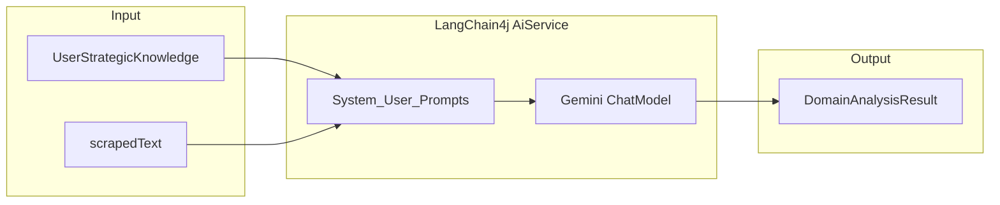

# フェーズ1.5.2 第2回：AI 契約とプロンプト（戦略・承認用）

## 1. 制約の確認（スコープ）

### 今回の目的

- 第1回の Records（[`UserStrategicKnowledge`](c:\cursor\project\geo-analytics\src\main\java\com\geo\analytics\application\dto\UserStrategicKnowledge.java)、[`DomainAnalysisResult`](c:\cursor\project\geo-analytics\src\main\java\com\geo\analytics\application\dto\DomainAnalysisResult.java)、[`SuggestedQuery`](c:\cursor\project\geo-analytics\src\main\java\com\geo\analytics\application\dto\SuggestedQuery.java)）を入出力に用い、**Gemini（LangChain4j）向けの「契約インターフェース」とシステム／ユーザープロンプト**を定義する。
- 出力は **GEO（生成 AI 最適化）** 文脈：**単語列の SEO キーワードではなく、Perplexity 等に入力されうる自然な会話調の質問**を **ちょうど 10 件**（型は `List<SuggestedQuery>`。件数はプロンプトとパース後検証の両面で固定する方針）。

### 厳守するプロダクト制約（指示の復唱）

- **Knowledge の絶対化**: `UserStrategicKnowledge` を **Ground Truth（最優先制約）** とし、サイトテキストは **それを裏付け・具体化する証拠**として扱うようモデルに明示する。
- **GEO 特化**: 生成クエリは **「AI 検索で人が実際に打ちそうな自然な質問文」** とし、キーワード羅列・過度に短いクエリ・明らかな内部向けラベルを避ける。

### 今回スコープ外（明示）

- **ユースケース／オーケストレーター**（`UrlContentFetcher` 呼び出しと本サービスの配線）は、必要なら **別タスク**。
- 既存コードは主に **`ChatLanguageModel` + `ChatRequest` + `ResponseFormat`（JSON スキーマ）**（例: [GeoOnboardingOutputSchema](c:\cursor\project\geo-analytics\src\main\java\com\geo\analytics\infrastructure\ai\GeoOnboardingOutputSchema.java)）だが、本タスクはユーザー指示どおり **`@AiService` ベースのインターフェース**を **第一市民** とする。**Bean 登録**は [AiConfig](c:\cursor\project\geo-analytics\src\main\java\com\geo\analytics\infrastructure\config\AiConfig.java) に **`AiServices.builder(...).chatLanguageModel(...)`** で追加する案とする（リポジトリに `langchain4j-spring-boot-starter` の自動スキャンは現状未確認のため、**手動 Bean が安全**）。

### アーキテクチャ上の注意（承認時の共有）

- 要求パスは **`com.geo.analytics.domain.service.DomainAnalysisAiService`**。**ドメインパッケージに `dev.langchain4j` のアノテーションが入る**ため、**技術的依存がドメイン層に乗る**。厳密なクリーンアーキテクチャでは「ポートをドメイン、AiService を application／infrastructure」に分けることも多いが、**今回は指示パスに従う**。将来分離する場合は **同シグネチャの純粋インターフェース**への抽出を検討可能。

---

## 2. プロンプト戦略

### 2.1 矛盾時の優先順位（Knowledge vs サイト）

**方針を System に明文化**する:

1. **ビジネス上の前提**（誰に・何を・どう価値提供するか、注力軸）は **`UserStrategicKnowledge` を正**とする。
2. サイト本文が Knowledge と**矛盾**する場合:
   - **ペルソナ・クエリの「戦略レイヤー」**（誰が・何を求めるか・どう比較するか）は **Knowledge に合わせる**。
   - サイト側は **「観測された事実」**として扱い、ペルソナ記述の一部（トーン、利用シーンの具体例、固有事実）に**限り**反映してよいが、**Knowledge と競合する主張は採用しない**。
3. モデルに **短い自己監査**を求める（出力前の内部手順として）: *「サイトに書いてあっても Knowledge と真逆なら捨てよ」* を **箇条書きルール**で明記（最終 JSON には矛盾解決ログ用フィールドを増やさない。第1回の型のまま）。

### 2.2「自然な質問文」の品質を上げる工夫（GEO）

**System／User に含める具体的演出**:

- **役割**: 「AI 検索時代の SoV を高める GEO コンサルタント」（指示済みの System Role を日本語／英語いずれか一貫で展開）。
- **思考ステップ**（出力 JSON の外でよい = 指示のみ）:
  1. Knowledge から **ペルソナの目的・不安・成功指標**を要約。
  2. サイト証拠で **補強できる具体**だけを取り込む。
  3. **情報ニーズ**（比較、手順、失敗回避、料金感、導入条件など）を列挙。
  4. 各ニーズを **一人称／二人称混在可の自然な日本語（またはサイト言語に合わせた言語）**の「質問」に変換。
- **禁止・消極例**: カンマ区切りキーワードのみ、`site: 演算子`、明らかなブログタイトル風の体裁だけ、**同一意図の言い換えの乱発**。
- **多様性**: 10 本は **意図（`intent`）が重複しにくい**ように指示（比較・仕様・導入・トラブル・費用・選定基準などのバランス）。
- **各 `SuggestedQuery`**: `queryText` は **完結した質問文**、`intent` は **なぜその質問が SoV／意思決定に効くか**を 1–2 文で。

### 2.3 入出力フォーマット（テキスト側）

- `UserMessage` 内に **構造化セクション**を置く:
  - `### UserStrategicKnowledge` 配下に `businessDescription` / `targetAudience` / `strategicFocus` を明示ラベル付きで配置（**`@V` で3フィールド、またはフォーマット済み1ブロック**のどちらか）。
  - `### ScrapedSiteContent` 配下に `scrapedText`。
- サイトが空に近い場合でも **Knowledge のみから**ペルソナとクエリを生成するよう指示。

---

## 3. インターフェース定義案

### 3.1 クラス／型

- **ファイル**: [DomainAnalysisAiService.java](c:\cursor\project\geo-analytics\src\main\java\com\geo\analytics\domain\service\DomainAnalysisAiService.java)（`interface` を想定量: `public interface DomainAnalysisAiService`）。
- **アノテーション（LangChain4j）**:
  - インターフェースに **`@AiService`**（`dev.langchain4j.service.AiService`）。
  - メソッドに **`@SystemMessage`**（長文 ROLE + ルール + 思考ステップ + 矛盾解決 + クエリ品質）。
  - メソッドに **`@UserMessage`**（上記テンプレート。プレースホルダ **`{{...}}`** + **`@V("...")`**）。

### 3.2 メソッド案

- **名前**: `analyzeDomain` または `analyze`（短く **`analyze`** で可）。
- **シグネチャ案**:
  - `DomainAnalysisResult analyze(@V("businessDescription") String businessDescription, @V("targetAudience") String targetAudience, @V("strategicFocus") String strategicFocus, @V("scrapedText") String scrapedText)`
  - **または** `DomainAnalysisResult analyze(@V("knowledge") UserStrategicKnowledge knowledge, @V("scrapedText") String scrapedText)`（**テンプレートが Record のフィールド展開に対応する場合**のみ。**確実性優先なら 4 引数の `String`** または **アプリケーション層でフォーマットした単一 `String`**）。
- **推奨（実装フェーズで確定）**: **3+1 の `String`** で `@UserMessage` と一致させ、**Record は呼び出し側で分解して渡す** —— **フレームワークのシリアライズ挙動に依存しない**。

### 3.3 構造化出力

- 戻り型 **`DomainAnalysisResult`**。Gemini 側では **`ResponseFormat.jsonSchema`** が必要になることが多い（既存 [GeoOnboardingOutputSchema](c:\cursor\project\geo-analytics\src\main\java\com\geo\analytics\infrastructure\ai\GeoOnboardingOutputSchema.java) と同型の **`DomainAnalysisOutputSchema`** を **infrastructure** に追加し、`AiServices.builder` で **`responseFormat`** を渡す**案を推奨**（本ファイルはユーザー指示の「対象ファイル」外だが、**動作に実質必須**）。
- スキーマ: `inferredPersona`（string）、`queries`（array of `{ queryText, intent }`）、`additionalProperties: false`、**必須フィールド明記**。

### 3.4 Bean 登録（実装時）

- [AiConfig](c:\cursor\project\geo-analytics\src\main\java\com\geo\analytics\infrastructure\config\AiConfig.java): 既存の `GoogleAiGeminiChatModel`（**専用 `@Qualifier` 定数**を新設してもよい）を渡し、`AiServices.builder(DomainAnalysisAiService.class).chatLanguageModel(...).defaultResponseFormat(...).build()` の形を想定（API は 0.36.2 の実際のメソッド名で確定）。

---

## 4. 承認後の作業サマリ（参考）

1. `DomainAnalysisAiService` を指定パッケージに新規作成（アノテーション＋英日混在可の確定プロンプト文面）。  
2. （推奨）`DomainAnalysisOutputSchema` + `AiConfig` Bean。  
3. 呼び出し側は `UserStrategicKnowledge` から 3 文字列を取り出して `analyze(...)` に渡す。
