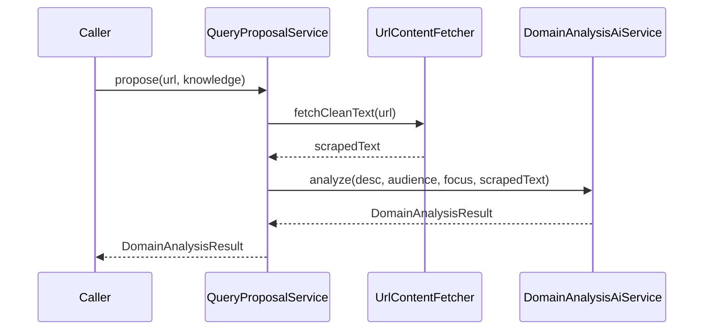

# フェーズ1.5.2 第3回：オーケストレーション・サービス（開発計画・承認用）

## 1. 制約の確認（スコープの復唱）

### 今回やること

- 新規クラス **[QueryProposalService.java](c:\cursor\project\geo-analytics\src\main\java\com\geo\analytics\application\service\QueryProposalService.java)** を **`@Service` 具象クラス**として追加する。
- **`public DomainAnalysisResult propose(String url, UserStrategicKnowledge knowledge)`** を実装し、次の **2 ステップの配線**のみ行う:
  1. **[`UrlContentFetcher#fetchCleanText`](c:\cursor\project\geo-analytics\src\main\java\com\geo\analytics\domain\port\UrlContentFetcher.java)** で URL から浄化済み本文を取得。
  2. **[`DomainAnalysisAiService#analyze`](c:\cursor\project\geo-analytics\src\main\java\com\geo\analytics\domain\service\DomainAnalysisAiService.java)** に、`knowledge` から展開した 3 文字列 + 手順1の文字列を渡し、返却された **[`DomainAnalysisResult`](c:\cursor\project\geo-analytics\src\main\java\com\geo\analytics\application\dto\DomainAnalysisResult.java)** を **そのまま return** する。

### 今回やらないこと（指示どおり次回以降）

- **リトライ**（指数バックオフ、ガスタイムアウトの再試行など）
- **DB 永続化**（分析結果・ジョブ状態の保存）
- **詳細なエラーハンドリング**（例: `ScrapingException` を HTTP 用 DTO にマップ、LLM 失敗の分類とリカバリ）
- **REST コントローラ・API の新規公開**（呼び出し元は別タスクでよい）

### 正常系に集中

- **`url` / `knowledge` のビジネス検証**（空 URL 禁止等）は **最小限**に留めるか、`UserStrategicKnowledge` の既存正規化に委ね、`url` が空なら **`fetchCleanText` 側や SSRF 層の挙動に任せる**方針でよい（明示的な `IllegalArgumentException` を足す場合は 1 行コメントレベル）。

---

## 2. 実装方針

### コンストラクタ注入とスタイル

- **依存**: `UrlContentFetcher`、`DomainAnalysisAiService` を **`private final`** フィールドに **単一コンストラクタ注入**（Lombok 不使用）。プロジェクトの [KeywordSuggestionService](c:\cursor\project\geo-analytics\src\main\java\com\geo\analytics\application\service\KeywordSuggestionService.java) と同様、`@Service` のみで可。
- **`@Qualifier`**: 現状 **`UrlContentFetcher` の Spring Bean は [JsoupUrlContentFetcherAdapter](c:\cursor\project\geo-analytics\src\main\java\com\geo\analytics\infrastructure\adapter\JsoupUrlContentFetcherAdapter.java) のみ**を想定するため **型注入で解決**。将来実装が複数化した場合のみ `@Qualifier` を検討。
- **null ガード**: オーケストレーターとして `knowledge == null` は **`Objects.requireNonNull(knowledge, "knowledge")`** で拒否（`UserStrategicKnowledge` 自体は record で内部正規化済み）。

### `propose` 本体の呼び出し順

```text
String scraped = urlContentFetcher.fetchCleanText(url);
return domainAnalysisAiService.analyze(
    knowledge.businessDescription(),
    knowledge.targetAudience(),
    knowledge.strategicFocus(),
    scraped);
```

（擬似コード。実装時は 1 メソッド内で可読サイズに収める。）

### `UserStrategicKnowledge` → AI の 4 引数マッピング

- **方針**: Record の **正式アクセサ**（`businessDescription()`, `targetAudience()`, `strategicFocus()`）をそのまま **`analyze` の先頭 3 引数**に渡す。冗長 DTO 変換や専用 Mapper は **作らない**。
- **4 番目の引数**は **`fetchCleanText` の戻り値**（変数名は `scrapedText` 等で可）。プロンプト上の「ScrapedSiteContent」と意味的に一致。

### 例外の扱い（今回の範囲）

- **`ScrapingException`**（取得失敗）、**LangChain4j / Gemini 由来のランタイム例外**は **キャッチせず上位へ伝播**する（「詳細ハンドリングは次回」）。



---

## 3. 承認後の作業サマリ（参考）

1. `QueryProposalService.java` を追加（import: `domain.port.UrlContentFetcher`, `domain.service.DomainAnalysisAiService`, `application.dto.*`）。
2. `mvnw -DskipTests compile` でコンパイル確認。
