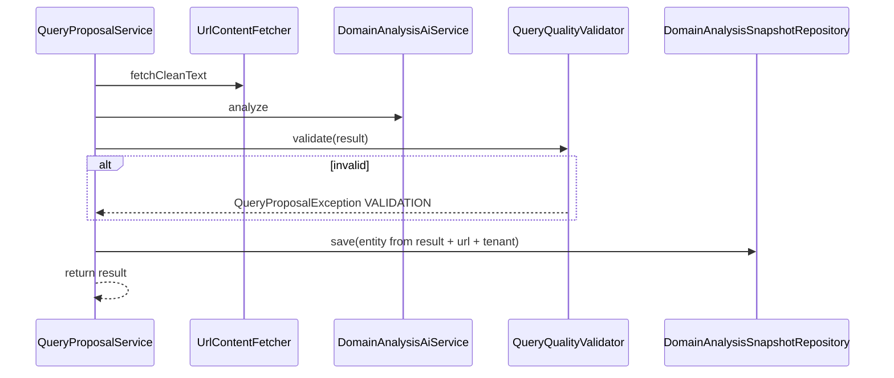

# フェーズ1.5.2 第5回：品質検閲と DB 永続化（最終計画・承認用）

## 1. 制約の確認（スコープ）

### 今回やること

- **生成後の品質チェック**（クエリ長・重複／類似・メタ発言混入・件数）を **`QueryQualityValidator`** に集約する。
- **検証通過後のみ**、`DomainAnalysisResult` を **JPA エンティティ＋リポジトリ**経由で **PostgreSQL に永続化**する。
- **[QueryProposalService](c:\cursor\project\geo-analytics\src\main\java\com\geo\analytics\application\service\QueryProposalService.java)** に **Validator と Repository を注入**し、AI 成功後のフローを **`analyze` → `validate` → `save` → `return`** に拡張する。
- **不合格時は保存しない**。**例外で停止**し、これまでの **[QueryProposalException](c:\cursor\project\geo-analytics\src\main\java\com\geo\analytics\application\exception\QueryProposalException.java)** 系に統一する。

### 今回やらないこと（意識的なスコープ外）

- **フロント（1.5.3）の画面実装**、**API コントローラの新設**（必要なら別タスクで `propose` を叩くエンドポイントを追加）。
- **品質不合格に対する AI 自動リトライ**（コスト・ループリスク・プロンプト改変の本格設計は持ち越し。方針提案は後述）。
- **非機能の高度化**（非同期ジョブ化、Outbox、監査ダッシュボード）。

---

## 2. 実装方針

### 2.1 「低品質」と判定して止める基準（QueryQualityValidator）

新規 **[QueryQualityValidator](c:\cursor\project\geo-analytics\src\main\java\com\geo\analytics\application\validator\QueryQualityValidator.java)**（`@Component`）。**`void validate(DomainAnalysisResult result)`** が失敗時 **`QueryProposalException`** を送出。

| 検証 | 基準（案） | 失敗時メッセージ例（userMessage は短文・固定） |
|------|------------|----------------------------------|
| 件数 | **`queries.size() == 10`**（[DomainAnalysisAiService](c:\cursor\project\geo-analytics\src\main\java\com\geo\analytics\domain\service\DomainAnalysisAiService.java) の契約と一致） | `Invalid query count` |
| 短文 | 各 **`queryText`** をトリム後 **Unicode コードポイント長 > 5**（ユーザー例「5文字以下を拒否」＋境界の明確化） | `Query too short` |
| 空 intent | **`intent`** トリム後 **長さ > 0**（意図なしは低品質扱い） | `Missing query intent` |
| 重複 | 正規化（NFKC 任意、`trim`、连续空白圧縮）後の **完全一致** がクエリ間に存在 | `Duplicate queries` |
| 過度な類似 | 正規化後の **大文字小文字無視**で、あるペアの **一致度が閾値以上**（実装案: 正規化 Levenshtein 距離 ÷ maxLen ≤ 0.15、または n-gram Jaccard ≥ 0.85）。閾値は **定数 1 箇所**に寄せ、テストで調整可能に。 | `Queries too similar` |
| メタ発言 | **`queryText` / `inferredPersona`** に **拒否パターン**（日英の短いフレーズ集合。例:「以下が」「10個の質問」「here are」「as an ai」「ご要望」「json」等。過検出を避けるため **単語単体ではなくフレーズ＋大小無視**） | `Meta or disclaimer text detected` |
| ペルソナ最低限 | **`inferredPersona`** トリム後 **最小長**（例: 32 コードポイント）未満は不合格 | `Persona too vague` |

**ログ**: 失敗理由は **`hostHint` は持たない**ため、`QueryProposalService` 側で **Validation フェーズ**の MDC を既存キーと揃えるか、**検証失敗は WARN 1 行**（**クエリ全文はログに出さない**。必要なら **失敗したインデックスのみ**）。

### 2.2 QueryProposalException の拡張

- **[QueryProposalPhase](c:\cursor\project\geo-analytics\src\main\java\com\geo\analytics\application\exception\QueryProposalPhase.java)** に **`VALIDATION`** を追加。
- バリデーション失敗は **`QueryProposalException(VALIDATION, userMessage, null)`** または **原因としてカスタム `QueryQualityViolationException` を足さず**シンプルに統一（アーキテクト承認次第）。

### 2.3 テーブル構造（Entity）の提案

**独立テーブル**を推奨（[JobEntity](c:\cursor\project\geo-analytics\src\main\java\com\geo\analytics\domain\entity\JobEntity.java) は監査ジョブ用に肥大化しており、`DomainAnalysisResult` は別概念のため）。

| カラム | 型 | 補足 |
|--------|-----|------|
| `id` | UUID PK | |
| `tenant_id` | VARCHAR(36) NOT NULL | [BaseTenantEntity](c:\cursor\project\geo-analytics\src\main\java\com\geo\analytics\domain\entity\BaseTenantEntity.java) / Hibernate `@TenantId` |
| `source_url` | TEXT NOT NULL | 分析対象 URL（`propose` の引数） |
| `inferred_persona` | TEXT NOT NULL | |
| `queries` | JSONB NOT NULL | `[{ "queryText", "intent" }, ...]` — [ProjectEntity](c:\cursor\project\geo-analytics\src\main\java\com\geo\analytics\domain\entity\ProjectEntity.java) の `@JdbcTypeCode(SqlTypes.JSON)` パターンに合わせる |
| `created_at` | TIMESTAMPTZ NOT NULL | |
| `project_id` | UUID NULL | **任意 FK**（将来 UI から紐づけ）。第5回は **`propose` に `UUID projectId` を増やさない**なら **NULL 許容のみ**で開始し、呼び出し側が揃い次第拡張 |

- **Flyway**: 次番 **[V113__...sql](c:\cursor\project\geo-analytics\src\main\resources\db\migration)**（現状最大 V112 の次）。テーブル名案: **`domain_analysis_snapshots`** または **`query_proposal_results`**。
- **Entity**: `DomainAnalysisSnapshotEntity`（`extends BaseTenantEntity`）、**Repository**: `DomainAnalysisSnapshotRepository extends JpaRepository<..., UUID>`。
- **テナント**: 保存直前に **`TenantContextHolder.requireContext()`** から **`workspaceId`（= tenant）** を取得し `setWorkspaceId`。**コンテキスト未束縛**の場合は **`IllegalStateException`**（または `QueryProposalException` に寄せるか実装時に統一）— Web 経由呼び出しが前提。

### 2.4 QueryProposalService のフロー拡張

- **MDC**: **`SCRAPING` → `AI_ANALYSIS` の後に `VALIDATION`** を付けてもよい（または AI 後に検証のみ）。**finally で `MDC.remove`** は維持。
- **トランザクション**: **`@Transactional`** を `propose` に付与するか、Repository の **`save` を同一トランザクションに含める**（読み取り専用でないこと）。

### 2.5 バリデーション失敗時：AI リトライするか

- **第5回の推奨**: **AI への自動リトライは行わない**。理由: 同じプロンプトでは同種欠陥が再発しやすい、コスト・レイテンシ増、ループ制御が別設計が必要。
- **代替**: **1.5.3** でユーザーが **再実行**、または将来 **プロンプト／温度のガードレール強化＋最大 1 回だけ再生成**を別フェーズで検討。

---

## 3. 承認後の作業サマリ（参考）

1. `QueryProposalPhase.VALIDATION` 追加。  
2. `QueryQualityValidator` 実装＋単体テスト推奨（表形式の境界値）。  
3. Flyway + Entity + Repository。  
4. `QueryProposalService` へ配線・MDC・トランザクション。  
5. `mvnw -DskipTests compile`（および可能ならテスト）。
