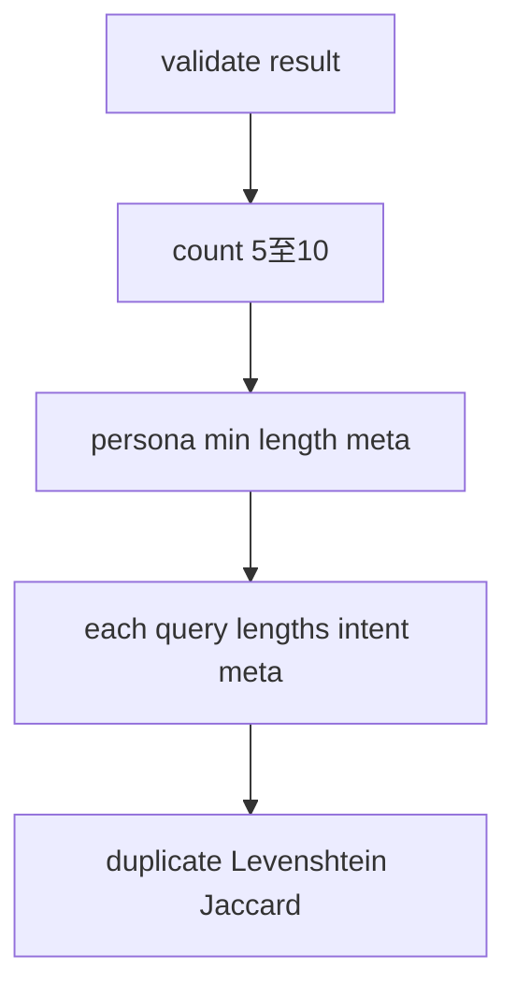

# 第5.2回：検閲ロジックの要塞化（ペルソナ防衛・類似度強化）— 承認用計画

## 1. スコープの確認（明記）

| 対象 | 今回 |
|------|------|
| [QueryQualityValidator.java](geo-analytics/src/main/java/com/geo/analytics/application/validator/QueryQualityValidator.java) | **のみ改修する** |
| [`DomainAnalysisAiService`](geo-analytics/src/main/java/com/geo/analytics/domain/service/DomainAnalysisAiService.java)、スキーマ、永続化、オーケストレーター等 | **触れない** |
| **新規外部ライブラリ** | **追加しない**（Java 標準＋現行アルゴリズムの延長のみ） |

**補足（承認判断用）**: 現状このクラスに専用のユニットテストファイルは無い。**本変更の回帰保証としてテスト追加を同 PR で推奨**するが、要件が「単一ファイルのみ」なら実装だけ先行しテストは別チケットでもよい——どちらにするかはアーキテクト判断が望ましい。

---

## 2. 件数チェックの緩和

**現状**（固定 10）:

```57:63:geo-analytics/src/main/java/com/geo/analytics/application/validator/QueryQualityValidator.java
        List<SuggestedQuery> queries = result.queries();
        if (queries.size() != QUERY_COUNT) {
            throw new QueryProposalException(
                    QueryProposalPhase.VALIDATION,
                    "Validation failed",
                    "queryCount expected " + QUERY_COUNT + " was " + queries.size(),
                    null);
        }
```

**方針**

- `QUERY_COUNT == 10` の単一定数は廃止（または **`MIN_QUERY_COUNT = 5` / `MAX_QUERY_COUNT = 10`** に置換）。
- 条件は `queries.size() < MIN || queries.size() > MAX` で `QueryProposalException`（メッセージに期待レンジを明示）。
- 作業配列の初期容量・`ArrayList<>(QUERY_COUNT)` は **`MAX_QUERY_COUNT`** などに変更。

---

## 3. `inferredPersona` の検閲追加

**配置**: 「件数チェック」の直後、クエリ・ループの前に評価（早期失敗で無駄なループを避ける）。

**3.1 最小サイズ**

- 要件どおり「例: 50 文字」の目安。**日本語のアーキテクト向け宣言**: 画面上の「文字数」とズレさせないため、**Unicode コードポイント数**（[`String.codePointCount`](https://docs.oracle.com/en/java/javase/21/docs/api/java.base/java/lang/String.html#codePointCount(int,int))）で **下限 50** を推奨（既存が `MIN_QUERY_CODE_POINTS` でコードポイント基準であることと統一）。
- `null` でないことは Record 側で空文字になるが、`isBlank()` の場合も同種の例外で落とす（メッセージを区別可能にしてもよい）。

**3.2 メタ発言ブラックリスト**

- **既存の** `containsMetaPhrase` と **同一リスト** (`META_PHRASES_LOWER`) を、`inferredPersona` にも適用（正規化＋lower の既存処理を再利用）。
- 失敗時の `detail` は `meta phrase in inferredPersona` のようにクエリ側と判別できる文言にする。

（ペルソナは通常「メタ」「列挙型の前置き」がクエリより少ないが、監査で指摘された**ペルソナ経路の汚染**に対して同等の門をかける）

---

## 4. メタ発言リスト（META_PHRASES）の拡充案

**原則**: 短文・誤爆しやすい単独語（「提案」「以下」だけ等）は避け、監査で抜けた**メタ体裁**や**LLM がしがちな口癖**寄りで **2〜5 コードポイント以上のフラグメント**を優先。

**日本語追加案（ドラフト／承認後に確定・マージ可否を判断）**

- こちらに / こちらが / こちらは（ユーザー・監査言及どおり）
- まとめました / （～を）リストにまとめ / （～を）一覧にしました
- （よろしければ）ご提案 / ご提案いたします / をご提案
- 参考までに / 念のため / チェックリスト
- 質問リスト / （～の）リストです / （～を）列挙
- （AI）としてお答え / 回答として / 出力（します・いたします）

**既存リスト調整**: 「10個の質問」「10件の質問」に加え、**「5つの質問」「6つの質問」のような整数列挙**はモデルによりメタになりうるので、限定パターン（例：`\\d\\s*[個件通]` のようなチェック）は正規表現を増やすと誤爆のリスクがあるため、今回は**固定フレーズ中心**とし「8件」「5件」を列挙するならごく少数だけ追加する、とするのが無難（必要なら第5.3 で正規表現を別設計）。

**英語追加案（ドラフト）**

- `according to`、`listed below`、`my response`、`output format` 程度の短いフラグメント（既存と重複しないもののみ）

リストは **private static final List** で維持し、並び順はグルーピングのコメント 1〜2 行で十分（ユーザー方針の「過剰コメント回避」）。

---

## 5. 類似度検閲の多層化：キーワード重複（Jaccard）

### 5.1 目的

レーベンシュタインは**表記が近い**言い換えには強いが、**語順・助詞・表記ゆれが大きく文字列距離だけでは別物**になりつつ**語彙集合はほぼ同じ**、というクエリへの耐性を追加する。

**現状のレーベンシュタイン閾値** [`MAX_NORMALIZED_EDIT_RATIO`](geo-analytics/src/main/java/com/geo/analytics/application/validator/QueryQualityValidator.java) は維持。ペア判定は:

- **過度類似（却下）** `=` `areOverlySimilar(norm_i, norm_j)` **または** `tokenSetsTooSimilar(norm_i, norm_j)`（新規）

### 5.2 トークン化（形態素なし・標準 Java のみ）

1. メタチェック済み・比較用の **既に `normalize` 済み文字列**（現行どおり NFKC・空白崩し）を入力とする。
2. **ASCII だけ** lowercase（`Locale.ROOT`）でラテン単語を揃える（日本語コードポイントはそのままでも可）。
3. **連続する「Unicode レター・マーク類」および「連続する数字」を 1 トークンとする**: `Pattern` と `Matcher` で `\p{L}[\p{L}\p{M}]*|\p{N}+` にマッチする部分を順に収集。（`\p{L}` に漢字・かななどが含まれるため、「日本語の空白なし短文」でも**意味のない 1 字ずつ**だけではなく可能なら**連続字の塊**がトークンになる。これは単純規則ゆえ不完全だがライブラリなしでの現実解。）
4. トークン長が **1 コードポイント**など極いトークンは重みを落としたい場合、**共通集合カウントから除外**（任意・誤検知低減。実装計画として「最初は除外なし」「誤検知時にだけ導入」でも可）。
5. トークン数が両方とも **极小**（例: 両方とも集合サイズ `< 3`）のときは **Jaccard チェックをスキップ**（短い質問で「共通 2 語だけ」などで不必要に弾くのを緩める）。

### 5.3 類似度定義・閾値

- **Jaccard**（ユーザー例の「Jaccard 係数的なアプローチ」に合わせる）:  
  `J = |A ∩ B| / |A ∪ B|`（両方とも `Set<String>`）。
- **`J >= JACCARD_TOO_SIMILAR`（既定 0.70）** なら重複として却下。**detail** は `queries too similar (token overlap) at indices …` とレベンシュタイン由来と区別できると運用が楽。
- 「共通単語の割合」を **min(|A|,|B|) 基底**など非対称にしたい場合は仕様変更だが、今回は Jaccard を第一案とする。

### 5.4 ワンセットの限界と宣言

| 強化による効き目 | 限界 |
|------------------|------|
| 「同じ実体語セットで言い回しのみ変えた」ペアで **集合が酷似**すると Jaccard で落ちやすい | 同義語（「料金」「費用」）や別表現はトークンが分かれると **両方とも取りこぼし**になりうる——その隙間は**レベンシュタイン**や既存 duplicate equality が部分的にカバー |
| ペルソナの短文・定型メタや「質問リスト」型の混入 | **下限文字数 + メタ**でテンプレ的形骸やメタ転載を強く抑止 |
| 完全な意味重複検出 | 形態素・埋め込みなしでは**不可能**。今回は**コスト・制約内容に沿った近似**であり「鉄壁」の定義は**多層ゲートでの期待値改善**に留まることを宣言する |

---

## 6. 実装時の関数分割（すべて同一ファイル内）

- `containsMetaPhrase`（共通）
- `normalize`（既存）
- `areOverlySimilar`（既存・package private のままでも可）
- **新規** `extractTokens(String normalized)` → `Set<String>`
- **新規** `jaccardSimilarity(Set<String> a, Set<String> b)`
- **新規** `areTokenSetsTooSimilar(String normA, String normB)`

定数クラスへの抽出はしない（単一ファイル制約）。

---

## 7. フロー（概要）



---

## 8. アーキテクト承認で確定させたい 1 点

- **ペルソナ最小**: コードポイント 50 でよいか（「文字」の定義ゆれ防止のためこちらを推奨）。
- （任意）**Jaccard 閾値 0.70** と **最小セットサイズ阈值** で誤検知が懸念なら PR レビューで微調整。
