# geo_analytics

## Tables

| Name | Columns | Comment | Type |
| ---- | ------- | ------- | ---- |
| [public.plans](public.plans.md) | 8 |  | BASE TABLE |
| [public.organizations](public.organizations.md) | 11 |  | BASE TABLE |
| [public.organization_users](public.organization_users.md) | 8 |  | BASE TABLE |
| [public.tenants](public.tenants.md) | 6 |  | BASE TABLE |
| [public.user_sessions](public.user_sessions.md) | 8 |  | BASE TABLE |
| [public.workspaces](public.workspaces.md) | 9 |  | BASE TABLE |
| [public.projects](public.projects.md) | 16 |  | BASE TABLE |
| [public.project_keywords](public.project_keywords.md) | 6 |  | BASE TABLE |
| [public.jobs](public.jobs.md) | 33 |  | BASE TABLE |
| [public.job_queries](public.job_queries.md) | 5 |  | BASE TABLE |
| [public.audit_histories](public.audit_histories.md) | 26 |  | BASE TABLE |
| [public.sge_results](public.sge_results.md) | 9 |  | BASE TABLE |
| [public.rag_domain_rules](public.rag_domain_rules.md) | 5 |  | BASE TABLE |
| [public.unresolved_entity_queue](public.unresolved_entity_queue.md) | 9 |  | BASE TABLE |
| [public.wallet_transactions](public.wallet_transactions.md) | 8 |  | BASE TABLE |
| [public.math_debate_audit_events](public.math_debate_audit_events.md) | 5 |  | BASE TABLE |
| [public.domain_analysis_snapshots](public.domain_analysis_snapshots.md) | 6 |  | BASE TABLE |
| [public.query_proposals](public.query_proposals.md) | 8 |  | BASE TABLE |
| [public.query_proposal_suggested_queries](public.query_proposal_suggested_queries.md) | 6 |  | BASE TABLE |
| [public.geo_asset_snapshots](public.geo_asset_snapshots.md) | 7 |  | BASE TABLE |
| [public.audit_rubric_results](public.audit_rubric_results.md) | 9 |  | BASE TABLE |
| [public.jobs_pdf_audit_logs](public.jobs_pdf_audit_logs.md) | 10 |  | BASE TABLE |
| [public.processed_stripe_events](public.processed_stripe_events.md) | 5 |  | BASE TABLE |

## Stored procedures and functions

| Name | ReturnType | Arguments | Type |
| ---- | ------- | ------- | ---- |
| public.update_updated_at_column | trigger |  | FUNCTION |
| public.jobs_prevent_applied_plan_change | trigger |  | FUNCTION |
| public.fn_jobs_pdf_audit_logs_worm | trigger |  | FUNCTION |

## Relations

```mermaid
erDiagram

"public.organizations" }o--|| "public.plans" : "FOREIGN KEY (plan_id) REFERENCES plans(id) ON DELETE RESTRICT"
"public.organization_users" }o--|| "public.organizations" : "FOREIGN KEY (organization_id) REFERENCES organizations(id) ON DELETE RESTRICT"
"public.tenants" }o--|| "public.organizations" : "FOREIGN KEY (organization_id) REFERENCES organizations(id) ON DELETE RESTRICT"
"public.user_sessions" }o--|| "public.organizations" : "FOREIGN KEY (organization_id) REFERENCES organizations(id) ON DELETE RESTRICT"
"public.user_sessions" }o--|| "public.organization_users" : "FOREIGN KEY (user_id) REFERENCES organization_users(id) ON DELETE RESTRICT"
"public.workspaces" }o--|| "public.organizations" : "FOREIGN KEY (organization_id) REFERENCES organizations(id) ON DELETE RESTRICT"
"public.project_keywords" }o--|| "public.projects" : "FOREIGN KEY (project_id) REFERENCES projects(id) ON DELETE CASCADE"
"public.jobs" }o--o| "public.projects" : "FOREIGN KEY (project_id) REFERENCES projects(id) ON DELETE SET NULL"
"public.job_queries" }o--|| "public.jobs" : "FOREIGN KEY (job_id) REFERENCES jobs(id) ON DELETE CASCADE"
"public.audit_histories" }o--|| "public.projects" : "FOREIGN KEY (project_id) REFERENCES projects(id) ON DELETE CASCADE"
"public.audit_histories" }o--|| "public.jobs" : "FOREIGN KEY (job_id) REFERENCES jobs(id) ON DELETE CASCADE"
"public.sge_results" }o--|| "public.jobs" : "FOREIGN KEY (job_id) REFERENCES jobs(id) ON DELETE CASCADE"
"public.wallet_transactions" }o--|| "public.organizations" : "FOREIGN KEY (organization_id) REFERENCES organizations(id) ON DELETE RESTRICT"
"public.wallet_transactions" }o--o| "public.projects" : "FOREIGN KEY (project_id) REFERENCES projects(id) ON DELETE SET NULL"
"public.wallet_transactions" }o--o| "public.wallet_transactions" : "FOREIGN KEY (parent_reservation_id) REFERENCES wallet_transactions(id) ON DELETE RESTRICT"
"public.query_proposal_suggested_queries" }o--|| "public.query_proposals" : "FOREIGN KEY (proposal_id) REFERENCES query_proposals(id) ON DELETE CASCADE"
"public.geo_asset_snapshots" }o--|| "public.organizations" : "FOREIGN KEY (organization_id) REFERENCES organizations(id) ON DELETE RESTRICT"
"public.geo_asset_snapshots" }o--|| "public.projects" : "FOREIGN KEY (project_id) REFERENCES projects(id) ON DELETE CASCADE"
"public.processed_stripe_events" }o--|| "public.organizations" : "FOREIGN KEY (organization_id) REFERENCES organizations(id) ON DELETE CASCADE"

"public.plans" {
  varchar_20_ id ""
  varchar_512_ name ""
  bigint monthly_price ""
  bigint monthly_credits ""
  integer keyword_limit ""
  timestamp_with_time_zone created_at ""
  timestamp_with_time_zone updated_at ""
  timestamp_with_time_zone deleted_at ""
}
"public.organizations" {
  uuid id ""
  varchar_512_ name ""
  varchar_20_ plan_id FK ""
  bigint credit_balance ""
  timestamp_with_time_zone billing_cycle_anchor ""
  timestamp_with_time_zone created_at ""
  timestamp_with_time_zone updated_at ""
  timestamp_with_time_zone deleted_at ""
  varchar_1024_ logo_file_path ""
  varchar_64_ brand_color ""
  varchar_255_ tool_name ""
}
"public.organization_users" {
  uuid id ""
  uuid organization_id FK ""
  varchar_320_ email ""
  varchar_255_ password_hash ""
  varchar_32_ role ""
  timestamp_with_time_zone created_at ""
  timestamp_with_time_zone updated_at ""
  timestamp_with_time_zone deleted_at ""
}
"public.tenants" {
  uuid id ""
  uuid organization_id FK ""
  varchar_512_ name ""
  timestamp_with_time_zone created_at ""
  timestamp_with_time_zone updated_at ""
  timestamp_with_time_zone deleted_at ""
}
"public.user_sessions" {
  uuid id ""
  uuid organization_id FK ""
  uuid user_id FK ""
  uuid session_id ""
  timestamp_with_time_zone expires_at ""
  timestamp_with_time_zone created_at ""
  timestamp_with_time_zone updated_at ""
  timestamp_with_time_zone deleted_at ""
}
"public.workspaces" {
  uuid id ""
  varchar_512_ name ""
  varchar_16_ subscription_plan ""
  uuid organization_id FK ""
  timestamp_without_time_zone created_at ""
  timestamp_without_time_zone updated_at ""
  timestamp_with_time_zone deleted_at ""
  varchar_64_ stripe_customer_id ""
  varchar_64_ stripe_subscription_id ""
}
"public.projects" {
  uuid id ""
  varchar_36_ tenant_id ""
  varchar_255_ name ""
  varchar_255_ target_url ""
  varchar_64_ brand_color ""
  varchar_2048_ logo_url ""
  timestamp_without_time_zone created_at ""
  timestamp_without_time_zone updated_at ""
  boolean auto_audit_enabled ""
  varchar_2048_ slack_webhook_url ""
  varchar_320_ notification_email ""
  timestamp_without_time_zone last_audit_at ""
  varchar_32_ industry_type "業種分類（IndustryTypeの列挙子名。既存行はOTHER）"
  text extracted_strengths "自社サイト解析等で抽出した強み"
  text target_audience "想定ターゲット層"
  jsonb minority_reports ""
}
"public.project_keywords" {
  uuid id ""
  varchar_36_ tenant_id ""
  uuid project_id FK ""
  text keyword_text ""
  varchar_16_ analysis_priority ""
  varchar_32_ preferred_engine ""
}
"public.jobs" {
  uuid id ""
  varchar_36_ tenant_id ""
  uuid project_id FK ""
  varchar_32_ job_status ""
  varchar_16_ subscription_plan ""
  jsonb plan_limits_snapshot ""
  varchar_255_ brand_name ""
  varchar_64_ brand_color ""
  varchar_2048_ logo_url ""
  varchar_255_ gemini_job_name ""
  text error_message ""
  varchar_32_ pdf_status ""
  varchar_1024_ pdf_file_path ""
  timestamp_without_time_zone created_at ""
  timestamp_without_time_zone updated_at ""
  text job_diagnostic_message ""
  jsonb job_recommended_actions ""
  uuid gap_batch_idempotency_key ""
  uuid create_idempotency_key ""
  varchar_512_ gap_analysis_gemini_job_name ""
  boolean gap_analysis_completed ""
  jsonb self_rubric_audit_json ""
  jsonb self_crawled_page_json ""
  integer meo_review_count ""
  double_precision meo_average_stars ""
  jsonb emotional_alert ""
  varchar_2048_ target_url ""
  text business_summary ""
  text target_audience ""
  text focus_points ""
  text extracted_knowledge ""
  varchar_32_ industry_type ""
  varchar_32_ job_advice_source "ジョブ全体アドバイスの生成元（AdviceSource: AI / TEMPLATE_FALLBACK）"
}
"public.job_queries" {
  uuid id ""
  varchar_36_ tenant_id ""
  uuid job_id FK ""
  text query_text ""
  boolean processed ""
}
"public.audit_histories" {
  uuid id ""
  varchar_36_ tenant_id ""
  uuid job_id FK ""
  uuid project_id FK ""
  text query ""
  jsonb raw_response ""
  double_precision som_score ""
  boolean brand_mentioned ""
  integer mention_rank ""
  integer overall_score ""
  varchar_512_ resolved_entity_label ""
  integer token_count ""
  integer ai_citation_position ""
  double_precision sentiment_intensity ""
  integer visibility_stage ""
  varchar_32_ calculation_version ""
  boolean negative_alert ""
  double_precision modified_z_score ""
  text diagnostic_message ""
  jsonb recommended_actions ""
  jsonb model_insights ""
  date audit_date ""
  timestamp_with_time_zone created_at ""
  numeric gbvs_normalized_score ""
  jsonb job_recommended_actions ""
  varchar_32_ ai_recognition_state ""
}
"public.sge_results" {
  uuid id ""
  varchar_36_ tenant_id ""
  uuid job_id FK ""
  uuid query_id ""
  text query ""
  jsonb sge_raw_response ""
  boolean sge_mentioned ""
  integer mention_count ""
  timestamp_without_time_zone created_at ""
}
"public.rag_domain_rules" {
  uuid id ""
  varchar_255_ host_suffix ""
  varchar_32_ rule_kind ""
  double_precision trust_boost ""
  boolean active ""
}
"public.unresolved_entity_queue" {
  uuid id ""
  varchar_36_ tenant_id ""
  text left_label ""
  text right_label ""
  varchar_64_ left_blocking_hash ""
  varchar_64_ right_blocking_hash ""
  boolean manual_review_required ""
  varchar_32_ calculation_version ""
  timestamp_without_time_zone created_at ""
}
"public.wallet_transactions" {
  uuid id ""
  uuid organization_id FK ""
  uuid project_id FK ""
  varchar_32_ transaction_type ""
  bigint amount ""
  uuid parent_reservation_id FK ""
  timestamp_without_time_zone created_at ""
  varchar_2048_ note ""
}
"public.math_debate_audit_events" {
  uuid id ""
  uuid target_id ""
  varchar_64_ event_type ""
  jsonb audit_data ""
  timestamp_with_time_zone created_at ""
}
"public.domain_analysis_snapshots" {
  uuid id ""
  varchar_36_ tenant_id ""
  text source_url ""
  text inferred_persona ""
  jsonb queries ""
  timestamp_without_time_zone created_at ""
}
"public.query_proposals" {
  uuid id ""
  varchar_36_ tenant_id ""
  varchar_2083_ url ""
  text business_description ""
  text target_audience ""
  text strategic_focus ""
  text inferred_persona ""
  timestamp_without_time_zone created_at ""
}
"public.query_proposal_suggested_queries" {
  uuid id ""
  varchar_36_ tenant_id ""
  uuid proposal_id FK ""
  text query_text ""
  text intent ""
  integer sort_order ""
}
"public.geo_asset_snapshots" {
  uuid id ""
  uuid organization_id FK ""
  uuid project_id FK ""
  date snapshot_date ""
  double_precision readiness_score ""
  bigint local_trust_count ""
  varchar_32_ calculation_version ""
}
"public.audit_rubric_results" {
  uuid id ""
  varchar_36_ tenant_id ""
  uuid audit_history_id ""
  varchar_64_ criterion_id ""
  varchar_16_ verdict ""
  text evidence ""
  numeric_7_3_ score ""
  varchar_2048_ target_url ""
  boolean is_self ""
}
"public.jobs_pdf_audit_logs" {
  uuid id ""
  varchar_36_ tenant_id ""
  uuid organization_id ""
  uuid job_id ""
  uuid actor_user_id ""
  uuid actor_session_id ""
  bigint pdf_byte_size ""
  varchar_32_ report_kind ""
  timestamp_with_time_zone exported_at ""
  timestamp_with_time_zone created_at ""
}
"public.processed_stripe_events" {
  uuid id ""
  uuid organization_id FK ""
  varchar_64_ event_id ""
  varchar_64_ event_type ""
  timestamp_without_time_zone processed_at ""
}
```

---

> Generated by [tbls](https://github.com/k1LoW/tbls)
