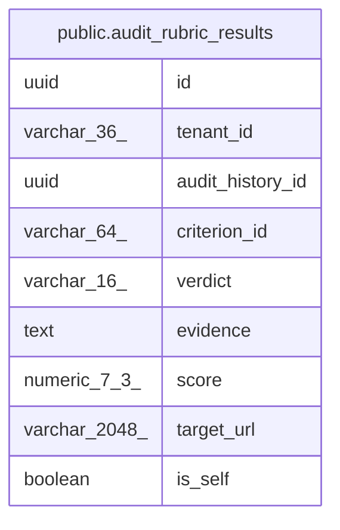

# public.audit_rubric_results

## Columns

| Name | Type | Default | Nullable | Children | Parents | Comment |
| ---- | ---- | ------- | -------- | -------- | ------- | ------- |
| id | uuid |  | false |  |  |  |
| tenant_id | varchar(36) |  | false |  |  |  |
| audit_history_id | uuid |  | false |  |  |  |
| criterion_id | varchar(64) |  | false |  |  |  |
| verdict | varchar(16) |  | false |  |  |  |
| evidence | text |  | true |  |  |  |
| score | numeric(7,3) | 0 | false |  |  |  |
| target_url | varchar(2048) | ''::character varying | false |  |  |  |
| is_self | boolean | false | false |  |  |  |

## Constraints

| Name | Type | Definition |
| ---- | ---- | ---------- |
| audit_rubric_results_pkey | PRIMARY KEY | PRIMARY KEY (id) |

## Indexes

| Name | Definition |
| ---- | ---------- |
| audit_rubric_results_pkey | CREATE UNIQUE INDEX audit_rubric_results_pkey ON public.audit_rubric_results USING btree (id) |
| idx_audit_rubric_results_tenant_history | CREATE INDEX idx_audit_rubric_results_tenant_history ON public.audit_rubric_results USING btree (tenant_id, audit_history_id) |
| idx_audit_rubric_results_history_criterion | CREATE INDEX idx_audit_rubric_results_history_criterion ON public.audit_rubric_results USING btree (audit_history_id, criterion_id) |
| idx_audit_rubric_results_history_self | CREATE INDEX idx_audit_rubric_results_history_self ON public.audit_rubric_results USING btree (audit_history_id, is_self) |
| idx_audit_rubric_results_history_target | CREATE INDEX idx_audit_rubric_results_history_target ON public.audit_rubric_results USING btree (audit_history_id, target_url) |

## Relations

---

> Generated by [tbls](https://github.com/k1LoW/tbls)
