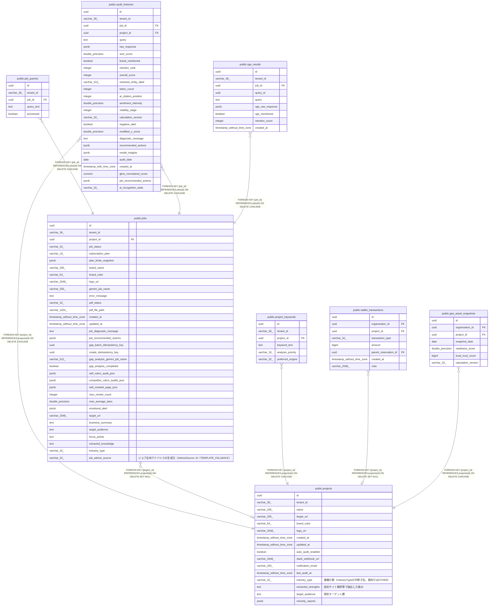

# public.jobs

## Columns

| Name | Type | Default | Nullable | Children | Parents | Comment |
| ---- | ---- | ------- | -------- | -------- | ------- | ------- |
| id | uuid |  | false | [public.job_queries](public.job_queries.md) [public.audit_histories](public.audit_histories.md) [public.sge_results](public.sge_results.md) |  |  |
| tenant_id | varchar(36) |  | false |  |  |  |
| project_id | uuid |  | true |  | [public.projects](public.projects.md) |  |
| job_status | varchar(32) |  | false |  |  |  |
| subscription_plan | varchar(16) |  | true |  |  |  |
| plan_limits_snapshot | jsonb |  | true |  |  |  |
| brand_name | varchar(255) |  | false |  |  |  |
| brand_color | varchar(64) |  | false |  |  |  |
| logo_url | varchar(2048) |  | true |  |  |  |
| gemini_job_name | varchar(255) |  | true |  |  |  |
| error_message | text |  | true |  |  |  |
| pdf_status | varchar(32) |  | true |  |  |  |
| pdf_file_path | varchar(1024) |  | true |  |  |  |
| created_at | timestamp without time zone |  | false |  |  |  |
| updated_at | timestamp without time zone |  | false |  |  |  |
| job_diagnostic_message | text |  | true |  |  |  |
| job_recommended_actions | jsonb |  | true |  |  |  |
| gap_batch_idempotency_key | uuid |  | true |  |  |  |
| create_idempotency_key | uuid |  | true |  |  |  |
| gap_analysis_gemini_job_name | varchar(512) |  | true |  |  |  |
| gap_analysis_completed | boolean |  | false |  |  |  |
| self_rubric_audit_json | jsonb |  | true |  |  |  |
| competitor_rubric_audits_json | jsonb |  | true |  |  |  |
| self_crawled_page_json | jsonb |  | true |  |  |  |
| meo_review_count | integer |  | true |  |  |  |
| meo_average_stars | double precision |  | true |  |  |  |
| emotional_alert | jsonb |  | true |  |  |  |
| target_url | varchar(2048) |  | false |  |  |  |
| business_summary | text |  | true |  |  |  |
| target_audience | text |  | true |  |  |  |
| focus_points | text |  | true |  |  |  |
| extracted_knowledge | text |  | true |  |  |  |
| industry_type | varchar(32) | 'LOCAL_STORE'::character varying | false |  |  |  |
| job_advice_source | varchar(32) |  | true |  |  | ジョブ全体アドバイスの生成元（AdviceSource: AI / TEMPLATE_FALLBACK） |

## Constraints

| Name | Type | Definition |
| ---- | ---- | ---------- |
| chk_jobs_industry_type | CHECK | CHECK (((industry_type)::text = ANY ((ARRAY['LOCAL_STORE'::character varying, 'CORPORATE_SERVICE'::character varying, 'ONLINE_SERVICE'::character varying])::text[]))) |
| chk_jobs_job_status | CHECK | CHECK (((job_status)::text = ANY ((ARRAY['CREATED'::character varying, 'EXTRACTING_COMPETITORS'::character varying, 'REALTIME_PROCESSING'::character varying, 'FILE_UPLOADED'::character varying, 'SUBMITTED'::character varying, 'RUNNING'::character varying, 'COMPLETED'::character varying, 'FAILED'::character varying])::text[]))) |
| chk_jobs_subscription_plan | CHECK | CHECK (((subscription_plan)::text = ANY ((ARRAY['STANDARD'::character varying, 'PRO'::character varying, 'EXPERT'::character varying])::text[]))) |
| fk_jobs_project | FOREIGN KEY | FOREIGN KEY (project_id) REFERENCES projects(id) ON DELETE SET NULL |
| jobs_pkey | PRIMARY KEY | PRIMARY KEY (id) |

## Indexes

| Name | Definition |
| ---- | ---------- |
| jobs_pkey | CREATE UNIQUE INDEX jobs_pkey ON public.jobs USING btree (id) |
| ux_jobs_tenant_create_idempotency_key | CREATE UNIQUE INDEX ux_jobs_tenant_create_idempotency_key ON public.jobs USING btree (tenant_id, create_idempotency_key) WHERE (create_idempotency_key IS NOT NULL) |

## Triggers

| Name | Definition |
| ---- | ---------- |
| trg_jobs_updated_at | CREATE TRIGGER trg_jobs_updated_at BEFORE UPDATE ON public.jobs FOR EACH ROW EXECUTE FUNCTION update_updated_at_column() |
| trg_jobs_applied_plan_immutable | CREATE TRIGGER trg_jobs_applied_plan_immutable BEFORE UPDATE ON public.jobs FOR EACH ROW EXECUTE FUNCTION jobs_prevent_applied_plan_change() |

## Relations

---

> Generated by [tbls](https://github.com/k1LoW/tbls)
