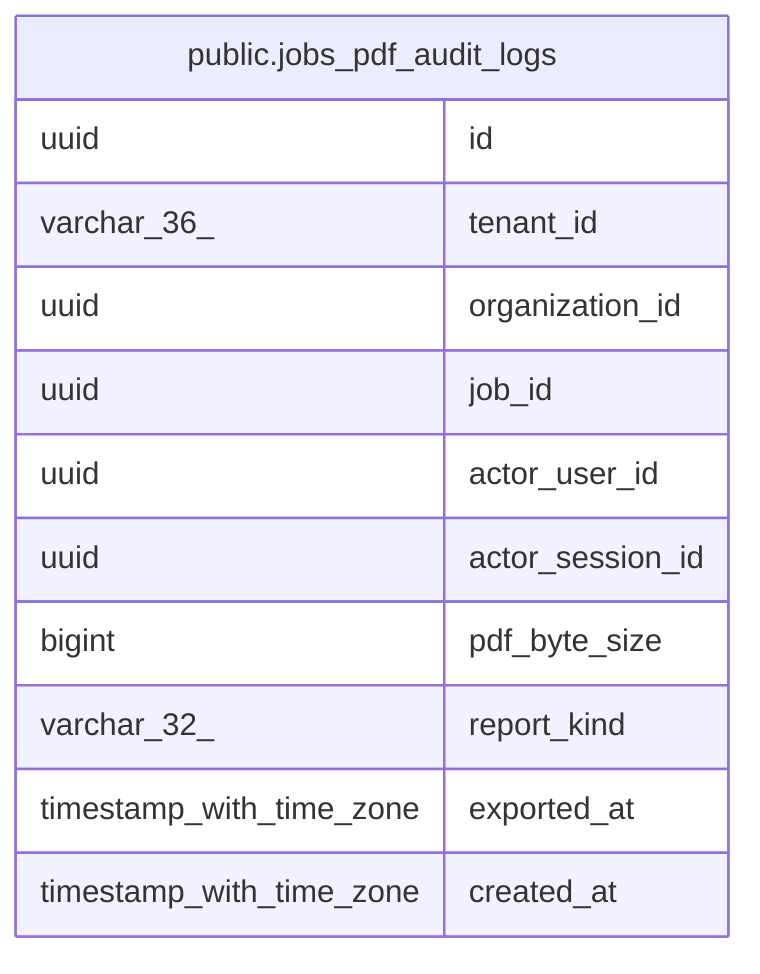

# public.jobs_pdf_audit_logs

## Columns

| Name | Type | Default | Nullable | Children | Parents | Comment |
| ---- | ---- | ------- | -------- | -------- | ------- | ------- |
| id | uuid |  | false |  |  |  |
| tenant_id | varchar(36) |  | false |  |  |  |
| organization_id | uuid |  | false |  |  |  |
| job_id | uuid |  | false |  |  |  |
| actor_user_id | uuid |  | true |  |  |  |
| actor_session_id | uuid |  | true |  |  |  |
| pdf_byte_size | bigint | 0 | false |  |  |  |
| report_kind | varchar(32) | 'JOB_REPORT'::character varying | false |  |  |  |
| exported_at | timestamp with time zone | now() | false |  |  |  |
| created_at | timestamp with time zone | now() | false |  |  |  |

## Constraints

| Name | Type | Definition |
| ---- | ---- | ---------- |
| jobs_pdf_audit_logs_pkey | PRIMARY KEY | PRIMARY KEY (id) |

## Indexes

| Name | Definition |
| ---- | ---------- |
| jobs_pdf_audit_logs_pkey | CREATE UNIQUE INDEX jobs_pdf_audit_logs_pkey ON public.jobs_pdf_audit_logs USING btree (id) |
| idx_jobs_pdf_audit_tenant_job | CREATE INDEX idx_jobs_pdf_audit_tenant_job ON public.jobs_pdf_audit_logs USING btree (tenant_id, job_id) |
| idx_jobs_pdf_audit_tenant_exported_at | CREATE INDEX idx_jobs_pdf_audit_tenant_exported_at ON public.jobs_pdf_audit_logs USING btree (tenant_id, exported_at DESC) |

## Triggers

| Name | Definition |
| ---- | ---------- |
| trg_jobs_pdf_audit_logs_no_update | CREATE TRIGGER trg_jobs_pdf_audit_logs_no_update BEFORE UPDATE ON public.jobs_pdf_audit_logs FOR EACH ROW EXECUTE FUNCTION fn_jobs_pdf_audit_logs_worm() |
| trg_jobs_pdf_audit_logs_no_delete | CREATE TRIGGER trg_jobs_pdf_audit_logs_no_delete BEFORE DELETE ON public.jobs_pdf_audit_logs FOR EACH ROW EXECUTE FUNCTION fn_jobs_pdf_audit_logs_worm() |

## Relations

---

> Generated by [tbls](https://github.com/k1LoW/tbls)
