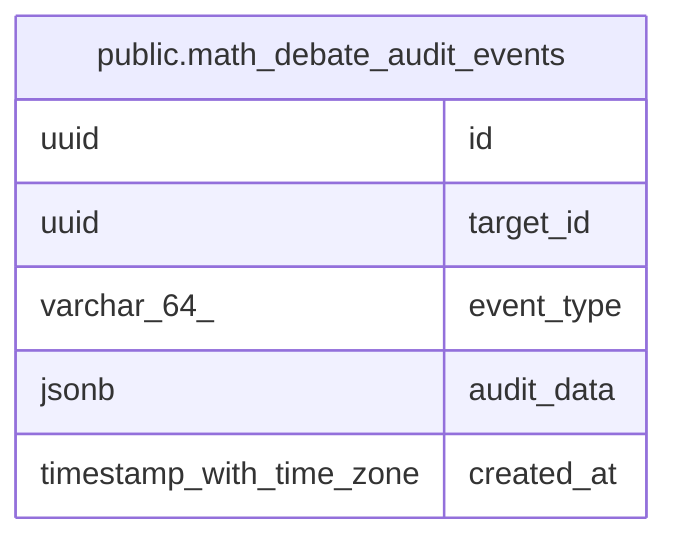

# public.math_debate_audit_events

## Columns

| Name | Type | Default | Nullable | Children | Parents | Comment |
| ---- | ---- | ------- | -------- | -------- | ------- | ------- |
| id | uuid |  | false |  |  |  |
| target_id | uuid |  | false |  |  |  |
| event_type | varchar(64) |  | false |  |  |  |
| audit_data | jsonb |  | false |  |  |  |
| created_at | timestamp with time zone |  | false |  |  |  |

## Constraints

| Name | Type | Definition |
| ---- | ---- | ---------- |
| math_debate_audit_events_pkey | PRIMARY KEY | PRIMARY KEY (id) |

## Indexes

| Name | Definition |
| ---- | ---------- |
| math_debate_audit_events_pkey | CREATE UNIQUE INDEX math_debate_audit_events_pkey ON public.math_debate_audit_events USING btree (id) |
| idx_math_debate_audit_events_target_created | CREATE INDEX idx_math_debate_audit_events_target_created ON public.math_debate_audit_events USING btree (target_id, created_at) |

## Relations

---

> Generated by [tbls](https://github.com/k1LoW/tbls)
