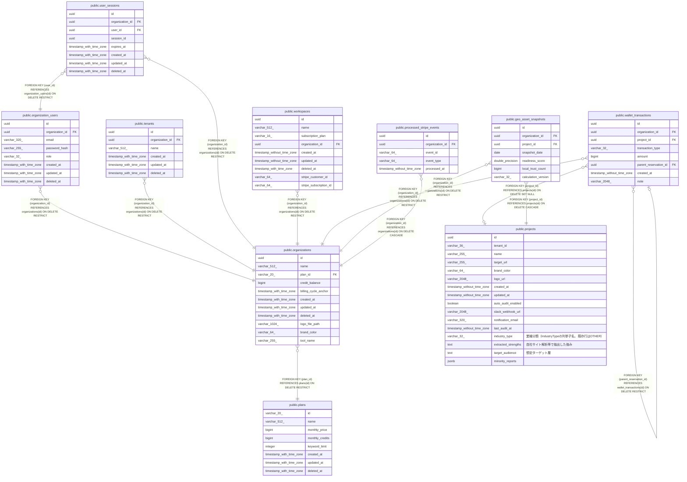

# public.organizations

## Columns

| Name | Type | Default | Nullable | Children | Parents | Comment |
| ---- | ---- | ------- | -------- | -------- | ------- | ------- |
| id | uuid | gen_random_uuid() | false | [public.organization_users](public.organization_users.md) [public.tenants](public.tenants.md) [public.user_sessions](public.user_sessions.md) [public.workspaces](public.workspaces.md) [public.wallet_transactions](public.wallet_transactions.md) [public.geo_asset_snapshots](public.geo_asset_snapshots.md) [public.processed_stripe_events](public.processed_stripe_events.md) |  |  |
| name | varchar(512) |  | false |  |  |  |
| plan_id | varchar(20) |  | false |  | [public.plans](public.plans.md) |  |
| credit_balance | bigint | 0 | false |  |  |  |
| billing_cycle_anchor | timestamp with time zone | now() | false |  |  |  |
| created_at | timestamp with time zone | now() | false |  |  |  |
| updated_at | timestamp with time zone | now() | false |  |  |  |
| deleted_at | timestamp with time zone |  | true |  |  |  |
| logo_file_path | varchar(1024) |  | true |  |  |  |
| brand_color | varchar(64) |  | true |  |  |  |
| tool_name | varchar(255) |  | true |  |  |  |

## Constraints

| Name | Type | Definition |
| ---- | ---- | ---------- |
| fk_organizations_plan | FOREIGN KEY | FOREIGN KEY (plan_id) REFERENCES plans(id) ON DELETE RESTRICT |
| organizations_pkey | PRIMARY KEY | PRIMARY KEY (id) |

## Indexes

| Name | Definition |
| ---- | ---------- |
| organizations_pkey | CREATE UNIQUE INDEX organizations_pkey ON public.organizations USING btree (id) |

## Triggers

| Name | Definition |
| ---- | ---------- |
| trg_organizations_updated_at | CREATE TRIGGER trg_organizations_updated_at BEFORE UPDATE ON public.organizations FOR EACH ROW EXECUTE FUNCTION update_updated_at_column() |

## Relations

---

> Generated by [tbls](https://github.com/k1LoW/tbls)
