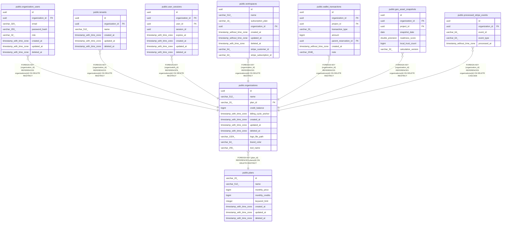

# public.plans

## Columns

| Name | Type | Default | Nullable | Children | Parents | Comment |
| ---- | ---- | ------- | -------- | -------- | ------- | ------- |
| id | varchar(20) |  | false | [public.organizations](public.organizations.md) |  |  |
| name | varchar(512) |  | false |  |  |  |
| monthly_price | bigint |  | false |  |  |  |
| monthly_credits | bigint |  | false |  |  |  |
| keyword_limit | integer |  | false |  |  |  |
| created_at | timestamp with time zone | now() | false |  |  |  |
| updated_at | timestamp with time zone | now() | false |  |  |  |
| deleted_at | timestamp with time zone |  | true |  |  |  |

## Constraints

| Name | Type | Definition |
| ---- | ---- | ---------- |
| plans_pkey | PRIMARY KEY | PRIMARY KEY (id) |

## Indexes

| Name | Definition |
| ---- | ---------- |
| plans_pkey | CREATE UNIQUE INDEX plans_pkey ON public.plans USING btree (id) |

## Triggers

| Name | Definition |
| ---- | ---------- |
| trg_plans_updated_at | CREATE TRIGGER trg_plans_updated_at BEFORE UPDATE ON public.plans FOR EACH ROW EXECUTE FUNCTION update_updated_at_column() |

## Relations

---

> Generated by [tbls](https://github.com/k1LoW/tbls)
