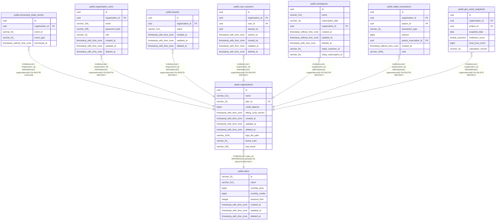

# public.processed_stripe_events

## Columns

| Name | Type | Default | Nullable | Children | Parents | Comment |
| ---- | ---- | ------- | -------- | -------- | ------- | ------- |
| id | uuid |  | false |  |  |  |
| organization_id | uuid |  | false |  | [public.organizations](public.organizations.md) |  |
| event_id | varchar(64) |  | false |  |  |  |
| event_type | varchar(64) |  | false |  |  |  |
| processed_at | timestamp without time zone | now() | false |  |  |  |

## Constraints

| Name | Type | Definition |
| ---- | ---- | ---------- |
| processed_stripe_events_organization_id_fkey | FOREIGN KEY | FOREIGN KEY (organization_id) REFERENCES organizations(id) ON DELETE CASCADE |
| processed_stripe_events_pkey | PRIMARY KEY | PRIMARY KEY (id) |
| uq_processed_stripe_event | UNIQUE | UNIQUE (event_id) |

## Indexes

| Name | Definition |
| ---- | ---------- |
| processed_stripe_events_pkey | CREATE UNIQUE INDEX processed_stripe_events_pkey ON public.processed_stripe_events USING btree (id) |
| uq_processed_stripe_event | CREATE UNIQUE INDEX uq_processed_stripe_event ON public.processed_stripe_events USING btree (event_id) |
| idx_processed_stripe_events_org | CREATE INDEX idx_processed_stripe_events_org ON public.processed_stripe_events USING btree (organization_id, processed_at) |

## Relations

---

> Generated by [tbls](https://github.com/k1LoW/tbls)
