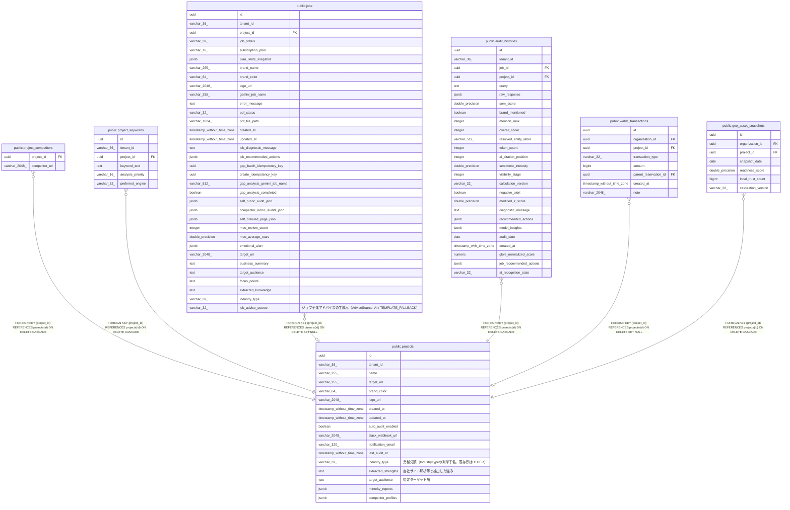

# public.project_competitors

## Columns

| Name | Type | Default | Nullable | Children | Parents | Comment |
| ---- | ---- | ------- | -------- | -------- | ------- | ------- |
| project_id | uuid |  | false |  | [public.projects](public.projects.md) |  |
| competitor_url | varchar(2048) |  | false |  |  |  |

## Constraints

| Name | Type | Definition |
| ---- | ---- | ---------- |
| fk_project_competitors_project | FOREIGN KEY | FOREIGN KEY (project_id) REFERENCES projects(id) ON DELETE CASCADE |

## Relations

---

> Generated by [tbls](https://github.com/k1LoW/tbls)
