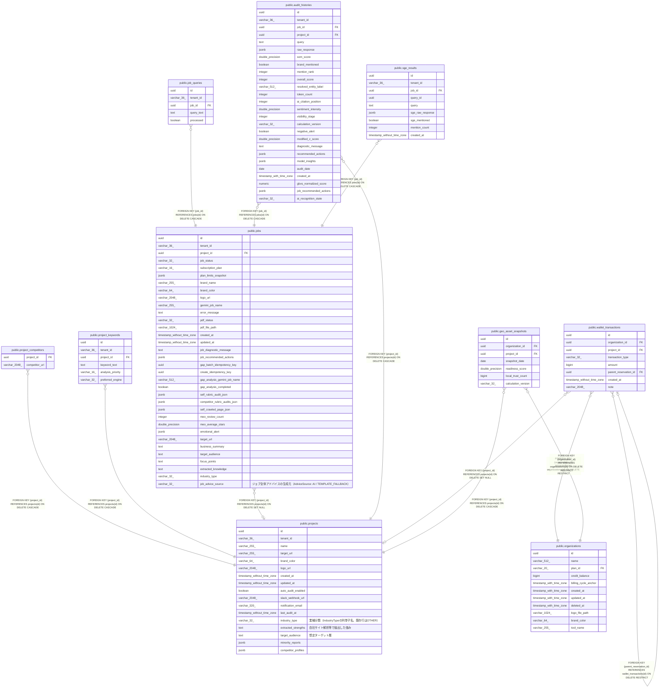

# public.projects

## Columns

| Name | Type | Default | Nullable | Children | Parents | Comment |
| ---- | ---- | ------- | -------- | -------- | ------- | ------- |
| id | uuid |  | false | [public.project_competitors](public.project_competitors.md) [public.project_keywords](public.project_keywords.md) [public.jobs](public.jobs.md) [public.audit_histories](public.audit_histories.md) [public.wallet_transactions](public.wallet_transactions.md) [public.geo_asset_snapshots](public.geo_asset_snapshots.md) |  |  |
| tenant_id | varchar(36) |  | false |  |  |  |
| name | varchar(255) |  | false |  |  |  |
| target_url | varchar(255) |  | false |  |  |  |
| brand_color | varchar(64) |  | false |  |  |  |
| logo_url | varchar(2048) |  | true |  |  |  |
| created_at | timestamp without time zone |  | false |  |  |  |
| updated_at | timestamp without time zone |  | false |  |  |  |
| auto_audit_enabled | boolean |  | false |  |  |  |
| slack_webhook_url | varchar(2048) |  | true |  |  |  |
| notification_email | varchar(320) |  | true |  |  |  |
| last_audit_at | timestamp without time zone |  | true |  |  |  |
| industry_type | varchar(32) | 'OTHER'::character varying | false |  |  | 業種分類（IndustryTypeの列挙子名。既存行はOTHER） |
| extracted_strengths | text |  | true |  |  | 自社サイト解析等で抽出した強み |
| target_audience | text |  | true |  |  | 想定ターゲット層 |
| minority_reports | jsonb | '[]'::jsonb | false |  |  |  |
| competitor_profiles | jsonb | '[]'::jsonb | false |  |  |  |

## Constraints

| Name | Type | Definition |
| ---- | ---- | ---------- |
| projects_pkey | PRIMARY KEY | PRIMARY KEY (id) |

## Indexes

| Name | Definition |
| ---- | ---------- |
| projects_pkey | CREATE UNIQUE INDEX projects_pkey ON public.projects USING btree (id) |

## Triggers

| Name | Definition |
| ---- | ---------- |
| trg_projects_updated_at | CREATE TRIGGER trg_projects_updated_at BEFORE UPDATE ON public.projects FOR EACH ROW EXECUTE FUNCTION update_updated_at_column() |

## Relations

---

> Generated by [tbls](https://github.com/k1LoW/tbls)
