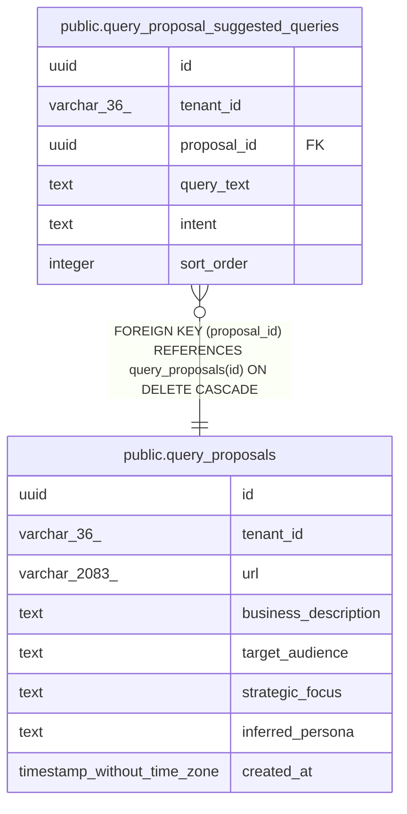

# public.query_proposal_suggested_queries

## Columns

| Name | Type | Default | Nullable | Children | Parents | Comment |
| ---- | ---- | ------- | -------- | -------- | ------- | ------- |
| id | uuid |  | false |  |  |  |
| tenant_id | varchar(36) |  | false |  |  |  |
| proposal_id | uuid |  | false |  | [public.query_proposals](public.query_proposals.md) |  |
| query_text | text |  | false |  |  |  |
| intent | text |  | false |  |  |  |
| sort_order | integer | 0 | false |  |  |  |

## Constraints

| Name | Type | Definition |
| ---- | ---- | ---------- |
| fk_query_proposal_suggested_queries_proposal | FOREIGN KEY | FOREIGN KEY (proposal_id) REFERENCES query_proposals(id) ON DELETE CASCADE |
| query_proposal_suggested_queries_pkey | PRIMARY KEY | PRIMARY KEY (id) |

## Indexes

| Name | Definition |
| ---- | ---------- |
| query_proposal_suggested_queries_pkey | CREATE UNIQUE INDEX query_proposal_suggested_queries_pkey ON public.query_proposal_suggested_queries USING btree (id) |
| idx_query_proposal_suggested_queries_proposal | CREATE INDEX idx_query_proposal_suggested_queries_proposal ON public.query_proposal_suggested_queries USING btree (proposal_id) |
| idx_query_proposal_suggested_queries_tenant_created | CREATE INDEX idx_query_proposal_suggested_queries_tenant_created ON public.query_proposal_suggested_queries USING btree (tenant_id, proposal_id) |

## Relations

---

> Generated by [tbls](https://github.com/k1LoW/tbls)
