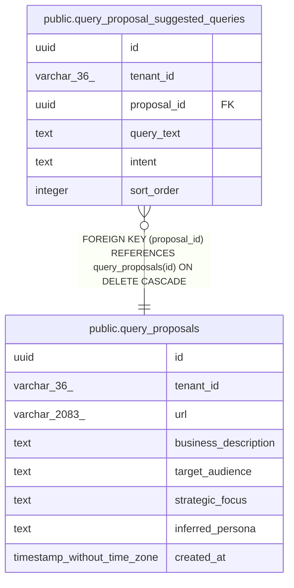

# public.query_proposals

## Columns

| Name | Type | Default | Nullable | Children | Parents | Comment |
| ---- | ---- | ------- | -------- | -------- | ------- | ------- |
| id | uuid |  | false | [public.query_proposal_suggested_queries](public.query_proposal_suggested_queries.md) |  |  |
| tenant_id | varchar(36) |  | false |  |  |  |
| url | varchar(2083) |  | false |  |  |  |
| business_description | text |  | false |  |  |  |
| target_audience | text |  | false |  |  |  |
| strategic_focus | text |  | false |  |  |  |
| inferred_persona | text |  | false |  |  |  |
| created_at | timestamp without time zone | now() | false |  |  |  |

## Constraints

| Name | Type | Definition |
| ---- | ---- | ---------- |
| query_proposals_pkey | PRIMARY KEY | PRIMARY KEY (id) |

## Indexes

| Name | Definition |
| ---- | ---------- |
| query_proposals_pkey | CREATE UNIQUE INDEX query_proposals_pkey ON public.query_proposals USING btree (id) |
| idx_query_proposals_tenant_created | CREATE INDEX idx_query_proposals_tenant_created ON public.query_proposals USING btree (tenant_id, created_at DESC) |

## Relations

---

> Generated by [tbls](https://github.com/k1LoW/tbls)
