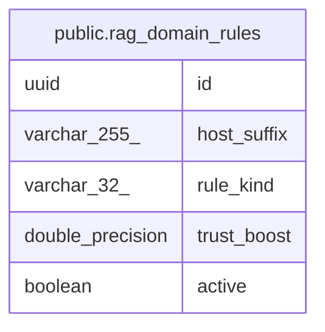

# public.rag_domain_rules

## Columns

| Name | Type | Default | Nullable | Children | Parents | Comment |
| ---- | ---- | ------- | -------- | -------- | ------- | ------- |
| id | uuid |  | false |  |  |  |
| host_suffix | varchar(255) |  | false |  |  |  |
| rule_kind | varchar(32) |  | false |  |  |  |
| trust_boost | double precision |  | true |  |  |  |
| active | boolean | true | false |  |  |  |

## Constraints

| Name | Type | Definition |
| ---- | ---- | ---------- |
| chk_rag_domain_rules_rule_kind | CHECK | CHECK (((rule_kind)::text = ANY ((ARRAY['TRUST_BOOST'::character varying, 'BLOCK_ANALYSIS'::character varying, 'ALLOW_NON_JP'::character varying])::text[]))) |
| rag_domain_rules_pkey | PRIMARY KEY | PRIMARY KEY (id) |
| uq_rag_domain_rules_host_suffix | UNIQUE | UNIQUE (host_suffix) |

## Indexes

| Name | Definition |
| ---- | ---------- |
| rag_domain_rules_pkey | CREATE UNIQUE INDEX rag_domain_rules_pkey ON public.rag_domain_rules USING btree (id) |
| uq_rag_domain_rules_host_suffix | CREATE UNIQUE INDEX uq_rag_domain_rules_host_suffix ON public.rag_domain_rules USING btree (host_suffix) |

## Relations

---

> Generated by [tbls](https://github.com/k1LoW/tbls)
