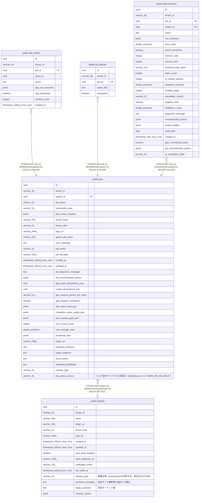

# public.sge_results

## Columns

| Name | Type | Default | Nullable | Children | Parents | Comment |
| ---- | ---- | ------- | -------- | -------- | ------- | ------- |
| id | uuid |  | false |  |  |  |
| tenant_id | varchar(36) |  | false |  |  |  |
| job_id | uuid |  | false |  | [public.jobs](public.jobs.md) |  |
| query_id | uuid |  | false |  |  |  |
| query | text |  | false |  |  |  |
| sge_raw_response | jsonb |  | false |  |  |  |
| sge_mentioned | boolean |  | false |  |  |  |
| mention_count | integer |  | false |  |  |  |
| created_at | timestamp without time zone |  | false |  |  |  |

## Constraints

| Name | Type | Definition |
| ---- | ---- | ---------- |
| fk_sge_results_job | FOREIGN KEY | FOREIGN KEY (job_id) REFERENCES jobs(id) ON DELETE CASCADE |
| sge_results_pkey | PRIMARY KEY | PRIMARY KEY (id) |

## Indexes

| Name | Definition |
| ---- | ---------- |
| sge_results_pkey | CREATE UNIQUE INDEX sge_results_pkey ON public.sge_results USING btree (id) |

## Relations

---

> Generated by [tbls](https://github.com/k1LoW/tbls)
