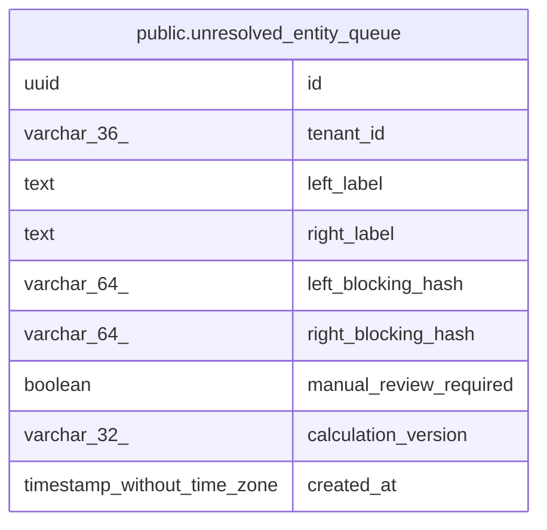

# public.unresolved_entity_queue

## Columns

| Name | Type | Default | Nullable | Children | Parents | Comment |
| ---- | ---- | ------- | -------- | -------- | ------- | ------- |
| id | uuid |  | false |  |  |  |
| tenant_id | varchar(36) |  | false |  |  |  |
| left_label | text |  | false |  |  |  |
| right_label | text |  | false |  |  |  |
| left_blocking_hash | varchar(64) |  | false |  |  |  |
| right_blocking_hash | varchar(64) |  | false |  |  |  |
| manual_review_required | boolean |  | false |  |  |  |
| calculation_version | varchar(32) |  | false |  |  |  |
| created_at | timestamp without time zone |  | false |  |  |  |

## Constraints

| Name | Type | Definition |
| ---- | ---- | ---------- |
| unresolved_entity_queue_pkey | PRIMARY KEY | PRIMARY KEY (id) |

## Indexes

| Name | Definition |
| ---- | ---------- |
| unresolved_entity_queue_pkey | CREATE UNIQUE INDEX unresolved_entity_queue_pkey ON public.unresolved_entity_queue USING btree (id) |

## Relations

---

> Generated by [tbls](https://github.com/k1LoW/tbls)
